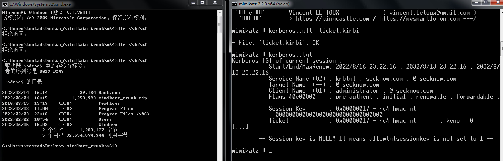

# 票据传递攻击

PTH（Pass The Hash,哈希传递）是基于NTLM认证的。而本节描述的票据传递（Pass The Ticket, PTT）是基于Kerberos协议认证的。

## 1.1 票据传递攻击原理

### 1.1.1 Kerberos协议

Kerberos是一种由MIT（麻省理工大学）提出的一种网络身份验证协议。它旨在通过使用密钥加密技术为客户端/服务器应用程序提供强身份验证。

Kerberos 协议是一种计算机网络授权协议，用来在非安全网络中，对个人通信以安全的手段进行身份认证。其设计目标是通过密钥系统为客户机与服务器应用程序提供强大的认证服务。该协议的认证过程的实现不依赖于主机操作系统的认证，无需基于主机地址的信任，不要求网络上所有主机的物理安全，并假定网络上传送的数据包可以被任意地读取、修改和插入数据。在以上情况下， Kerberos 作为一种可信任的第三方认证服务，是通过传统的密码技术（如：共享密钥）执行认证服务的。**Kerberos 协议在在内网域渗透领域中至关重要，白银票据、黄金票据、攻击域控等都离不开 Kerberos 协议。**

在Kerberos协议中主要是有三个角色的存在：

**1.访问服务的Client**

**2.提供服务的Server**

**3.KDC（Key Distribution Center）密钥分发中心** 

其中KDC服务默认会安装在一个域的域控中，而Client和Server为域内的用户或者是服务，如HTTP服务，SQL服务。在Kerberos中Client是否有权限访问Server端的服务由KDC发放的票据来决定。


认证流程：

1.AS_REQ: Client向KDC发起AS_REQ,请求凭据是Client NTLM-Hash加密的时间戳.

2.AS_REP: KDC使用Client NTLM-Hash进行解密，如果结果正确就返回以下信息给Client:

* AS生成一个临时密钥**Session-Key AS**，并使用Client NTLM-Hash进行加密，用于确保客户端和KGS之间的通信安全
* **TGT:** 用KDC的一个特定账户krbtgt(创建域控时自动生成) 的NTLM-Hash加密Session-key AS，时间戳、Client-info
* AS_REP: 将上述两部分以及PAC作为AS_REP回复给Client。PAC包含Client的sid，Client所在的组一些信息。

3.TGS_REQ: Client收到AS_REP消息，获取TGT和加密的Session-key AS。Client先使用自己的NTLM-Hash解密获得解密后的Session-key AS并缓存。需要访问某台服务器上的服务时，先凭借TGT票据向KGS发起购买相应的ST服务票据。此时Client 使用Session-key AS加密时间戳、Client-info、Server-info等数据和原始的TGT（由于使用了krbtgt NTLM-Hash，Client无法解密）一起发送给TGS特定服务的TGS_REQ请求。

4.TGS_REP: KDC使用krbtgt hash进行解密得到Session-key AS、时间戳、Client-info以及Server-info，再用Session-key AS解密第一部分内容，得到Client-info、时间戳并进行对比验证。如果相等，继续判断Client有没有权限访问Server,如果认证都通过了，KGS会生成一个Session-key TGS、时间戳以及Client-info等数据生成ST，TGS将这两部分内容回复给Client,即TGS_REP。

5.AP_REQ: Client收到TGS_REP消息后，获得了ST和加密的Session-Key TGS。Client使用本地缓存了的session-key AS解密出原始的Session-Key TGS，并缓存ST和原始的Session-Key TGS。当访问某台服务器上的服务时会项服务器发送请求。使用Session-Key TGS加密Client-info、时间戳等信息作为一部分内容，加上原始的ST（使用了Server NTLM-Hash加密， client无法解密）一起发送给Sever,即AP_REQ。

6.AP_REP: 服务使用自己的hash解密ST票据得到Session-Key TGS。再解密出Client-info、时间戳等数据。然后与 ST 的Client-info、时间戳等进行一一对比。通过客户端身份验证后，服务器 Server 会拿着 PAC 去询问 DC 该用户是否有访问权限，DC 拿到 PAC 后进行解密，然后通过 PAC 中的 SID 判断用户的用户组信息、用户权限等信息，然后将结果返回给服务端，服务端再将此信息域用户请求的服务资源的 ACL 进行对比，最后决定是否给用户提供相关的服务。通过认证后 Server 将返回最终的`AP-REP`并与 Client 建立通信。

**1.1.2 kerberos 测试工具**

在学习kerberos协议的过程中，一直以来都是利用工具发包，然后再通过wireshark抓包分析，这让用惯了Burp的我很不习惯，burp的repeater模块可以很方便的改包，发包，查看响应包。为了更方便得学习kerberos，简单得写了个测试工具，用于kerbreos协议的研究。

### 1.1.3 PTT原理

PTH（Pass The Hash,哈希传递）是基于NTLM认证的。而本节描述的票据传递（Pass The Ticket, PTT）是基于Kerberos协议认证的。

PTT攻击的优势：PTH攻击需要获取目标机器的管理员权限， 而PTT攻击不需要管理员权限。


## 1.2 票据传递攻击技术

在票据传递攻击（PTT）中，我们常用的有**MS14-068、黄金票据、白银票据**。其中MS14-068可用来横向获取域内主机权限，黄金票据、白银票据则可以用来对域控进行权限维持。这里我们主要讲解MS14-068，至于黄金票据、白银票据我们将在未来的域内权限维持中讲解。


### 1.2.1 MS14-068

这里便用到了我们之前所讲到的 PAC 这个东西，PAC 是用来验证 Client 的访问权限的，它会被放在 TGT 里发送给 Client，然后由 Client 发送给 TGS。但也恰恰是这个 PAC 造成了MS14-068这个漏洞。

该漏洞是位于 kdcsvc.dll 域控制器的密钥分发中心（KDC）服务中的 Windows 漏洞，它允许经过身份验证的用户在其获得的票证 TGT 中插入任意的 PAC 。普通用户可以通过呈现具有改变了 PAC 的 TGT 来伪造票据获得管理员权限。

在讲解MS08-068之前，我们要先了解PAC这个东西，PAC是用来验证Client的访问权限的，它会被放在TGT里发送给Client，然后由Client发送给TGS。

Windows域中使用kerberos协议过程中，为了让服务器判断Client是否有权限访问服务，微软在Windows平台上对Kerberos协议进行了一些扩充，即在协议中增加了PAC（Privilege Attribute Certificate），特权属性证书，也就是这个PAC造成了MS14-068这个漏洞。

MS14-068是密钥分发中心（KDC）服务中的Windows漏洞。它允许经过身份验证的用户在其Kerberos票证（TGT）中插入任意的PAC（表示所有用户权限的结构）。该漏洞位于kdcsvc.dll域控制器的密钥分发中心(KDC)中。普通用户可以通过呈现具有改变了PAC的Kerberos TGT来获得票证，进而伪造票据获得管理员权限。


### 1.2.2 黄金票据

#### 1）黄金票据原理分析

**黄金票据原理：**在 Windows 的kerberos认证过程中，Client 将自己的信息发送给 KDC，然后 KDC 使用 Krbtgt 用户的 NTLM-Hash 作为密钥进行加密，生成 TGT。那么如果获取到了 Krbtgt 的 NTLM-Hash 值，就可以伪造任意的 TGT了。域控制器中的KDC服务不验证TGT中的用户帐户，直到TGT超过20分钟

**黄金票据的使用条件和场景：**因为 Krbtgt 只有域控制器上面才有，所以使用黄金凭据意味着你之前拿到过域控制器的权限，黄金凭据可以理解为一个后门，主要用于权限维持。

优点：不需要与AS进行交互、需要用户krbtgt的HASH

#### 2）黄金票据实验条件

**实验场景：**假设攻击者已拿到了域内所有的账户Hash，包括 Krbtgt这个账户，由于有些原因导致你对域管权限丢失，但好在你还有一个普通域用户权限，碰巧管理员在域内加固时忘记重置 Krbtgt 密码，基于此条件，我们利用该票据重新获得域管理员权限。利用 Krbtgt 的 Hash 值可以伪造生成任意的 TGT，能够绕过对任意用户的账号策略，让用户成为任意组的成员，可用于 Kerberos 认证的任何服务。

**实验环境：**

域控主机：Windows Server 2019  IP:192.168.20.134  域：secknow.com， 域管用户名:administrator

域成员主机： Windows7  IP:192.168.20.103 主机名client

普通与用户：bguser01


**实验条件：** 通过某次攻击，拿到了包括域控在内的所有的账户Hash，也包括特殊的账号Krbtgt。由于某些原因导致后来对域管权限丢失，只有一个普通域用户权限。

**实验目的：**基于上述实验条件，利用黄金票据重新获得域管权限。


#### 3）使用mimikatz进行攻击

**a、准备攻击条件**

攻击者再使用黄金票据进行票据传递攻击时，需要直到以下信息：需要伪造的域管理员用户名、完整的域名、域 SID、krbtgt用户的NTLM哈希值。通过某种手段我们已经知道以下信息：

* 域SID:S-1-5-21-1935054445-4259798144-178899724
* krbtgt的NTLM哈希值：64d453ca53d1f8fd0aa9ad1f31d9b4ef

**b、伪造TGT票据**

切换到普通域用户的机器Windows 7，用mimikatz 生成名为 ticket.kirbi 的 TGT 凭证，用户名为 administrator：

```cmd
# kerberos::golden /user:需要伪造的域管理员用户名 /domain:域名 /sid:域sid /krbtgt: krbtgt用户的Hash /ticket:ticket.kirbi

kerberos::golden /user:administrator /domain:secknow.com /sid:S-1-5-21-1935054445-4259798144-178899724 /krbtgt:64d453ca53d1f8fd0aa9ad1f31d9b4ef /ticket:ticket.kirbi
```


**c、注入票据**

使用 mimikatz 将凭证ticket.kirbi 注入进去：

```cmd
#kerberos::ptt <票据文件>
kerberos::ptt ticket.kirbi
```

查看当前会话中的票据:kerberos::tgt

在注入票据前无法访问域控主机资源、注入后访问成功。



**d、攻击成功，执行相关操作**

成功连接域控制器后，可进性相关操作。如使用psexec工具对域控执行远程命令。


**4）使用MFS进行攻击**

前提，已经拿到了域SID和krbtgt的NTLM哈希值。并且在普通域成员主机上上线一个MSF会话。加载kiwi模块后，执行下面命令：

```shell
# golden_ticket_create -d 域名 -k krbtgt用户的Hash -s 域sid -u 需要伪造的域管理员用户名 -t /root/krbtgt.ticket
golden_ticket_create -d whoamianony.org -k 6be58bfcc0a164af2408d1d3bd313c2a -s S-1-5-21-1315137663-3706837544-1429009142 -u administrator -t /root/krbtgt.ticket

kerberos_ticket_list # 查看本地储存的票据
kerberos_ticket_use /root/krbtgt.ticket # 将票据注入内存
```


### 1.2.3 白银票据

#### 1）白银票据原理分析

**白银票据原理：**白银票据不同于黄金票据，白银票据的利用过程是**伪造TGS**，通过已知的授权服务密码生成一张可以访问该服务的TGT。因为在票据生成过程中不需要使用KDC，所以可以绕过域控制器，很少留下日志。而黄金票据在利用过程中由KDC颁发TGT，并且在生成伪造的TGT得20分钟内，TGS不会对该TGT的真伪进行效验。白银票据依赖于服务账号的密码散列值，这不同于黄金票据利用需要使用 Krbtgt 账号的密码哈希值，因此更加隐蔽。白银票据会通过相应的服务账号来伪造TGS，例如：LDAP、MSSQL、WinRM、DNS、CIFS等，范围有限，只能获取对应服务的权限。

**白银票据使用条件：**KDC 向客户端 Client 返回`AS_REP`时插入了 PAC，PAC 中包含的是用户的 SID、用户所在的组等一些信息。当最后服务端 Server 收到 Client 发来的`AP_REQ`请求后，首先会对客户端身份验证。通过客户端身份验证后，服务器 Server 会拿着 PAC 去询问 DC 该用户是否有访问权限，DC 拿到 PAC 后进行解密，然后通过 PAC 中的 SID 判断用户的用户组信息、用户权限等信息，然后将结果返回给服务端，服务端再将此信息域用户请求的服务资源的 ACL 进行对比，最后决定是否给用户提供相关的服务。

但是在有些服务中并没有验证 PAC 这一步，这也是白银票据能成功的前提，因为就算拥有用户的 Hash，可以伪造 TGS，但是也不能制作 PAC，PAC 当然也验证不成功，但是有些服务不去验证 PAC，这是白银票据成功的前提。

#### 2）白银票据实验分析

**a、准备前期需要的信息：**

不需要与KDC进行交互、需要server的NTLM hash。

- 域名：secknow.com
- 域 SID：S-1-5-21-1315137663-3706837544-1429009142
- 目标服务器的 FQDN：
- 可利用的服务：
- 服务账号的 NTLM 哈希值(DC$)：6decb5d75eb5727d8535e67680b52571
- 要伪造的用户名：administrator

**b、用白银票据来伪造 CIFS 服务权限**

CIFS 服务通常用于Windows 主机之间的文件共享。

```cmd
# kerberos::golden /domain:域名 /sid:域 SID /target:FQDN /rc4:server 机器的哈希 /service:可利用的服务 /user:要伪造的用户名 /ptt

kerberos::golden /domain:whoamianony.org /sid:S-1-5-21-1315137663-3706837544-1429009142 /target:DC.secknow.com /rc4:6decb5d75eb5727d8535e67680b52571 /service:cifs /user:administrastor /ptt
```

**c、攻击成功后执行其他操作**

**d、白银票据和黄金票据对比**

| 对比项     | 黄金票据                | 白银票据                    |
| ---------- | ----------------------- | --------------------------- |
| 伪造票据   | TGT                     | ST                          |
| 认证流程   | 同KDC交互、但不同AS交互 | 不同KDC交换，直接访问Server |
| 获取的权限 | 所有域内主机的访问权限  | 特定服务的访问权限          |
| 加密方式   | 由krbtgt NTKM-Hash加密  | 由服务账号NTLM-Hash加密     |

### 1.2.4 密码喷洒攻击（Password Spraying）

对密码进行喷洒式的攻击，这个叫法很形象，因为它属于自动化密码猜测的一种。这种针对所有用户的自动密码猜测通常是为了避免帐户被锁定，因为针对同一个用户的连续密码猜测会导致帐户被锁定。所以只有对所有用户同时执行特定的密码登录尝试，才能增加破解的概率，消除帐户被锁定的概率。普通的爆破就是用户名固定，爆破密码，但是密码喷洒，是用固定的密码去跑用户名。

### 1.2.5 AS-REP Roasting

AS_REQ & AS_REP 认证的过程是 Kerberos 身份认证的第一步，该过程又被称为预身份验证。预身份验证主要是为了防止密码脱机爆破。而如果域用户设置了选项 "Do not require Kerberos preauthentication"（该选项默认没有开启）关闭了预身份验证的话，攻击者可以使用指定的用户去请求票据，向域控制器发送`AS_REQ`请求，此时域控会不作任何验证便将 TGT 票据和加密的 Session-key 等信息返回。因此攻击者就可以对获取到的加密 Session-key 进行离线破解，如果爆破成功，就能得到该指定用户的明文密码。这种攻击方式被称作 AS-REP Roasting 攻击。

## 1.3 参考资料

https://www.freebuf.com/articles/web/282203.html

[Kerberos Authentication Overview | Microsoft Docs](https://docs.microsoft.com/zh-cn/windows-server/security/kerberos/kerberos-authentication-overview)

[AS_REQ & AS_REP - windows protocol (gitbook.io)](https://daiker.gitbook.io/windows-protocol/kerberos/1)

[内网渗透测试：Kerberos协议相关安全问题分析与利用 - FreeBuf网络安全行业门户](https://www.freebuf.com/articles/web/274035.html)