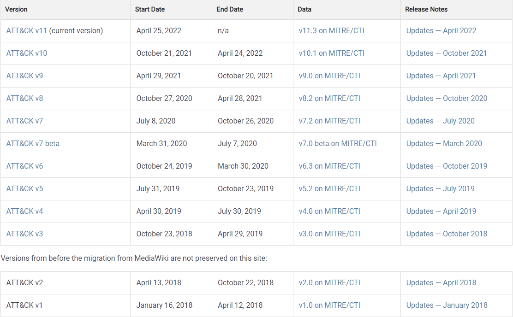

# 1、安全威胁模型

## 1.1 Cyber Kill Chain

### 1.1.1 背景介绍

网络杀伤链(cyber kill chain)，是美国国防承包商洛克希德·马丁公司（Lockheed Martin）提出的网络安全威胁的杀伤链模型。内容包括成功的网络攻击所需的七个阶段：**侦察跟踪、武器构建、载荷投递、漏洞利用、安装植入、命令与控制、目标达成。**

官网：https://www.lockheedmartin.com/en-us/capabilities/cyber/cyber-kill-chain.html

### 1.1.2 针对网络杀伤链的防御对策

**1、侦察跟踪**

- 描述：攻击者进行探测、识别及确定攻击对象（目标）的阶段。信息一般通过互联网进行收集（内容包括网站、邮箱、电话、社会工程学等一切可能相关的情报）
- 预防：侦察跟踪阶段往往是防守方感知比较少的阶段；应关注于日常异常流量、日志和数据（特别是已经泄露的数据），将其存储备查是必要的，更重要的是建立和优化分析模型。

**2、武器构建**

- 描述：攻击者通过侦察跟踪阶段确定目标、收集足够的信息后，准备网络武器的阶段。网络武器一般由攻击者直接构建或使用自动化工具构建等。
- 预防：
- 守方的“资源”密切相关，武器的构建需要基于“资源”的漏洞或缺陷（包括操作系统、应用软件、甚至社会工程）；应关注“资产”相关漏洞、补丁、修复流程是否完备。

**3、载荷投递**

- 描述：攻击者将构建完成的网络武器向目标投递的阶段。投递方式一般包括钓鱼邮件、物理USB投递等。
- 预防：防护策略在该阶段尤为重要，云防护、边界防护、区域防护、系统防护、应用防护等，应关注是否具备且有效防护措施，另外安全意识也同样重要，人的弱点往往比设备的弱点更容易被利用。

**4、漏洞利用**

- 描述：攻击者将网络武器投递到目标系统后，启动恶意代码的阶段。一般会利用应用程序或操作系统的漏洞或缺陷等。
- 预防：安全检测、安全监测、阻断+审计，这就是日常的安全监控工作（看大门的工作，重要！）

**5、安装植入**

- 描述：攻击者在目标系统设置木马、后门等，一定期限内在目标系统营造活动环境的阶段。
- 预防：在最短的时间内发现并隔离，关注终端/服务器安全管理策略、防病毒。

**6、命令与控制**

- 描述：攻击者建立目标系统攻击路径的阶段。一般使用自动和手工相结合的方式进行，一旦攻击路径确立后，攻击者将能够控制目标系统。
- 预防：洛克希德·马丁公司描述此阶段为“防御者阻止攻击的最后机会......如果对手无法发出命令，防御者便可控制影响”，此阶段正是考验响应策略的最后一次尝试，所以更应关注访问控制。

**7、目标达成**

- 描述：攻击者达到预期目标的阶段。攻击目标呈现多样化，可能包括侦察、敏感信息收集、数据破坏、系统摧毁等。
- 预防：虽然木已成舟，但仍需要集中精力把损失降低到最小，吸取教训、改进措施，才能避免在同一个地方摔倒两次。

## 1.2 ATT&CK 

官网：https://attack.mitre.org/

Github: https://github.com/mitre-attack/attack-navigator

### 1.2.1 ATT&CK模型的背景

ATT&CK（Adversarial Tackics, Techniques, and Common Knowledge, 简称ATT&CK），是由MITRE公司为解决防守方面临的困境，于2013年基于现实中发生的真实攻击事件创建的一个对抗战术和技术知识库。ATT&CK提供一个复杂的框架，介绍了攻击者在攻击过程中使用的180多项技术、360多项子技术，其中包括特定的技术和通用的技术，以及有关知名攻击组织及其攻击活动的背景和攻击中使用的战术、技术。

#### 1）PRE-ATT&CK 

由于刚开始ATT&CK只专注于攻击者入侵系统后的行为，大致对应Kill Chain中从漏洞利用到维持的阶段。无法揭露攻击者入侵成功之前的行为。MITRE团队于2017年发布了PRE-ATT&CK模型，

#### 2）ATT&CK

根据技术性标准、可见性标准和证明攻击者的使用情况三个标准进行筛选，将PRE ATT&CK整合到Enterprise ATT&CK中称为两个新战术：侦察、资源开发。

### 1.2.1 ATT&CK模型的构成

ATT&CK框架中主要包括五大对象：攻击组织、软件、技术/子技术、战术、缓解措施。

#### 1)攻击组织

ATT&CK框架会通过攻击组织这一对象来追踪已知攻击者。这些已知攻击者由公共组织和私有组织跟踪并已在威胁报告中报道过。攻击组织通常代表有针对性的持续威胁活动的知名入侵团队、威胁组织、行动者组织活动。ATT&CK主要关注APT组织。

#### 2）软件

在入侵过程中，攻击者通常会用不同类型的软件，按照有关技术的使用方法分类，主要分为以下两大类：

* 工具：这一类即包括不在企业系统上存在的软件，也包括在环境已有的操作系统中存在的软件。例如：PsExec、Metasploit、Mimikatz等。
* 恶意软件：攻击者出于恶意软件目的的使用的商业、闭源或开源软件，例如plugX、CHOPSTICK等。

#### 3）技术/子技术

技术代表攻击者通过执行动作来实现战术目的的方式。

#### 4）战术

战术表示攻击者执行ATT&CK技术或子技术的目标，说明攻击者为什么会进行这项操作。

#### 5）缓解措施

ATT&CK中缓解措施介绍的是阻止某种技术或子技术成功执行的安全概念和技术类别。Enterprise ATT&CK中有40多种缓解措施，其中包括应用程序隔离和沙箱、数据备份、执行保护和网络分段等缓解措施。

### 1.2.2 ATT&CK模型的版本

[Versions of ATT&CK | MITRE ATT&CK®](https://attack.mitre.org/resources/versions/)

# 2、ATT&CK模型

现在整个Enterprise ATT&CK 矩阵内容变得丰富，已发展为14项战术，其中前两项战术---侦察和资源开发覆盖了Kill Chain的前两个阶段，包含了攻击者利用特定的目标网络或者系统漏洞进行相关操作的战术和技术，后面12项战术则覆盖了KIll Chain的后五个阶段。ATT&CK框架的14项战术没有高低之分，都同样重要。攻击者在使用ATT&CK模型时页不存在任何线性顺序。下面将以最新版本的ATT&CK Enterprise来详细介绍其中各项战术及具体的技术。

**截至目前，最新版本为2022年4月25发布的ATT&CK v11版本， 此版本的Enterprise ATT&CK包含14中战术、191 技术、386项子技术。**

## 2.1 侦察（Reconnaissance）

攻击者试图收集可用于规划未来操作的信息。

侦察包括攻击者主动或被动地收集可用于达成目标的信息的技术。此类信息可能包括受害者组织、基础设施或工作人员的详细信息。攻击者可以利用此信息为攻击者生命周期的其他阶段提供帮助，例如使用收集的信息来规划和执行初始访问，确定妥协后目标的范围和优先顺序，或推动和领导进一步的侦察工作。

## 2.2 资源开发（Resource Development）

攻击者试图建立可以用于支持行动的资源。

资源发展包括攻击者创建、购买或妥协/窃取可用于达成目标的资源的技术。这些资源包括基础设施、账户或功能。攻击者可以利用这些资源为攻击者生命周期的其他阶段提供帮助，例如使用购买的域来支持命令和控制，将电子邮件帐户进行网络钓鱼作为初始访问的一部分，或者窃取代码签名证书以进行防御规避。

## 2.3 初始化访问（Initial Access）

攻击者试图进入你的网络。

初始访问包括使用各种入口向量在网络中获得初始立足点的技术。用于获得初始立足点的技术包括有针对性的鱼叉钓鱼和利用面向公众的web服务器上的弱点。通过初始访问获得的立足点可能允许继续访问（如有效帐户和使用外部远程服务），或者可能由于密码更改，使用受到限制。

## 2.4 执行（Execution)

攻击者试图运行恶意代码。

执行包括导致攻击者控制的代码在本地或远程系统上运行的技术。运行恶意代码的技术通常与所有其他战术的技术相结合，以实现更广泛的目标，如探索网络或窃取数据。例如，攻击者可能使用远程访问工具执行PowerShell脚本进行远程系统发现。

## 2.5 持久化（Persistence）

攻击者试图维持他们的立足点。

持久化包括攻击者用来在重启、更改凭证和其他可能切断其访问的中断之后，保持对系统的访问的技术。用于持久化的技术包括允许它们在系统上维持立足点的任何访问、行动或配置更改，例如替换或劫持合法代码或添加启动代码。

### 2.5.1 T1098-账户操纵

攻击者可能会操纵帐户以维持对受害者系统的访问。 帐户操纵可能包括保留攻击者对受损帐户的访问权限的任何操作，例如修改凭据或权限组。 这些操作还可能包括旨在破坏安全策略的帐户活动，例如执行迭代密码更新以绕过密码持续时间策略并保留受损凭据的生命周期。

#### 1）其他的云凭证

#### 2）额外的电子邮件代理权限

#### 3）其他云角色

#### 4）SSH 授权密钥

#### 5）设备注册

## 2.6 权限提升（Privilege Escalation)

攻击者试图获得更高级别的权限。

提权包括攻击者用来获得系统或网络的更高级别权限的技术。攻击者非特权访问通常可以进入和探索网络，但需要提权才能实现其目标。常见的方法是利用系统弱点、错误配置和漏洞。

提权的例子包括：系统/root 级别、本地管理员、具有类似管理员权限的用户帐户、具有访问特定系统或执行特定功能的用户帐户。这些技术通常与持久化的技术重叠，因为允许攻击者持久化的OS功能可以在提权的环境中执行。

## 2.7 防御绕过（Defense Evasion）

攻击者试图避免被发现。

防御规避包括攻击者用来避免在整个攻击过程中被发现的技术。用于防御规避的技术包括卸载/禁用安全软件或混淆/加密数据和脚本。 攻击者还利用和滥用受信任的进程来隐藏和伪装恶意软件。当其他战术的技术包括破坏防御的附加好处时，就会在此处交叉列出。

## 2.8 凭据访问（Credential Access）

攻击者试图窃取用户名和密码。

凭据访问包括用于窃取凭据（例如用户名和密码）的技术。 用于获取凭据的技术包括密钥记录或凭据转储。 使用合法的凭据可以使攻击者访问系统，使其更难被发现，并提供创建更多用户来实现目标的机会。

## 2.9 发现（Discovery）

攻击者试图弄清楚目标环境。

发现包括攻击者可能用来获取系统和内部网络知识的技术。 这些技术可帮助攻击者在决定如何采取行动之前观察环境并自我定位。还允许攻击者探索他们可以控制什么，以及他们的入口点周围是什么，以便发现如何有利于他们当前的目标。操作系统本机工具通常用于此后渗透过程中的信息收集。

## 2.10 横向移动（Lateral Movement）

攻击者试图在目标环境中移动。

横向移动由攻击者用来进入和控制网络上的远程系统的技术组成。为了实现他们的主要目标，通常需要探索网络来找到他们的目标，并随后获得访问权。 达到他们的目标通常需要通过多个系统和账户来实现。攻击者可能会安装自己的远程访问工具来完成横向移动，或者将合法的凭据与本地网络和操作系统工具一起使用，这可能会更隐蔽。

## 2.11 收集（Collection）

攻击者试图收集对于他们的目标来说有用的数据。

收集包括攻击者可能用来收集信息的技术，从中收集与攻击者目标有关的信息。通常，收集数据后的下一个目标是窃取（回传）数据。 常见的目标来源包括各种驱动器类型，浏览器，音频，视频和电子邮件。常见的收集方法包括捕获屏幕截图和键盘输入。

## 2.12 命令与控制（Command and Control）

攻击者试图与沦陷的系统通信并进行控制。

命令与控制由攻击者在受害者的网络内与其控制下的系统进行通信的技术组成。攻击者通常会尝试模仿正常的预期流量以避免被发现。攻击者可以采用多种方式来建立命令和控制，并根据受害者的网络结构和防御来进行不同程度的隐身。

## 2.13 数据窃取（Exfiltration）

攻击者试图窃取数据。

数据回传由攻击者从目标网络窃取数据的技术组成。攻击者收集到数据后，通常会打包这些数据以避免在删除数据时被发现，包括压缩和加密。用于从目标网络中获取数据的技术通常包括在其命令和控制通道或备用通道上传输数据，并且还可能包括在传输中设置大小限制。

## 2.14 危害（Impact）

攻击者试图操纵、中断或破坏目标的系统和数据。

影响包括攻击者通过操纵业务和操作流程来破坏可用性或完整性的技术。用于影响的技术可以包括破坏或篡改数据。在某些情况下，业务流程可能看起来没有问题，但可能已进行被更改，为了达成攻击者的目标。攻击者可能会使用这些技术来实现其最终目标，或为违反保密性提供掩护。

# 3、ATT&CK应用

[cti/enterprise-attack/attack-pattern at master · mitre/cti (github.com)](https://github.com/mitre/cti/tree/master/enterprise-attack/attack-pattern)

# 4、参考资料

- [《MITRE ATT&CK：Design and Philosophy》](https://www.mitre.org/sites/default/files/publications/pr-18-0944-11-mitre-attack-design-and-philosophy.pdf)
- [《Putting MITRE ATT&CK into Action with What You Have, Where You Are》](https://www.slideshare.net/KatieNickels/putting-mitre-attck-into-action-with-what-you-have-where-you-are)
- [《Improving Threat Intellingence and Cyber Defense with MITRE ATT&CK》](https://www.sans.org/cyber-security-summit/archives/file/summit_archive_1536260992.pdf)
- [《ATT&CK™ Your CTI with Lessons Learned from Four Years in the Trenches》](https://www.sans.org/cyber-security-summit/archives/file/summit_archive_1548090281.pdf)
- [《ATT&CK™ Is Only as Good as Its Implementation: Avoiding Five Common Pitfalls》](https://redcanary.com/blog/avoiding-common-attack-pitfalls/)