# 1、owasp 简介

OWASP（开放式web应用程序安全项目）关注web应用程序的安全。OWASP这个项目最有名的，也许就是它的"十大安全隐患列表"。这个列表不但总结了web应用程序最可能、最常见、最危险的十大安全隐患，还包括了如何消除这些隐患的建议。（另外，OWASP还有一些辅助项目和指南来帮助IT公司和开发团队来规范应用程序开发流程和测试流程，提高web产品的安全性。）这个"十大"差不多每隔三年更新一次。

官网：https://owasp.org/

# 2、owasp 版本


## 2.1 OWASP Top 10 - 2010

1. A1—注入      
2. A2—跨站脚本、XSS                           
3. A3—失效的身份认证会话管理               
4. A4—不安全的直接对象引用    
5. A5—跨站请求伪造(CSRF)              
6. A6—安全配置错误                      
7. A7—不安全的加密存储                   
8. A8—没有限制的URL访问                   
9. A9—传输层保护不足 
10. A10—未验证的重定向和转发  

## 2.2 OWASP Top 10 - 2013

1. A1—注入
2. A2—失效的身份认证会话管理
3. A3—跨站脚本、XSS
4. A4—不安全的直接对象引用
5. A5—安全配置错误
6. A6—敏感信息泄漏                  
7. A7—功能级访问控制缺失              
8. A8—跨站请求伪造(CSRF)
9. A9—使用含有已知漏洞的组件         
10. A10—未验证的重定向和转发 

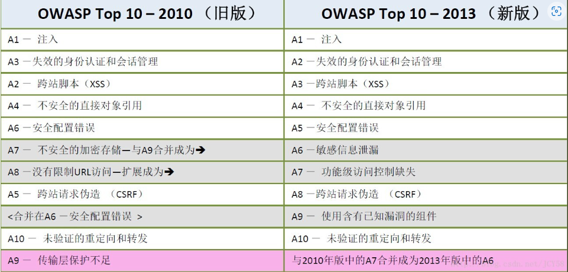

## 2.3 OWASP Top 10 - 2017

1. A1：2017-Injection（注入漏洞）

2. A2：2017-BrokenAuthentication（中断身份认证）
3. A3：2017-Sensitive DataExposure（敏感数据泄露）
4. A4：2017-XML ExternalEntities（XXE）XML外部处理器漏洞
5. A5：2017-Broken AccessControl（中断访问控制）
6. A6：2017-SecurityMisconfiguration（安全配置错误）
7. A7：2017-Cross-SiteScripting（XSS）跨站脚本攻击
8. A8：2017-InsecureDeserialization（不安全的反序列化）
9. A9：2017-UsingComponents with Known Vulnerabilities（使用含有已知漏洞的组件）
10. A10：2017-InsufficientLogging & Monitoring（不足的记录和监控漏洞）

参考资料： [OWASP Top Ten 2017 | 2017 Top 10 | OWASP Foundation](https://owasp.org/www-project-top-ten/2017/Top_10)

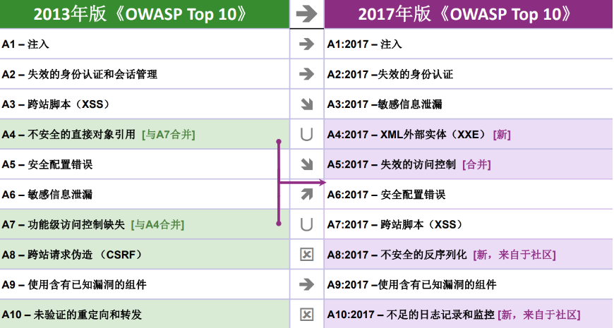

## 2.4 OWASP Top 10 - 2021

1. A01:2021-Broken Access Control 失效的访问控制
2. A02:2021-Cryptographic Failures 加密失败
3. A03:2021-Injection 注入
4. A04:2021-不安全的设计
5. A05:2021-安全配置错误
6. A06:2021-Vulnerable and Outdated Components 易受攻击和过时的组件
7. A07:2021-Identification and Authentication Failures 认证和授权失败
8. A08:2021-软件和数据完整性故障
9. A09:2021-安全日志记录和监控失败
10. A10:2021-Server-Side Request Forgery 服务器请求伪造

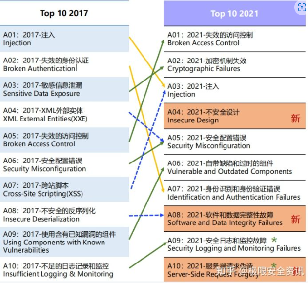

# 3、owasp 实验环境搭建

## 3.1 owasp环境搭建

### 3.1.1 owasp 虚拟机

[OWASP Broken Web Applications Project - Browse Files at SourceForge.net](https://sourceforge.net/projects/owaspbwa/files/)

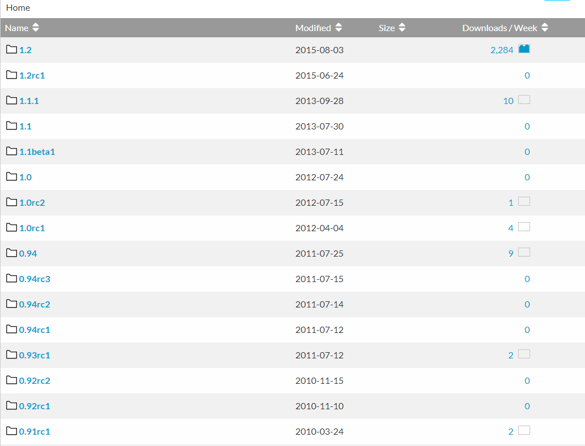

以1.2版本为例， 下载OVA镜像文件，导入VMware虚拟机即可：

**虚拟机密码： root/owaspbwa**

**DVWA密码: admin/admin**

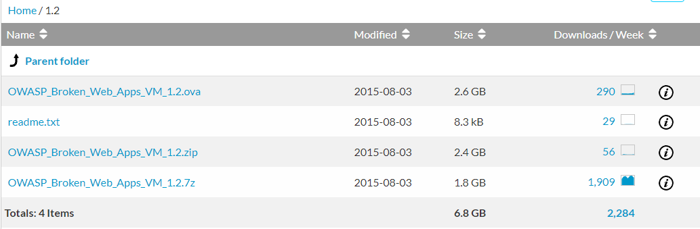

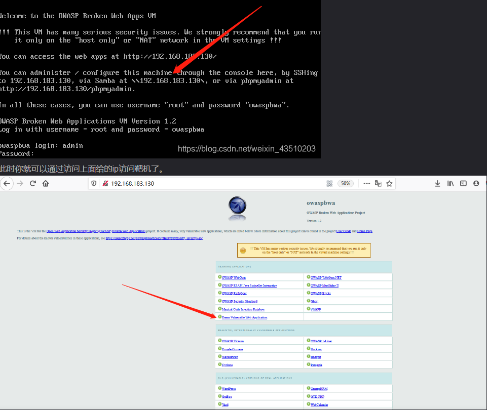

### 3.1.2 owasp项目介绍

OWASP WebGoat:

OWASP ESAPI Java SwingSet Interactive:

OWASP RailsGoat:

**Damn Vulnerable Web Application:**

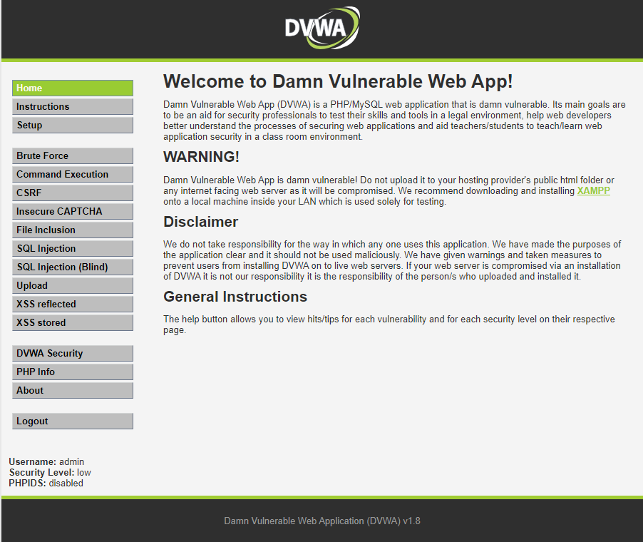


## 3.2 DVWA环境搭建

> *DVWA (Dam Vulnerable Web Application)是用PHP+Mysql编写的一套用于常规WEB漏洞教学和检测的WEB脆弱性测试程序。包含了SQL注入、XSS、盲注等常见的一些安全漏洞。*

官网：https://dvwa.co.uk/

Github：https://github.com/digininja/DVWA

### 3.2.1 DVWA 模块

1. `Brute Force（暴力（破解））`
2. `Command Injection（命令行注入）`
3. `CSRF（跨站请求伪造）`
4. `File Inclusion（文件包含）`
5. `File Upload（文件上传）`
6. `Insecure CAPTCHA（不安全的验证码）`
7. `SQL Injection（SQL注入）`
8. `SQL Injection（Blind）（SQL盲注）`
9. `XSS（Reflected）（反射型跨站脚本）`
10. `XSS（Stored）（存储型跨站脚本）`

### 3.2.2 Phpstudy搭建DVWA环境

1、**下载DVWA源码**

解压到phpStudy网站目录下，如：F:\phpStudy\WWW\DVWA\

**2、修改数据库配置**

将 config.inc.php.dist 复制一份或重命令为 config.inc.php；修改数据库信息

```bash
$_DVWA[ 'db_server' ]   = '127.0.0.1'; #数据库地址
$_DVWA[ 'db_database' ] = 'dvwa'; #数据库名称
$_DVWA[ 'db_user' ]     = 'root'; #数据库用户名
$_DVWA[ 'db_password' ] = 'root'; #数据库密码
```

因为phpstudy默认的mysql数据库地址是“127.0.0.1 或 localhost”，用户名和密码都是”root”。主要是修改’**db_password**‘为**root**，这里很重要，修改后自然是需要保存文件的，这个不用说相信大家也能知道。

3、**设置数据库或重置数据库**

浏览器访问 http://127.0.0.1/dvwa/setup.php，设置数据库

配置DVWA时出现如下错误：reCAPTCHA key: Missing。  在`DVWA-master/config/config.inc.php`文件中找到下面代码：

```bash
$_DVWA[ 'recaptcha_public_key' ]  = ' '; 

_$_DVWA[ 'recaptcha_private_key' ] = ' ';
```

使用公共的KEY：

```bash
$_DVWA[ 'recaptcha_public_key' ]  = '6LdK7xITAAzzAAJQTfL7fu6I-0aPl8KHHieAT_yJg';

$_DVWA[ 'recaptcha_private_key' ] = '6LdK7xITAzzAAL_uw9YXVUOPoIHPZLfw2K1n5NVQ';
```

**4、登录DVWA**

浏览器访问 http://127.0.0.1/dvwa/login.php， 

DVWA默认用户名 ： admin/password

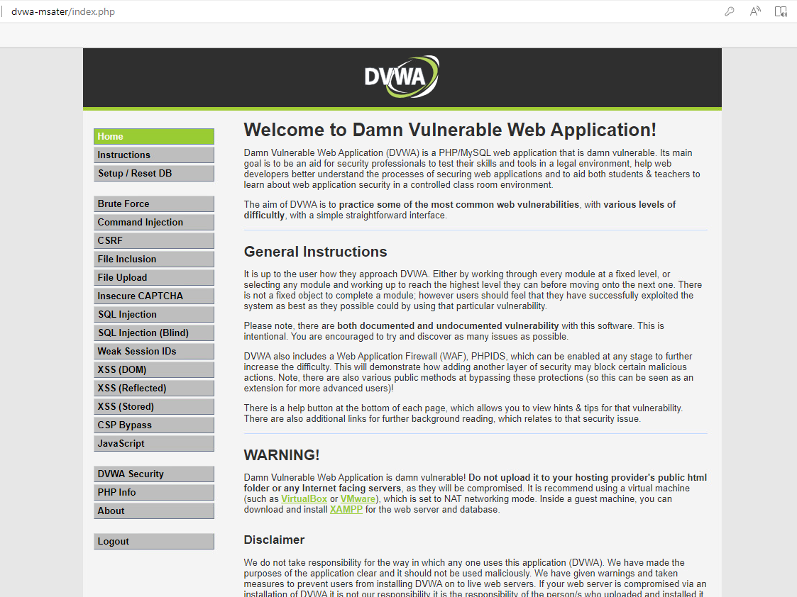


### 5、修改phpstudy配置

上面实验中的DVWA环境只能在虚拟机内部访问， 如果要在外部机器中访问PhpStudy中的网站，需要特殊配置。即使用phpstudy8布置网站，局域网内部其他电脑即可访问。

使用ip访问：

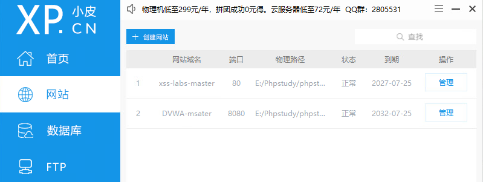

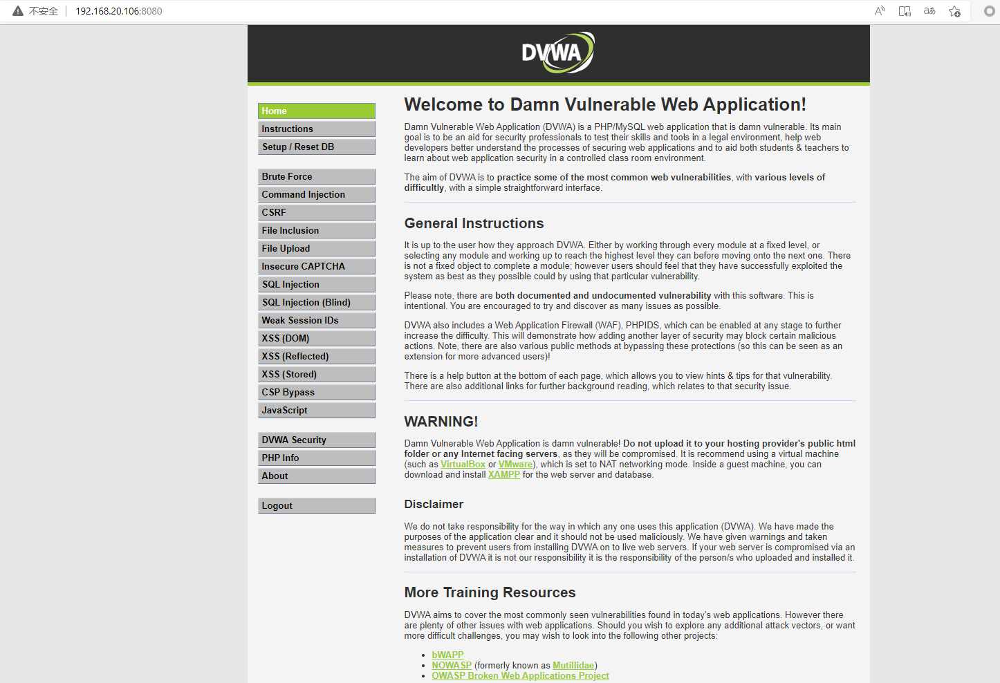

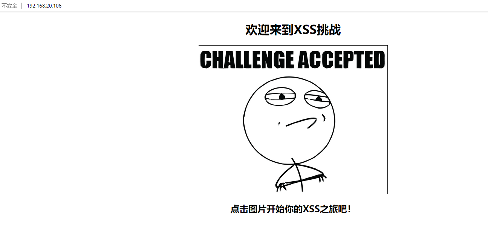

