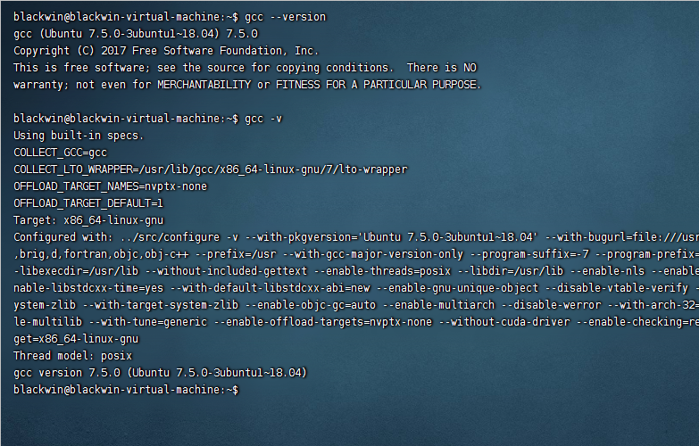
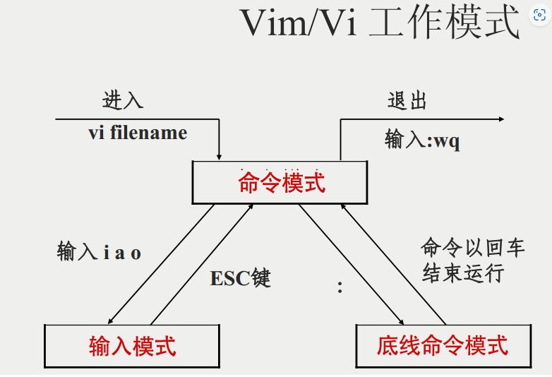
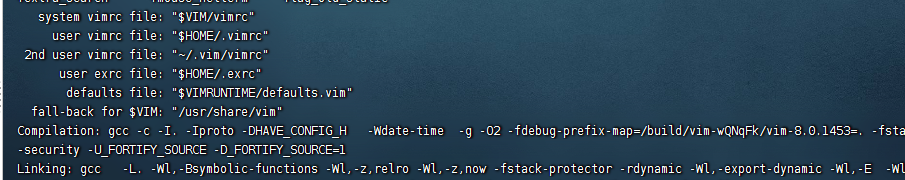
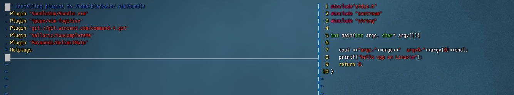

## 1、Linux下C/C++开发概述

### 1.1 

编译器gcc

编译器g++

调试器gdb

### 1.2 非集成环境开发

Linux下的C++开发就是开发过程（编辑、编译、链接）全部在Linux下完成。其中讲编辑、编译、调试分开的开发方式称为非集成式开发，也叫命令行开发方式。

#### 1）编辑器

命令行工具：vi/vim

图形化工具:gedit、vscode等。

#### 2）编译器

> 传统的编译器通常分为三个部分，前端（frontEnd），优化器（Optimizer）和后端（backEnd）. 在编译过程中，前端主要负责词法和语法分析，将源代码转化为抽象语法树；优化器则是在前端的基础上，对得到的中间代码进行优化，使代码更加高效；后端则是将已经优化的中间代码转化为针对各自平台的机器代码。

1、**GNU Compiler Collection**(**GCC**)

GNU编译器集合(GCC)是用于编程的编译器集合，如c++、C、Objective-C、Java和Fortran。GCC版本是通过一个通过命令行操作的自由软件基础来实现的。GCC开发是由Richard Stallman作为GNU项目的一部分进行的。

```bash
gcc program.c -o targetFile
```


2、**GNU C++ Compiler(G++)**

GNU提供了C++的优化编译器，也就是众所周知的G++。它可以在各种处理器上运行，大家可以在Emacs下找到完整的文档。与GCC一样，G++包含独立的程序。通过这个编译器，所有的语言都使用通用的内部结构，该结构由特定于语言的前端组成，前端解析程序并创建抽象语法树和后端。

G++主要用于编译C++编程语言。它是不同操作系统(如Linux、BSD和MAC OS x)中的主编译器。它是免费提供的软件，支持许多用c++编程语言创建并使用g++编译的自由软件。

```text
g++ program.cpp –o targetFile
```

**GCC和g++之间的主要区别是文件名扩展名。gcc将. C文件视为C文件，而g++同时将. C和cpp文件视为c++文件**


**3、clang**

clang是LLVM编译器工具集的一个用于编译C、C++、Objective-C的前端。LLVM项目的目标是提供一个GNU编译器套装（gcc）的替代品，由苹果公司的赞助开发，其源代码授权采用的是类BSD的伊利诺伊大学厄巴纳-香槟分校开源码许可。


**4、LLVM**

LLVM （Low Level Virtual Machine，底层虚拟机)）提供了与编译器相关的支持，能够进行程序语言的编译期优化、链接优化、在线编译优化、代码生成。简而言之，可以作为多种编译器的后台来使用。


#### 3）调试器：GDB

GDB 全称“GNU symbolic debugger”，从名称上不难看出，它诞生于 GNU 计划（同时诞生的还有 GCC、Emacs 等），是 Linux 下常用的程序调试器。发展至今，GDB 已经迭代了诸多个版本，当下的 GDB 支持调试多种编程语言编写的程序，包括 C、C++、Go、Objective-C、OpenCL、Ada等。实际场景中，GDB 更常用来调试 C 和 C++程序。


### 1.3 集成环境开发

将编辑、编译、调试在一个集成开发环境中完成的开发方式称为集成开发方式。

#### **1）Clion**

Clion是一款专门开发C/C++所设计的跨平台的IDE。提供C/C++支持(包含C++,libc++和Boost),同时也支持JavaScript,XML,HTML和CSS。跨平台：您可以在64-bit Linux、OS X以及64-bit Windows上使用它。支持GCC、clang、MinGW、Cygwin编译器以及GDB调试器。

CLion官网: https://www.jetbrains.com/clion/

#### 2) VScode

[vscode](https://so.csdn.net/so/search?q=vscode&spm=1001.2101.3001.7020)是文本编辑而非集成开发环境，需要经过配置才能在其上编译执行代码。

VScode官网： [Visual Studio Code - Code Editing. Redefined](https://code.visualstudio.com/)

VScodeC++开发相关的插件：C/C++、 C++ Intellisense、 Code Runner 和 Include Autocomplete

## 2、非集成式开发环境搭建

以ubuntu18.04为例，下面主要介绍非集成式C++开发环境。

* 编译器：g++
* 编辑器：Vim及其插件
* 调试器：gdb

### 2.1 安装gcc/g++编译器

刚装好的系统中已经有GCC了，但是这个GCC什么文件都不能编译，因为没有一些必须的头文件，所以要安装build-essential这个软件包，安装了这个包会自动安装上g++,libc6-dev,linux-libcdev,libstdc++6-4.1-dev等一些必须的软件和头文件的库。

```shell
sudo apt-get install build-essential
```

查看gcc/g++版本




### 2.2 安装Cmake

CMake是一个跨平台的、开源的构建工具。cmake是[makefile](https://so.csdn.net/so/search?q=makefile&spm=1001.2101.3001.7020)的上层工具，它们的目的正是为了产生可移植的makefile，并简化自己动手写makefile时的巨大工作量.目前很多开源的项目都可以通过CMake工具来轻松构建工程，例如博客之前分享的openHMD、hidapi、OSVR-Core等等，代码的分享者提供源代码和相应的Cmake配置文件，使用者就可以非常方便的在自己的电脑上构建相应的工程，进行开发和调试。

**1、下载源码**

去https://cmake.org/files/下载所需版本的源码。如：

```bash
wget https://cmake.org/files/v3.22/cmake-3.22.1.tar.gz
```

**2、解压**

```bash
tar -xvzf cmake-3.22.1.tar.gz
```

**3、配置**

```bash
chmod 777 ./configure 

./configure
```

**4、编译**

执行命令： make

**5、安装**

执行命令: sudo make install

**6、替换旧版本**

```bash
sudo update-alternatives --install /usr/bin/cmake cmake /usr/local/bin/cmake 1 --force
```

**7、测试cmake**

```bash
cmake --version
# cmake version 3.22.1

# CMake suite maintained and supported by Kitware (kitware.com/cmake).
```


### 2.3 安装Vim编辑器

>Vim 是从 vi 发展出来的一个文本编辑器。代码补全、编译及错误跳转等方便编程的功能特别丰富，在程序员中被广泛使用。简单的来说， vi 是老式的字处理器，不过功能已经很齐全了，但是还是有可以进步的地方。 vim 则可以说是程序开发者的一项很好用的工具。



安装

```bash
sudo apt-get  update
sudo apt-get install vim
```

更新

```bash
1. sudo add-apt-repository ppa:jonathonf/vim 
2. sudo apt update
3. sudo apt upgrade
```

卸载

```bash
1. sudo apt remove vim
2. sudo add-apt-repository --remove ppa:jonathonf/vim
```


#### 2.3.1 Vim配置文件

**.vimrc**配置文件分系统配置和用户配置两种。

* 系统vimrc配置文件存放在Vim的安装目录，默认路径为`/usr/share/vim/.vimrc`。可以使用命令`echo $VIM`来确定Vim的安装目录。

* 用户vimrc文件，存放在用户主目录下`~/.vimrc`。可以使用命令`echo $HOME`确定用户主目录。

通过vim  --version命令可以查看配置文件路径信息及gcc编译器信息。

**注意：用户配置文件优先于系统配置文件，Vim启动时会优先读取当前用户根目录下的.vimrc文件。所以与个人用户相关的个性化配置一般都放在`~/.vimrc`中。**



如果你需要配置vim，只需在Home目录创建一个**~/.vimrc**文件即可以配置vim了，如需安装插件，在~/.vim目录下创建一个bundle文件夹，插件装在里面。

在默认目录下创建文件 ~/.vimrc，保存以下内容

```bash
显示行号：set number
打开语法高亮：syntax on
Tab 大小：set tabstop=4
缩进大小：set shiftwidth=4
```

[Vim的终极配置方案，完美的写代码界面! ——.vimrc_amoscykl的博客-CSDN博客_vim配置](https://blog.csdn.net/amoscykl/article/details/80616688)

#### 2.2.2 vim插件管理器

Vundle是Vim bundle的缩写，是一个Vim插件的管理器。通过Vundle我们可以安装很多有用的插件。

**1）获取源码**

git clone [https://github](https://link.zhihu.com/?target=https%3A//github/).com/VundleVim/Vundle.vim.git ~/.vim/bundle/Vundle.vim

**2）添加vim配置文件进行vundle的安装**

此时会一起安装vundle和YCM，但是YCM会提示未运行，不用关心

```bash
set nocompatible " be iMproved, required
set rtp+=~/.vim/bundle/Vundle.vim
call vundle#begin()
Plugin 'VundleVim/Vundle.vim'
Plugin 'Valloric/YouCompleteMe'
call vundle#end() " required
filetype plugin indent on " required
```

**3）$ vim 进入vim界面**

**4）安装插件**

:PluginInstall

5）等待左下方提示done，说明安装完成

#### 2.2.3 安装VIM插件

参考资料：

* [Vim 实用插件推荐（2017） - 知乎 (zhihu.com)](https://zhuanlan.zhihu.com/p/24742679?refer=hack-vim#:~:text=Vim 实用插件推荐（2017） 1 插件管理器 2 文件，代码搜索工具 3 自动补全.YouCompleteMe,( Git %2C Svn ) 8 改善生活.玩Vim很久的老油条应该都知道，先不装逼我们 )

**1）代码自动补全插件**

**YouCompleteMe**



报错：The ycmd server SHUT DOWN (restart with ':YcmRestartServer'). Unexpected exit code 1

解决方案：在插件路径~/.vim/plugged/YouCompleteMe下执行：/usr/bin/python install.py

2）

### 2.3 编写Makefile

Makefile非常重要，它定义了一系列规则，哪些文件需要编译，编译的顺序，以及文件之间的依赖关系。会不会写Makefile反映了一个程序员是否具备完成大型项目的能力。

示例：一项目有三个文件:

* myFun.h: 定义函数add原型
* add.cpp：实现函数add的具体逻辑
* main: 在主函数中调用add函数

makefile文件内容;

```bash
first: test.o  Fadd.o
        g++ -Wall test.o Fadd.o -o first
Fadd.o: myFun.h add.cpp 
        g++ -Wall -c add.cpp  -o Fadd.o
test.o: main.cpp
        g++ -Wall -c main.cpp -o test.o

clean:
        rm *.o first
```


## 3、参考资料

[GNU Emacs - GNU Project](https://www.gnu.org/software/emacs/)

[推荐 15 款最好的C/C++ 编译器和集成开发环境 - 知乎 (zhihu.com)](https://zhuanlan.zhihu.com/p/77628364)

[Linux快速搭建C/C++开发环境 - Coding十日谈 - 博客园 (cnblogs.com)](https://www.cnblogs.com/jfzhu/p/13467226.html)
