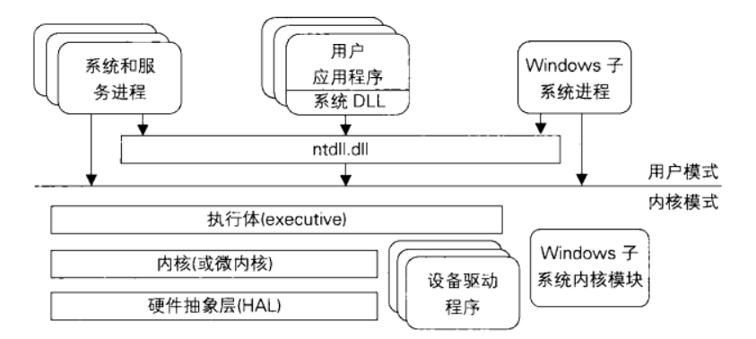
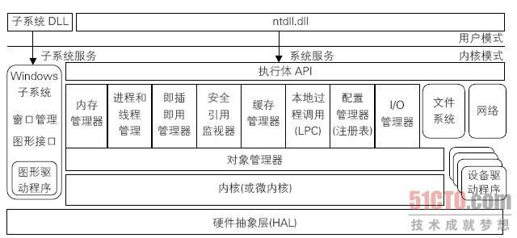
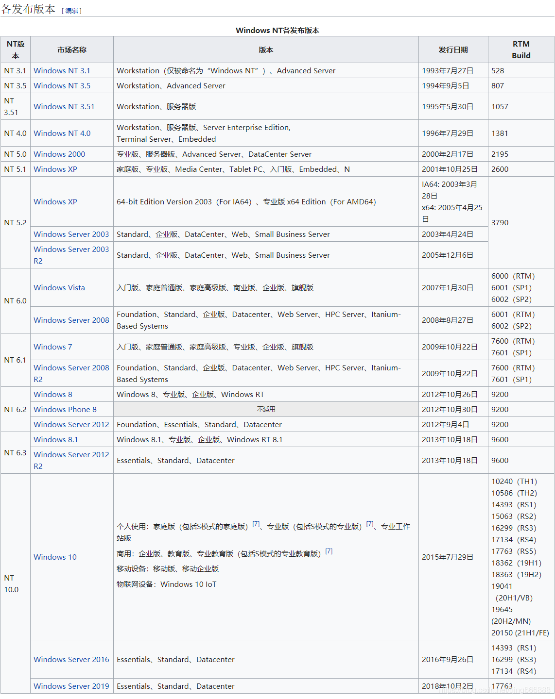

## 1.1 Windows架构


### 1.1.1 Windows系统架构




### 1.1.2 Windows内核及其组件




1. **硬件抽象层(HAL)：**硬件打交道的一层。这一层的用意是将与硬件相关联的逻辑隔离到一个专门的模块中，从而使上面的层次尽可能独立于硬件。
2. **微内核(micro-kernel)：**位于中间层。这一层包含了基本的操作系统原语和功能，如进程和线程的调度，中断和异常的处理和同步进制等等。内核层实现操作系统的基本机制。
3. **执行体层（Executive):** 这层的作用是为提供一些可供上层应用程序或内核驱动程序直接调用的功能和语义。windows内核的执行体包含了一个对象管理器，用于一致地管理执行体内的对象。执行体和内核层位于同一个二进制模块中，即内核基本模块。其名为ntoskrnl.exe。所有的策略决定则留给了执行体层。执行体中绝大多数封装了一个或者多个内核对象，宁通过某种方式暴漏给应用程序。

#### 1）硬件抽象层HAL

作用： 通过引入一个HAL行来屏蔽硬件差异。

在Windows中， 和LA是一个独立的动态链接库。名称为hal.dll

HAL: 提供一些例程供其他内核模块或者设备驱动程序调用。

#### 2）微内核


#### 3）执行体

执行体API函数接受的参数来自于各种应用程序，因此名为确保系统的健壮性、以及抵抗来自用户模式的恶意攻击，所有的执行体API函数必须保证参数的有效性。

执行体是内核模块的上层部分，在大的方面看，执行体包含以下组件：

- 进程和线程管理器，负责创建进程和线程，以及终止进程和线程。对于进程和线程的底层支持是在内核层中提供的，执行体在内核层的基础上又添加了一些语义和功能。
- 内存管理器。此组件提供了虚拟内存功能，既负责系统地址空间的内存管理，又为每个进程提供了一个私有的地址空间，并且也支持进程间的内存共享。
- 安全引用监视器，该组件强制在本地计算机上实施安全策略，守护操作系统的资源，执行对象的保护和审计。
- I/O管理器。实现与设备无关的输入和输出功能，负责将I/O请求分发给争取的设备驱动程序以便进一步处理。
- 缓存管理器。为文件系统提供统一的数据缓存执行，允许文件系统驱动程序将磁盘上的数据映射到内存中，并通过内存管理器来协调物理内存的分配。
- 配置管理器。负责系统注册表的实现和管理。
- 即插即用管理器。负责列举设备，并为每个列举到的设备确定哪些驱动程序是必须的，然后加载并初始化这些驱动程序。当它检测到系统中的设备变化时，负责发送合适的事件通知。
- 电源管理器。负责协调电源事件，向设备驱动程序发送电源I/O通知。

由上来看，实际执行体就是负责了整个操作系统对外的功能。我们的应用程序更多的时候是和执行体打交道。


#### 4）设备驱动程序

在内核中除了内核模块ntoskrnl.exe和HAL外，其他模块几乎都以设备驱动程序的形式存在。设备驱动程序并不一定对应于物理设备。驱动程序既可以创建虚拟设备，也可以完全与设备无关。仅仅是内核的扩展模块。

设备驱动时可以动态加载到系统中的模块。其文件名为.sys。文件格式是PE。

设备驱动程序有以下三种基本类型：

- 即插即用驱动程序：WDM驱动程序。通常是为了驱动硬件设备而由硬件厂商提供。他们与Windows的I/O管理器、即插即用管理器和电源管理器一起工作。支持各种常见的存储设备、视频适配器、网络适配器、输入设备等
- 内核扩展驱动程序：非即插即用驱动程序。用于扩展内核的功能。
- 文件系统驱动程序。这一类驱动程序接受针对文件的请求，在进一步将请求转变成真正对于存储设备或者网络设备的IO请求，从而满足原始的文件请求。

#### 5）文件系统/存储管理器

文件系统是外部存储设备的标准接口，他为应用程序使用这些设备中的数据提供了同一的抽象。多个应用或者设备可以共享使用这些设备。

Windows的原生文件系统是NTFS（NT File Sytsem)。其驱动程序是ntfs.sys。

另一个常用的文件系统是FAT（File Allocation Table),是从DOS时代发展起来的文件系统格式，格式规范相对比较简单。


#### 6）网络

- Windows套接字，简称Winsock,实现并扩展了BSD套接字标准， 对应的DLL文件为ws2_32.dll。它提供的传输服务和名字空间服务都通过内核模式驱动程序afd.sys实现网络通信。
- WinInet: 一个高层的网络API。支持多个协议，Gopher、FTP和HTTP。
- 命名管道和油槽：用于不同进程之间进行通信。他们支持不同机器上的进程之间互相通信。
- NetBIOS：早期的网络编程API，支持有连接的通信和无连接的通信
- RPC：网络编程的一个标准，往往是分布式系统基础设施的重要组件

### 1.1.3 Windows子系统

在NT最初的设计中，它支持三个子系统：OS/2、POSIX、Windows（win32)


#### 1）win32子系统

Windows子系统中既有用户模式部分、也有内核模式部分。

内核模式部分核心是win32k.sys。一方面向用户代码提供系统服务。另一方面也跟Windows内核紧密地融合在一起，它通过向内核注册一组出调函数以便介入到内核的线程和进程管理器等处理逻辑中，同时页可以接受电源事件。从功能上将，它包含两部分：

* 窗口管理：负责收集和分发消息，控制窗口显示和管理屏幕输出
* 图形设备接口GDI：绘制各种形状及文本输出功能

**1、窗口管理**

2、图形设备接口


用户模式部分包括:

- windows子系统进程csrss.exe以及一组动态链接库：主要负责控制台窗口的功能，以及创建或者删除进程和线程等，子系统DLL则被直接链接到应用程序中，包括kernel32.dll、user32.dll、gdi32.dll和advapi.dll等，负责实现已文档化的API函数。


### 1.1.4 系统线程和系统进程


## 1.2 windows内核

### 1.2.1 Windows内核历史版本




### 1.2.2 WRK

WRK（windows Research Kernel ） 是微软公开的一部分 windows 内核源码，用来供给开发人员学习。。

WRK的全称是“Windows Research Kernel”，它是微软为高校操作系统课程提供的可修改和跟踪的操作系统教学平台。它给出了Windows这个成功的商业操作系统的内核大部分代码，可以对其进行修改、编译，并且可以用这个内核启动Windows操作系统。可让学生将操作系统基本原理和商业操作系统内核联系起来，进一步加深对操作系统整体的理解。

https://github.com/HighSchoolSoftwareClub/Windows-Research-Kernel-WRK-

http://www.awarenetwork.org/home/iqlord/other/wrk.rar


### 1.2.3 ReactOS

ReactOS 是一个开源项目，通过逆向来兼容 windows 系统，相比 WRK 代码更全面但 bug 也多。
下载地址：https://sourceforge.net/projects/reactos/


### 1.2.4 Windows内核基本概念


处理器模式

内存管理

进程线程管理

中断和异常

同步


### 1.2.5 Windows内核中的公共管理设施

#### 1）对象管理器


**2）注册表和配置管理器**

#### 3）事件追踪ETW

#### 4）安全性管理

内核层和执行体的分工是：内核层实现操作系统的基本机制，策略相关决定留给执行体。即**机制与策略分离**。

Windows管理内存的方式：使用分页机制。在Intel X86处理器上访问内存时必须要通过段描述符。

Windows内存：x86中，每个进程都拥有4GB的虚拟内存，其中高2GB是内核空间（所有进程公用的）、低2GB是用户空间（每个进程私有）。

内存的使用：先申请，动态分配。Windows采用按需分配的策略来管理内存。当一段虚拟内存空间真正被使用的时候，系统才会为它分配页表和物理页面。每个进程的虚拟地址空间的分配情况通过一组虚拟地址描述符VAD记录（数据结构是二叉树）。

```c++
//win7 32位
typedef struct _MMVAD 
{
    ULONG u1;                    //包含父结点
    struct _MMVAD* LeftChild;    //左子树
    struct _MMVAD* RightChild;   //右子树
    ULONG StartingVpn;           //内存块起始地址的页帧
    ULONG EndingVpn;             //内存块结束地址的页帧（对于4kb（0x1000）的页而言，内存块地址就是StartingVpn*0x1000~EndingVpn*0x1000+0xfff）
    ULONG u;                     //_MMVAD_FLAGS类型的指针，包含了内存块的一些属性位
    EX_PUSH_LOCK PushLock;
    ULONG u5;                    //_MMVAD_FLAGS3类型的指针，包含了内存块的一些属性位
    ULONG u2;                    //_MMVAD_FLAGS2类型的指针，包含了内存块的一些属性位
    struct _SUBSECTION* Subsection;   //包含了_CONTROL_AREA结构和_SEGMENT结构，含有更多的详细信息
    struct _MSUBSECTION* MappedSubsection; 
    struct _MMPTE* FirstPrototypePte; //原型PTE,对于Mapped共享的内存块有意义（private私有内存块无意义）。第一个原型PTE
    struct _MMPTE* LastContiguousPte; //原型PTE,对于Mapped共享的内存块有意义（private私有内存块无意义）。最后一个原型PTE
    struct _LIST_ENTRY ViewLinks; 
    struct _EPROCESS* VadsProcess; 
}MMVAD;
```

[VAD（Virtual Address Descriptor）虚拟地址描述符 - revercc - 博客园 (cnblogs.com)](https://www.cnblogs.com/revercc/p/16055714.html)


windows系统内存管理

会话空间是由会话管理器和Windows子系统使用的

换页内存池和非换页内存池则是提供给系统内核模块和设备驱动程序使用的。换页内存池中分配的内存有可能在物理内存紧缺的情况瞎被换出到外存中；而非换页内存池中分配的内存总是处于物理内存中。为了实现这两种池，Windows使用了两层内存管理。下层是基于页面的内存管理，仅限于执行体内部使用；上层建立在下层的内存管理功能基础之上，对外提供各种粒度的内存服务。两层结果如下图所示

系统换页内存池和非换页内存池是Windows系统提供的最基本动态内存管理手段，它以页面为基本粒度来管理系统中划定的地址范围。


## 1.3 Windows引导过程

### 1.3.1 内核加载

### 1.3.2 内核初始化

### 1.3.3 建立用户登录会话


