# 1、计算机网络模型

## 1.1 计算机网络模型

有三种不同的网络分层模型：

- **OSI模型：**为了使全世界不同体系结构的计算机能够互联，国际化标准组织ISO提出开放系统互联基本参考模型，简称OSI，即所谓的7层协议体系结构。（理论模型）
- **TCP/IP 模型：**TCP/IP四层模型，是由实际应用发展总结出来的，TCI/IP已经被广泛使用，成为网络互连实际上的标准。
- **网络五层：**5层模型只出现在计算机网络学习教学过程中

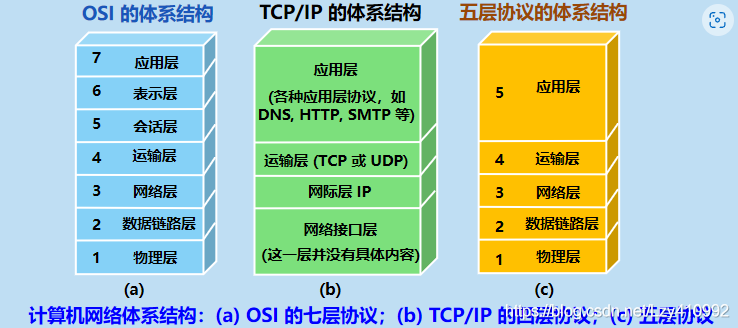

参考资料：

* [网络编程懒人入门(一)：快速理解网络通信协议（上篇）-网络编程/专项技术区 - 即时通讯开发者社区!](http://www.52im.net/thread-1095-1-1.html)

### 1.1.1 OSI模型（七层）

**OSI分层 （7层）：物理层、数据链路层、网络层、传输层、会话层、表示层、应用层。**

1. 物理层：通过媒介传输比特,确定机械及电气规范（比特Bit）。即把电脑连接起来的物理手段。它主要规定了网络的一些电气特性，作用是负责传送0和1的电信号。光缆、电缆、双绞线、无线电波等方式。
2. 数据链路层：在"物理层"的上方，确定了0和1的分组方式。将比特组装成帧和点到点的传递（帧Frame）
3. 网络层：以太网协议，依靠MAC地址发送数据。"网络层"的功能是建立"主机到主机"的通信。负责数据包从源到宿的传递和网际互连（包PackeT）
4. 传输层："传输层"的功能，就是建立"端口到端口"的通信。Unix系统就把主机+端口，叫做"套接字"（socket）
5. 会话层：建立、管理和终止会话（会话协议数据单元SPDU） 
6. 表示层：对数据进行翻译、加密和压缩（表示协议数据单元PPDU） 
7. 应用层： TCP协议可以为各种各样的程序传递数据，比如Email、WWW、FTP等等。"应用层"的作用，就是规定应用程序的数据格式。这是最高的一层，直接面对用户。它的数据就放在TCP数据包的"数据"部分。

### 1.1.2 TCP/IP模型（四层）

**TCP/IP4层模型： 应用层、传输层、网路层、网络接口层。**

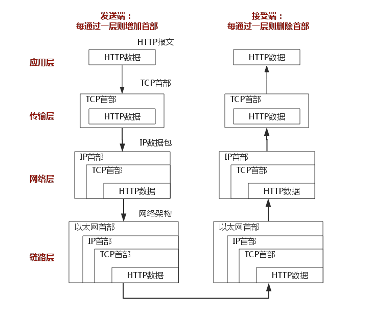

### 1.1.3 五层模型

**五层模型：物理层、数据链路层、网络层、运输层、 应用层。**

1. 物理层（建立物理连接，传输二进制流）。首先建立主机A与主机B之间的一条物理链路（有线、无线）进行数据传输。所以物理层的作用便是在主机之间搭建一条物理链路传输二进制流（即0与1，与协议无关）。
2. 数据链路层（局域网，主机间通信）。物理链路联通以后主机之间就具备了数据传输的基础能力，但是物理链路上是无协议的，传输的是二进制流；二进制流意味着没有起始标识符，接收的主机不知道什么时候开始解析数据，也不知道什么时候终止数据的接收；于是在数据链路层上对发送的数据进行了封装：分装成帧（frame）；这样主机在接收二进制流时就知道什么时候开始，什么时候结束。
3. 网络层（网络路由，主机间通信）。当物理层和数据链路层准备就绪以后，另外的问题出现了：计算机网络中存在大量的主机，那么主机A如何找到主机B呢？即网络路由寻址能力；在网络层最出名的协议莫过于IP协议（Internet Protocol）。在特定的网络下，每台主机都分配了一个唯一IP地址，配合路由器的IP路由寻址，主机A就能通过IP协议找到主机B了；也就意味着主机A与主机B之间具备了数据传输能力。
4. 传输层（进程间通信）。主机之间具备传输功能之后，那么更近一步把数据发送到指定端口即可完成一次不同主机间的进程通信了；记住传输层并不是数据传输的地方，而是控制数据如何传输的地方：面向连接还是无连接，传输的拥塞控制等。
5. 应用层（发送&接收数据）。主机B上的进程b只要监听特定的端口号，那么就能够收到主机A上的进程a发送过来的数据了。

## 1.2 网络中的硬件设备

### 1.2.1 集线器Hub

### 1.2.2 交换机

我们也说交换机工作在数据链路层

### 1.2.3 路由器

# 2、网络分层与协议

计算机网络协议

| 网络所在层   | 该层包含的协议                                      | 该层涉及的网络设备 |
| ------------ | --------------------------------------------------- | ------------------ |
| 物理层       | RJ45、CLOCK、IEEE802.3                              | 中继器，集线器     |
| **数据链路** | **PPP、FR、HDLC、VLAN、MAC**                        | **网桥，交换机**   |
| **网络层**   | **IP、ICMP、ARP、RARP、OSPF、IPX、RIP、IGRP、DHCP** | **路由器**         |
| **传输层**   | **TCP、UDP、SPX**                                   |                    |
| 会话层       | NFS、SQL、NETBIOS、RPC                              |                    |
| 表示层       | JPEG、MPEG、ASII                                    |                    |
| **应用层**   | **FTP、DNS、Telnet、SMTP、HTTP、WWW、NFS**          | 微信、QQ、浏览器   |

## 2.1 应用层协议

应用层：允许访问OSI环境的手段（应用协议数据单元APDU）

应用层：FTP、DNS、Telnet、SMTP、HTTP、WWW、NFS 

### 2.1.1 HTTP协议

> HTTP协议（hyperText Transfer Protocol, 超文本传输协议）是万维网的传输机制。允许浏览器通过连接web服务器浏览网页。是web服务器和客户端浏览器之间进行数据传输的规则。

#### 1) HTTP协议

**HTTP协议的特点：**

* 支持客户端/服务器模式，支持基本认证和安全认证
* 简单快捷：客户端请求数据时只需要发送请求方法和路径。常用的请求方法有GET、POST、HEAD等。
* 灵活：HTTP允许传输任意类型的数据对象，以Content－Type字段标记
* HTTP0.9和1.0使用非持续连接，限制一次连接只处理一个请求
* 无状态：指协议对于事务处理没有记忆能力。

**HTTP协议的请求方法：**

*　OPTIONS：返回服务器针对特定资源所支持的HTTP请求方法
*　HEAD：向服务器索要与GET请求相一致的响应
*　GET：向特定的资源发出请求
*　POST：向指定的资源提交数据进行处理请求
*　PUT：向指定的资源位置上传其最新内容
*　DELETE：
*　TRACE：
*　PATCH：

**HTTP工作流程：**

- 客户端通过TCP三次握手与服务器建立连接
- TCP建立连接成功后，向服务器发送HTTP请求
- 服务器收到客户端的HTTP请求后，将返回应答，并向客户端发送数据
- 客户端通过TCP四次握手与服务器断开TCP连接

**HTTP的持久连接和非持久连接：**

*　HTTP协议中由头部的Connection字段来标识HTTP是否是持久连接的
*　HTTP/1.0版本默认是非持久，HTTP/1.1默认是持久连接
*　目前浏览器可以支持配置来控制TCP连接数目，一般默认是5～10个并行的TCP
*　持久连接分为带流水线的的不带流水线的持久连接，带流水线的持久连接效率更高，一般默认是带流水线的。

#### 2) HTTP数据包格式

HTTP 数据报文格式

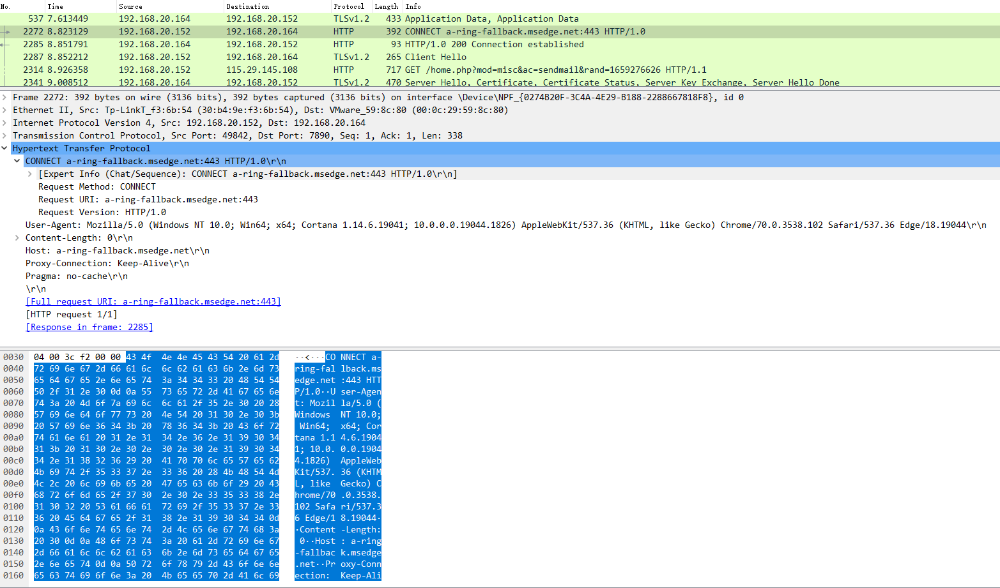


**HTTP请求报文格式**

* 请求行：由３部分组成：请求方式、URI、协议版本。

* 请求头：包含很多与客户端环境以及请求正文相关的信息，由关键字：值组成。请求头域名称和功能

  | 头域名称         | 功能                                                         |
  | ---------------- | ------------------------------------------------------------ |
  | Accept           | 表示浏览器可以接受的MIME类型                                 |
  | Accept-Charset   | 浏览器能够以正确解析的数据编码格式，如zip                    |
  | Accept－Language | 浏览器所希望接受的语言种类                                   |
  | Authorization    | 授权信息                                                     |
  | Except           | 用于指定客户端要求的特殊服务器行为                           |
  | From             | 请求发送者的-mail地址，                                      |
  | Host             | 初始URL中指定的主机和端口                                    |
  | if－match        | 指定一个资源的实体标记                                       |
  | User－Agent      | 浏览器类型，如果server返回数据与浏览器类型强相关则此字段十分重要 |

* 空行：必不可少，表示头部结束。

*　请求正文：如以POST方式提交的表单数据

**HTTP响应报文格式**

* 状态行：由３部分组成：HTTP协议版本、状态码（如200、400、401、404、500等）、状态代码描述。

* 响应头：包含很多有用的信息，由关键字：值组成。

  | 头域名称      | 功能                                                         |
  | ------------- | ------------------------------------------------------------ |
  | Accept-Ranges | 服务器指定它对某个资源请求的可接受范围                       |
  | Age           | 服务器规定自服务器生成该响应以来所经过的时间                 |
  | Etag          | 提供实体标签的当前值                                         |
  | Location      | 因资源已经移动，把请求的重定向至另一个位置，与状态码302或者301配置使用 |
  | Server        | 标明服务器软件及其版本号                                     |
  | Vary          | 用于代理是否看可以使用缓存中的数据响应客户端请求             |

* 空行：必不可少，表示头部结束。

* 响应正文：服务器返回的文档，一般以HTML最为常见。

**常见的媒体格式：**

- text/html ： HTML格式
- text/plain ：纯文本格式
- text/xml ： XML格式
- image/gif ：gif图片格式
- image/jpeg ：jpg图片格式
- image/png：png图片格式
- application/xhtml+xml ：XHTML格式
- application/xml： XML数据格式
- application/atom+xml ：Atom XML聚合格式
- **application/json**： JSON数据格式
- application/pdf：pdf格式
- application/msword ： Word文档格式

### 2.1.2 HTTPS协议

> HTTPS全称是Hypertext Transfer Protocol over Secure Socket Layer. 即基于SSL的HTTP协议。使用不同于HTTP的默认80端口， 默认HTTPS端口为443。在HTTP及TCP之间加了一个加密和身份验证层， 用于在互联网上传输敏感通信。

#### 1）HTTPS协议

HTTPS协议的主要特点：

* 默认使用443端口
* SSL使用40位的关键字作为RC4流加密算法
* HTTPS和SSL支持使用数字整数认证：保证数据传输的安全性、保证网站的真实性
* 

#### 2）HTTPS工作流程

使用HTTPS协议时，服务端和客户端信息都会通过TLS进行加密，所以传输的数都是加密后的数据：

* 客户端使用https的URL访问web服务器，要求与Web服务器建立SSL连接
* Web服务器收到客户端访问请求后，会将网站的证书信息（证书中的公钥）传送一份给客户端
* 客户端收到服务端公钥后，使用服务端公钥对对称密钥（本地生成的随机对称密钥）加密，并协商SSL连接的安全等级
* 双方约定好安全等级后，建立会话密钥，然后利用网站的公钥将会话密钥加密，并传送给网站服务器
* Web服务器利用自己的私钥解密出会话密钥
* Web服务器利用会话密钥加密与客户端之间的通信

#### 3）SSL协议

> SSL协议位于TCP/IP协议的与各种应用层协议之间，给数据通信提供安全支持。SSL协议分为两层：SSL记录协议（SSL Record Protocol, 建立在可靠的传输协议-TCP之上，为高层协议提供数据分装、压缩、加密等基本功能）和SSL握手协议（SSL Handshake Protocol，建立在SSL记录协议之上，用于在数据传输开始前，通信双方进行身份认证、协商加密算法和交换加密密钥等)。
>
> 
>
> SSL协议使用公钥加密技术（非对称密钥）和对称加密技术：使用非对称加密来传输对称加密中用到的密钥，使用对称加密来传输消息内容。
>
> 
>
> SSL当前最新版本为3.0

**SSL工作流程**

SSL 分为两个阶段，分别是服务器认证阶段和用户认证阶段。

1、服务器认证阶段

* 客户端向服务器发送一个开始信息”Hello“,以便开始一个新的会话连接
* 服务器根据客户的信息确定是否需要生成新的主密钥。如果需要，则服务器在响应客户端的”hello”消息时，将包含生成主密钥所需要的信息
* 客户端根据收到的服务器响应信息，产生一个主密钥，并用服务器的公开密钥加密后传给服务器
* 服务器回复该主密钥，并返回给客户一个用主密钥认证的信息，以此让客户端认证服务器

2、用户认证阶段

此前服务器已通过了客户端的认证。这一阶段主要完成对客户端的认证。经过认证的服务器发送一个提问给客户端，客户端则返回签名后的提问及其公开的密钥，从而向服务器提供认证。

**SSL协议的握手过程：**

* 客户端（浏览器）向服务器传送客户端SSL协议的版本号、加密算法的种类、产生随机数以及其他服务器和客户端之间通信所需要的各种信息
* 服务器向客户端传送SSL协议的版本号、加密算法种类、随机数及其他相关信息，同时服务器还将向客户端传送自己的证书
* 客户端利用服务器传过来的信息校验服务器的合法性。包括证书是否过期、发行服务器证书的CA是否可靠。发行者公钥是否正确，以及服务器上的域名是否和服务器的实际域名相匹配。
* 如果校验成功，客户端随机产生一个用于后面通信的“对称密码”，然后用服务器的公钥对其加密。然后将加密后的“预主密码”传送给服务器
* 如果服务器要求客户端进行身份认证（握手阶段可控制），用户可以建立一个随机数，然后对其进行数据签名。将这个含有签名的随机数和客户端自己的证书以及加密过的“预主密码”一起传给服务器。
* 如果服务器验证客户端身份，需要校验加密的随机数、客户端证书等信息
* 服务器和客户端用相同的主密码。一个对称密钥用于SSL协议的安全数据通信加解密通信。同时保证数据的完整性
* 客户端向服务器段发消息，指明后面的数据通信将使用上一步骤中的主密码为对称密钥，同时通知服务器客户端的握手过程结束
* 服务器向客户端发出信息，指明后面数据通信使用的主密码，同时通知客户端服务器端的握手过程结束。
* SSL的握手部分结束，SSL安全通道开始进行数据通信，双方使用对称密钥进行数据通信，同时校验数据完整性

#### 4）HTTPS数据包解析

HTTPS数据通信过程分为三个步骤：

* 建立TCP连接过程：TCP三次握手
* SSL握手过程：客户端发起HTTPS请求（Hello）、服务端Hello。
* HTTPS通信过程：建立加密信道后，使用普通的HTTP传输会话密钥加密后的数据。

**Client Hello数据包：**

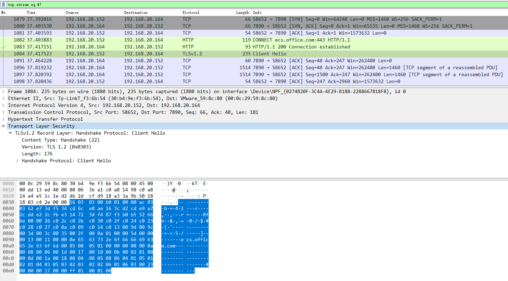

* TLS版本：1.2

* Length: 176

* 随机数: 34cd6ce8ae163cd2cde9a72cdde22cfbe314723df487f3b0b552666e

* 支持21中加密算法：

  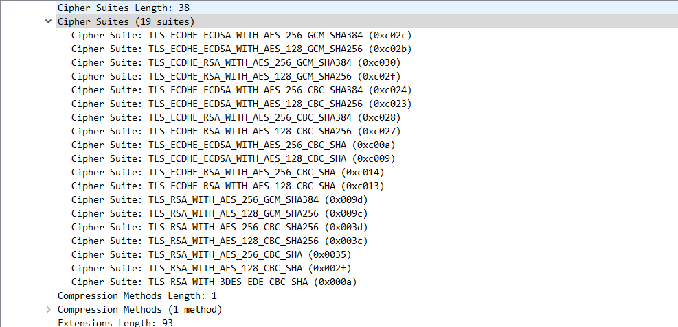


**Server Hello数据包：**

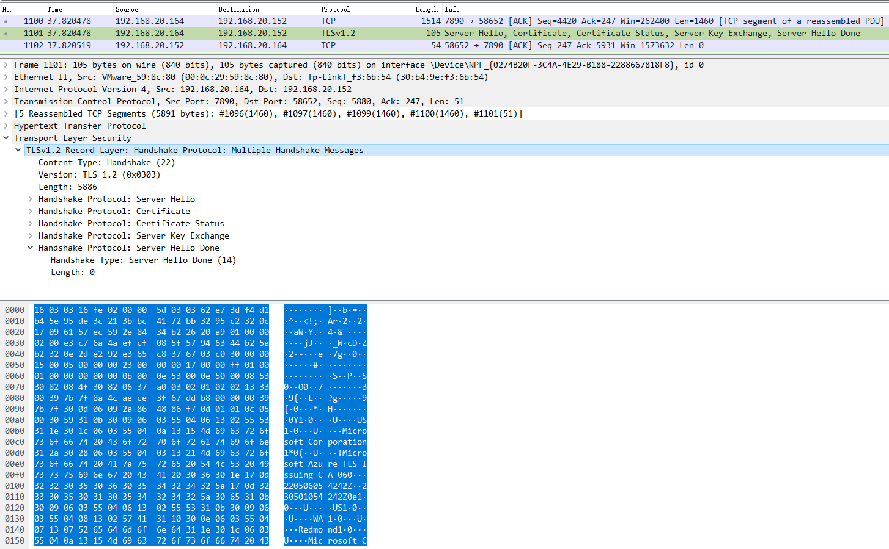


* TLS版本：1.2
* Length: 5886
* 服务端选择的加密套件：TLS_ECDHE_E+RSA_WITH_AES_256_GCM_SHA384(0xc030)
* Session ID: a90100000200e3c76a4aefcf085f57946344b25ab2320e2de292e365c8376703
* handshake type: Certificate(11)  握手协议为证书。如何从wireshark中到处服务器证书;
  * 在捕获的数据包中定位到Server Hello数据包
  * 展开Server Hello数据包到Handshake Protocl:Certificatet
  * 选择Certificates后， 文件->到处分组字节流， 保存到本地文件，文件格式.cer,即可
* HandShake protocol:Certificate Status： OSCP证书校验
* HandShake protocol: Server Key Exchange 握手协议
* HandShake protocol: Server Key Done. 表示Server Hello结束


**Client Key Exchange数据包：**

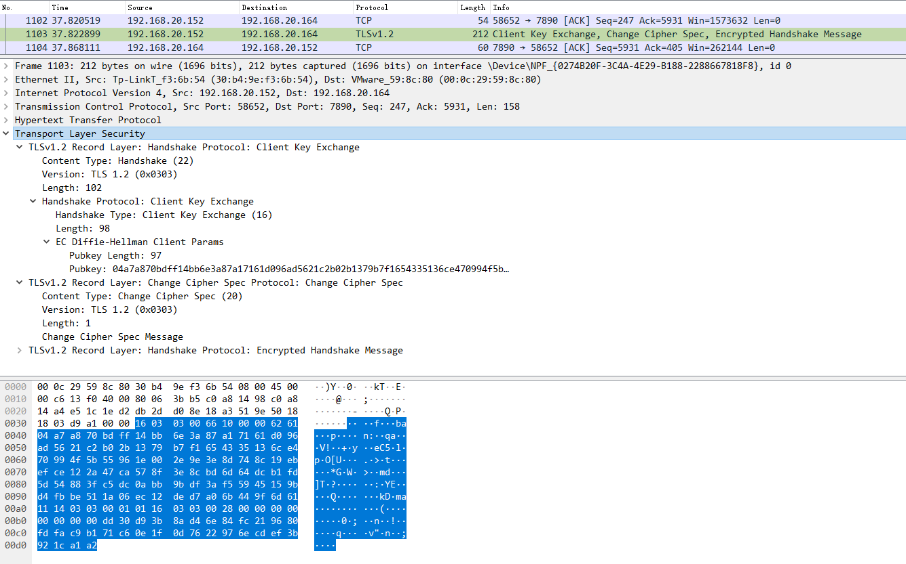

密钥交换数据包中包括3个TLS记录：Client key Exchange、Change Cipher Spec、Encrypted Handshake Message。

* TLSv1.2 Record Layer: HandShake Protocol： Client key Exchange
* TLSv1.2 Record Layer: Change Cipher Spec Protocol：Change Cipher Spec
* TLSv1.2 Record Layer: HandShake Protocol： Encrypted Handshake Message

以上步骤完成后，整个握手过程也就结束了。接下来客户端与服务器端进入加密通信，即完全使用普通的HTTP协议，但是会使用“会话密钥”加密通信内容。

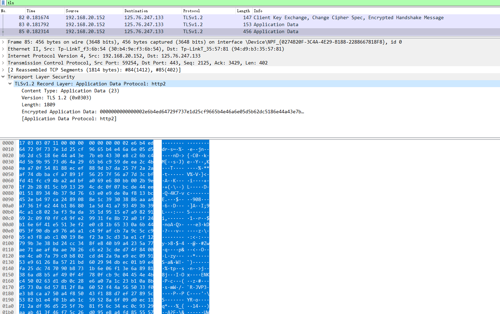


### 2.1.3 DNS协议

### 2.1.4 SMTP协议


### 2.1.5 NFS协议

### 2.1.6 DHCP协议

## 2.2 传输层协议

### 2.2.1 TCP协议

#### 1）TCP协议概述

> TCP 是一种面向连接的、可靠的、基于IP的传输层协议。
>
> 
>
> 主要目的是：为数据提供可靠的端到端的服务。在RFC793中定义，在OSI模型中属于第四层--传输层。能够处理数据的顺序和错误恢复，并且最终保证数据能够到达其应到达的地方。
>
> 
>
> 在通信过程中，通过三次握手建立连接，通信结束后通过四次挥手断开连接。在发送数据时，如果没有被正确的发送到目的地。将会被重新发送数据包。

TCP的端口：TCP端口就是TCP协议提供通信服务的端口。所有的TCP通信都会使用源端口和目标端口。在使用TCP端口的时候，由65536个端口可供使用，分成两部分：

* 标准端口组：1~1023。特定服务会用到这些通常位于标准服务分组中的端口。如：http服务80端口、HTTPs使用443端口，发FTP服务使用25号端口，SSH服务使用22号端口。
* 临时端口组：1024~65535。当一个服务想在任意的时间使用端口进行通信的时候，操作系统都会随机的选择这个源端口，让这个通信使用唯一的源端口。

#### 2）三次握手

TCP/IP协议中，TCP使用可靠的连接服务，通过三次握手建立一个连接。其中Seq表示请求序列、Ack表示确认序列、SYN和ACK为控制位。

* 第一次握手：客户端向服务端发送SYN报文（Seq=x,SYN=1）,进入SYN_SENT状态，等待服务器确认

* 第二次握手：分为两部分完成SYN+ACK

  * 服务器收到客户端的请求，向客户端回复一个确认信息ACK=x+1
  * 服务器向客户端再发送一个SYN报文（Seq=y)建立连接的请求，此时服务器进入SYN_RECV状态。

* 第三次握手：客户端收到服务端的回复（SYN+ACK报文）。此时客户端也向服务器端发送确认包ACK，此报文发送完毕后客户端和服务器端都进入ESTABLISHED状态，完成三次握手

  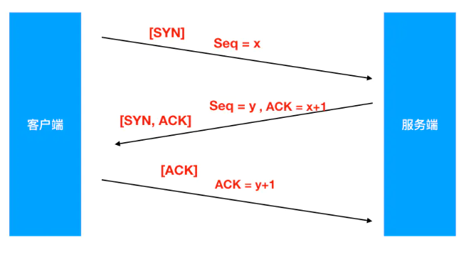

#### 3）四次挥手

* 客户端通过发送一个设置了FIN和ACK标志的TCP数据包告诉服务器通信已经完成

* 服务器收到客户端发送的数据包后，发送一个ACK数据包来响应客户端

* 服务器在向客户端发送一个传输自己的FIN/ACK数据包

* 客户端收到服务器的FIN/ACK包时，响应一个ACK数据包，然后结束通信过程。

  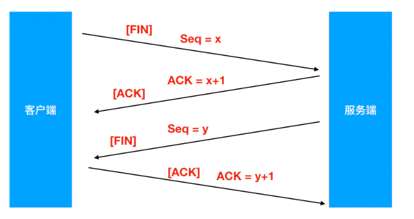

#### 4）TCP重置


#### 5）TCP数据包

**TCP 首部格式**

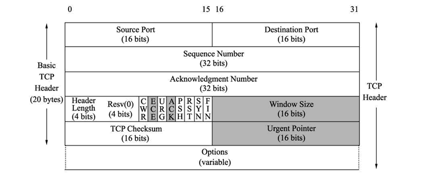

TCP首部各个字段含义：

* 源端口
* 目标端口：
* 序号：
* 确认号：
* 保留：
* 标记：
* 窗口大小：
* 校验和：
* 紧急指针：
* 选项： 各种可选的域，可以在TCP数据包中进行指定，主要有URG、ACK、PSH、RST、SYN、FIN共6种。
  * URG：
  * ACK：
  * RST：
  * PSH：
  * SYN：
  * FIN：

**第一次握手报文：**客户端发送SYN报文

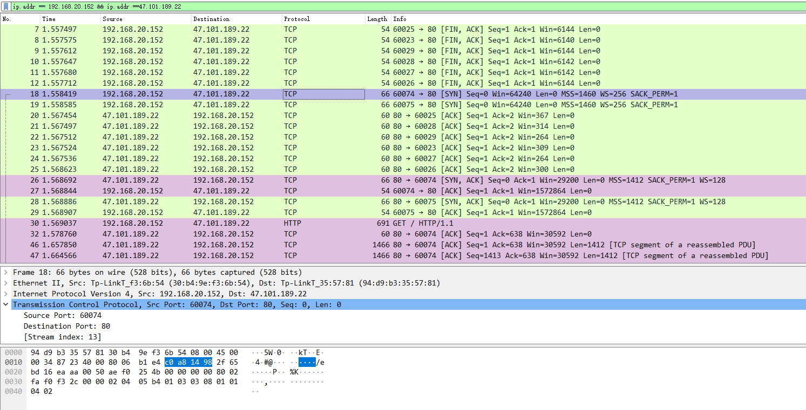


**第二次握手报文**：服务端发送SYN， ACK+1

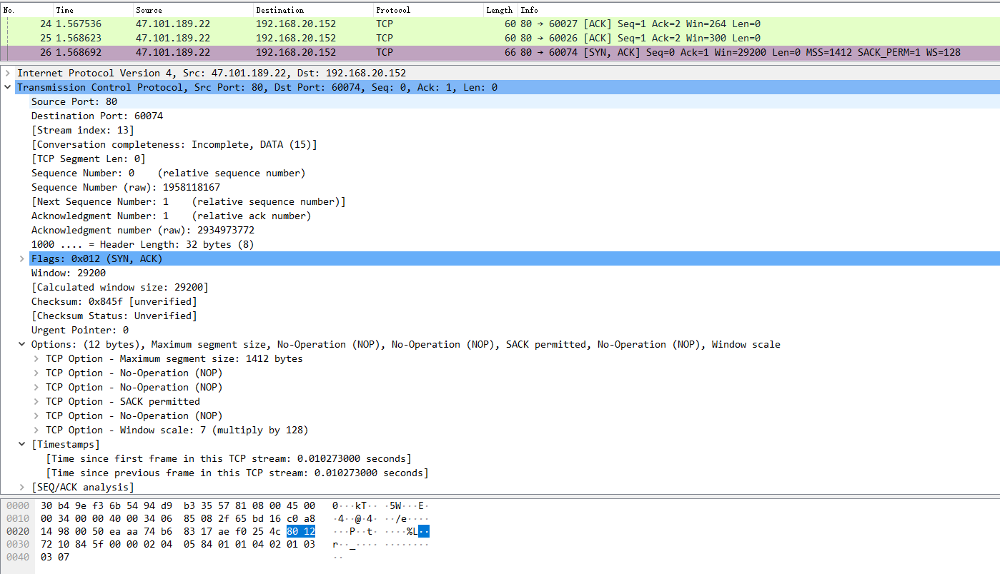

**第三次握手报文**：客户端发送ACK报文

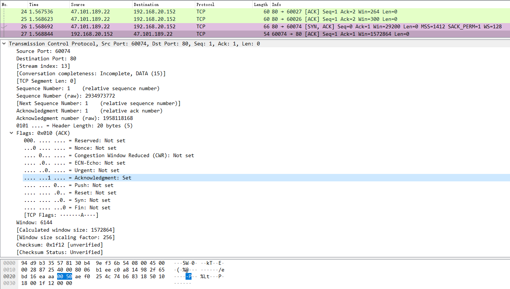

### 2.2.2 UDP协议

> UDP 协议是一种无连接的协议。该协议工作在OSI模型中的第四层（传输层）。处于IP协议的上一层。传输层的功能是建立“端口到端口”的通信。
>
> 
>
> UDP协议主要作用是将网络数据流量压缩成数据包的形式。一个典型的数据包就是一个二进制的传输单位。每一个数据包的前8个字节用来包含头部信息，剩余字节则用来包含具体的传输数据。
>
> 
>
> 应用举例：在屏幕上报告股票市场、显示航班信息、在路由协议RIP中修改路由表、包括QQ聊天、视频、网络电视、网络视频会议系统在内的众多客户/服务器模式的产品应用。

#### 1）UDP协议的特点

UDP使用底层的互联网协议来传送报文，同IP一样提供不可靠的无连接传输服务。具有以下特点：

* UDP是无连接的：在传输数据之前源端口和目标端口不建立传输服务。在发送端，UDP传输数据的速度仅仅是收到应用程序生成数据块的速度、计算机能力和带宽限制。在服务端UDP将消息放到队列中，应用程序每次从队列中读取一个消息段。
* 不建立连接，不需要维护连接状态。一台服务器可以同时向多个客户机传输相同的数据
* UDP信息包的标题很短，只有8个字节。TCP20个字节
* 吞吐量不受拥挤控制算法的调节，只收到应用软件生成数据的速率、传输带宽、源端和目标端主机性能的限制
* UDP使用尽最大的努力交付，不保证可靠交付
* UDP是面向报文的。由应用层下来的报文，只添加首部就可以向下传送给IP层。不拆分也不合并。因此应用程序需要选择合适的报文大小

#### 2）UDP数据包

**UDP首部格式**

UDP数据报由首部和数据两部分组成。在首部定义了发出端口和接收端口，数据部分就是具体的内容。其中首部共8个字节，总长度不超多65536字节。

* 源端口（2字节）： 用来传输数据包的端口
* 目标端口（2字节）：数据包将要被传输到的端口
* 数据报长度（2字节）：数据报的字节长度
* 校验和（2字节）：用来确保UDP首部和数据到达时的完整性
* 数据：被UDP封装进去的数据，包含应用层协议的头部和用户发送的数据

**UDP数据包**

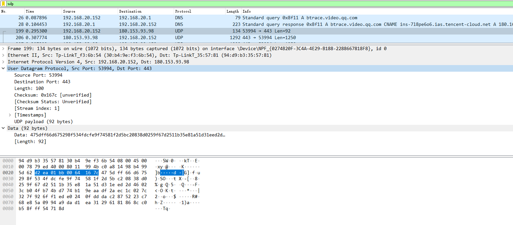

## 2.3 网络层协议

网络层：IP、ICMP、ARP、RARP、OSPF、IPX、RIP、IGRP、 （路由器） 

网络层：负责数据包从源到宿的传递和网际互连（包PackeT） 

### 2.3.1 ARP协议

> ARP(Address Resolution Protocol, 地址解析协议)根据IP地址获取物理地址的一个TCP/IP协议。由于IP在OSI中第三层-传输层，　MAC地址在OSI中第二层-数据链路层。彼此不直接通信。通过以太网发送IP数据包时，需要先封装第三层和第二层的报头。但是由于发送数据时只知道目标IP地址，不知道其MAC地址，又不能直接跨越二三层，所以需要使用ARP协议。
>
> 
>
> 在OSI模型中ARP协议属于链路层；而在TCP/IP模型中ARP协议属于网络层。

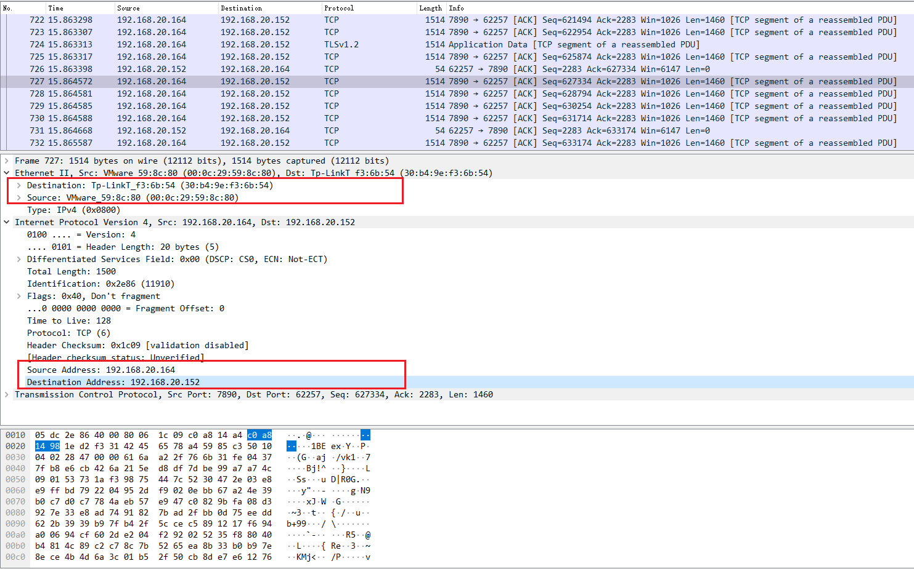


#### 1）ARP工作流程

ARP工作过程分为两个阶段，一个是ARP请求过程，一个是ARP响应过程。

- 当主机1向发送数据给主机2时，首先在自己本地ARP缓存中检查主机2匹配的MAC地址
- 如果在主机１的ARP缓存中没有找到主机２的MAC地址，他将询问主机２的MAC地址。从而将ARP的请求帧广播到本地网络上的所有主机。该帧中包含主机１的IP和MAC地址。本地网络上的主机都会收到ARP请求，并检查是否与自己的IP地址匹配，如果不匹配，则丢弃ARP请求
- 主机２确定ARP请求中的IP地址与自己的IP一致，则将主机１的MAC地址添加到自己的ARP缓存中
- 主机２将包含主机２MAC地址的ARP请求直接发送给主机1（单播）
- 主机1收到主机2的ARP回复消息时，会将主机2的MAC地址添加到自己的ARP缓存表中。本机的ARP缓存表是有周期的，有效期一般默认是120s。
- 当确定主机2的MAC地址后，主机1就可以与主机2 进行通信了。

#### 2）ARP缓存表

ARP缓存表包含一个或者多个表，用于存储IP地址及其经过解析的MAC地址。局域网中的每一台主机中都有一个ARP缓存表，保存了多个ARP条目。每个条目都是一个由IP地址和一个对应的MAC地址组成的。这样多个ARP条目就组成了一个ARP缓存表。

ARP缓存表维护工具1:Arp

```bash
C:\Users\blackwin>arp

显示和修改地址解析协议(ARP)使用的“IP 到物理”地址转换表。

ARP -s inet_addr eth_addr [if_addr]
ARP -d inet_addr [if_addr]
ARP -a [inet_addr] [-N if_addr] [-v]

  -a            通过询问当前协议数据，显示当前 ARP 项。
                如果指定 inet_addr，则只显示指定计算机
                的 IP 地址和物理地址。如果不止一个网络
                接口使用 ARP，则显示每个 ARP 表的项。
  -g            与 -a 相同。
  -v            在详细模式下显示当前 ARP 项。所有无效项
                和环回接口上的项都将显示。
  inet_addr     指定 Internet 地址。
  -N if_addr    显示 if_addr 指定的网络接口的 ARP 项。
  -d            删除 inet_addr 指定的主机。inet_addr 可
                以是通配符 *，以删除所有主机。
  -s            添加主机并且将 Internet 地址 inet_addr
                与物理地址 eth_addr 相关联。物理地址是用
                连字符分隔的 6 个十六进制字节。该项是永久的。
  eth_addr      指定物理地址。
  if_addr       如果存在，此项指定地址转换表应修改的接口
                的 Internet 地址。如果不存在，则使用第一
                个适用的接口。
示例:
  > arp -s 157.55.85.212   00-aa-00-62-c6-09.... 添加静态项。
  > arp -a                                  .... 显示 ARP 表。
```

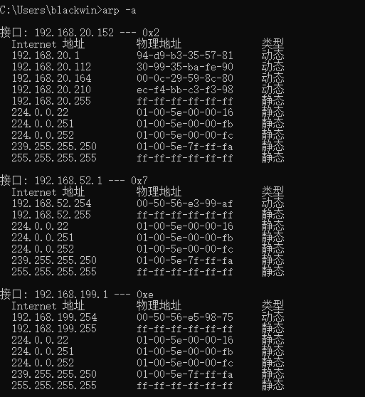


ARP缓存表维护工具2: netsh：

```bash
C:\Users\blackwin>netsh -h

用法: netsh [-a AliasFile] [-c Context] [-r RemoteMachine] [-u [DomainName\]UserName] [-p Password | *]
             [Command | -f ScriptFile]

下列指令有效:

此上下文中的命令:
?              - 显示命令列表。
add            - 在项目列表上添加一个配置项目。
advfirewall    - 更改到 `netsh advfirewall' 上下文。
branchcache    - 更改到 `netsh branchcache' 上下文。
bridge         - 更改到 `netsh bridge' 上下文。
delete         - 在项目列表上删除一个配置项目。
dhcpclient     - 更改到 `netsh dhcpclient' 上下文。
dnsclient      - 更改到 `netsh dnsclient' 上下文。
dump           - 显示一个配置脚本。
exec           - 运行一个脚本文件。
firewall       - 更改到 `netsh firewall' 上下文。
help           - 显示命令列表。
http           - 更改到 `netsh http' 上下文。
interface      - 更改到 `netsh interface' 上下文。
ipsec          - 更改到 `netsh ipsec' 上下文。
lan            - 更改到 `netsh lan' 上下文。
mbn            - 更改到 `netsh mbn' 上下文。
namespace      - 更改到 `netsh namespace' 上下文。
netio          - 更改到 `netsh netio' 上下文。
p2p            - 更改到 `netsh p2p' 上下文。
ras            - 更改到 `netsh ras' 上下文。
rpc            - 更改到 `netsh rpc' 上下文。
set            - 更新配置设置。
show           - 显示信息。
trace          - 更改到 `netsh trace' 上下文。
wcn            - 更改到 `netsh wcn' 上下文。
wfp            - 更改到 `netsh wfp' 上下文。
winhttp        - 更改到 `netsh winhttp' 上下文。
winsock        - 更改到 `netsh winsock' 上下文。
wlan           - 更改到 `netsh wlan' 上下文。

下列的子上下文可用:
 advfirewall branchcache bridge dhcpclient dnsclient firewall http interface ipsec lan mbn namespace netio p2p ras rpc trace wcn wfp winhttp winsock wlan

若需要命令的更多帮助信息，请键入命令，接着是空格，
后面跟 ?。
```

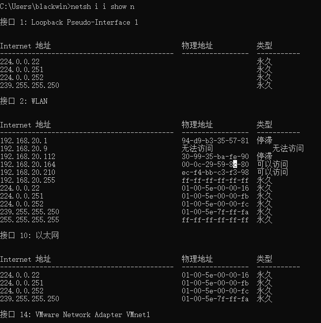


#### 3）ARP数据报

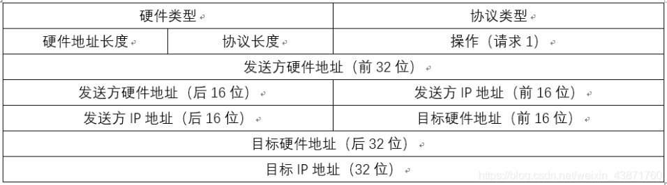

ARP请求报文和响应报文格式基本一致，不同的是：

* 响应报文中以太网头部的目标MAC地址为发送ARP协议地址解析请求的MAC地址
* 源MAC地址为被解析的主机MAC地址
* 操作类型字段为2，表示ARP协议应答数据报
* 目标MAC地址被填充为目标MAC地址

ARP请求报文

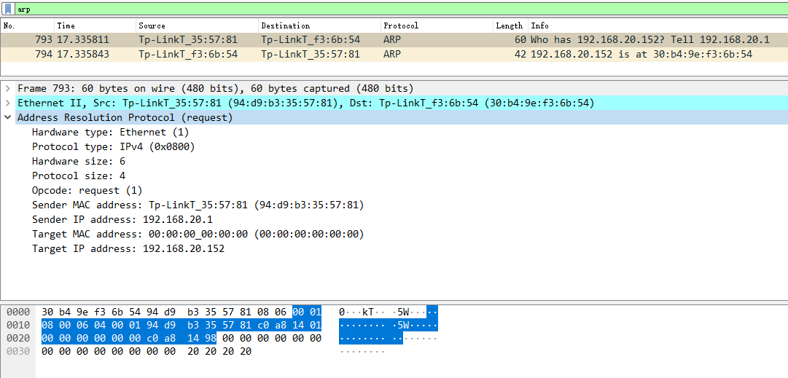

ARP响应报文

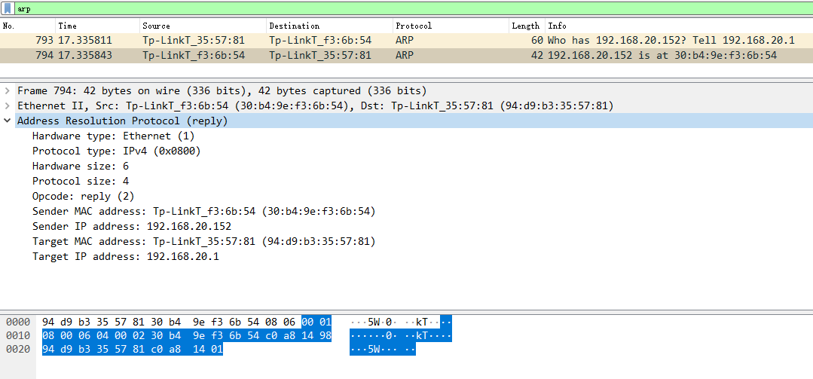


### 2.3.2 IP协议

> 互联网协议IP是Internet　Protocol的缩写。IP协议位于OSI模型中的第三层--网络层。主要目的是使得网络间能够互联通信。
>
> 
>
> 每台计算机有两中地址：　MAC地址（绑定在网卡上的）、网络地址（IP地址，由管理员分配的），两者没有任何关联。

IP地址分为IPv４和IPv６两大类，目前IPv４地址池已经耗尽。

#### １）IPv4地址

该类地址由32个二进制位组成，用来标识连接到网络上的设备。方便起见，使用点分十进制表示。每一个IP地址由两部分构成：网络地址和主机地址。

*　网络地址：用来标识设备所连接到的局域网
*　主机地址：标识这个网络中的设备本身。

子网掩码：表示子网络特征的一个参数。形式同３２位IP地址，也采用点分十进制标识。一般为255.255.0.0、255.255.255.0

IP无类型域间选路（CIDR）：一个完整的IP地址、一个左斜杠/，以及一个用来表示IP地址中网络部分位数的数字，形式如：10.10.1.22/16（子网掩码为255.255.0.0），　10.10.1.22/24（子网掩码为255.255.255.0）

#### 2）IPv6地址


#### 3）IP数据报格式

IP数据报是一个与硬件无关的虚拟包。由首部和数据两部分组成，首部主要包括版本、长度和IP地址等信息，首部长度为20～60字节，整个数据报最大长度65535字节，但是由于以太网数据报的数据部分最大长度为1500字节，如果IP的数据报超过了1500字节就需要分割以几个以太网数据报分开发送了。数据部分一般是用来传送的其他协议，如TCP、UDP和ICMP等。

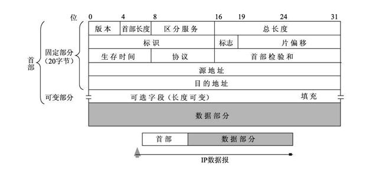

* 版本：占 4 位，表示 IP 协议的版本。通信双方使用的 IP 协议版本必须一致。目前广泛使用的IP协议版本号为 4，即 IPv4。
* 首部长度：占 4 位，可表示的最大十进制数值是 15。
* 区分服务：也被称为服务类型，占 8 位，用来获得更好的服务。
* 总长度：用来标识数据报，占 16 位。IP 协议在存储器中维持一个计数器。每产生一个数据报，计数器就加 1，并将此值赋给标识字段。当数据报的长度超过网络的 MTU，而必须分片时，这个标识字段的值就被复制到所有的数据报的标识字段中。具有相同的标识字段值的分片报文会被重组成原来的数据报。
* 标识：用来标识数据报，占 16 位。IP 协议在存储器中维持一个计数器。每产生一个数据报，计数器就加 1，并将此值赋给标识字段。当数据报的长度超过网络的 MTU，而必须分片时，这个标识字段的值就被复制到所有的数据报的标识字段中。具有相同的标识字段值的分片报文会被重组成原来的数据报。
* 标志：占 3 位。第一位未使用，其值为 0。第二位称为 DF（不分片），表示是否允许分片。取值为 0 时，表示允许分片；取值为 1 时，表示不允许分片。第三位称为 MF（更多分片），表示是否还有分片正在传输，设置为 0 时，表示没有更多分片需要发送，或数据报没有分片。
* 片偏移：占 13 位。当报文被分片后，该字段标记该分片在原报文中的相对位置。片偏移以 8 个字节为偏移单位。
* 生存时间TTL：表示数据报在网络中的寿命，占8位。该字段由发出数据报的源主机设置。其目的是防止无法交付的数据报无限制地在网络中传输，从而消耗网络资源。
* 协议：表示该数据报文所携带的数据所使用的协议类型，占8位。TCP的协议号为6，UDP的协议号为17，ICMP的协议号为1。
* 首部校验和：用于校验数据报的首部，占 16 位。数据报每经过一个路由器，首部的字段都可能发生变化（如TTL），所以需要重新校验。而数据部分不发生变化，所以不用重新生成校验值。
* 源地址：表示数据报的源 IP 地址，占 32 位。
* 目的地址：表示数据报的目的 IP 地址，占 32 位
* 可选字段： 该字段用于一些可选的报头设置，主要用于测试、调试和安全的目的。这些选项包括严格源路由（数据报必须经过指定的路由）、网际时间戳（经过每个路由器时的时间戳记录）和安全限制。
* 填充：由于可选字段中的长度不是固定的，使用若干个 0 填充该字段，可以保证整个报头的长度是 32 位的整数倍。
* 数据部分：表示传输层的数据，如保存 TCP、UDP、ICMP 或 IGMP 的数据。数据部分的长度不固定。


IP分片：将一个数据流分为更小的片段，用于解决跨域不同类型网络时可靠传输的一个特性。一个数据报的分片主要是基于第二层数据链路层所使用的最大传输单元MTU大小。多数情况下，第二层使用的数据链路层协议是以太网，以太网MTU是1500.也即以太网上能传输的最大的数据报大小是1500字节，不包括14字节的以太网头部信息。一个数据报分片的步骤：

-　设备将数据分割为若干可成功进行传输的数据包
-　每个IP首部的总长度域会修改为每个分片的片段长度
-　更多分片标志将会在数据流的所有数据报中设置为1，除最后一个数据包外
-　IP头部分片部分偏移会被设置
-　数据包被发送出去

#### 4）IP数据包解析

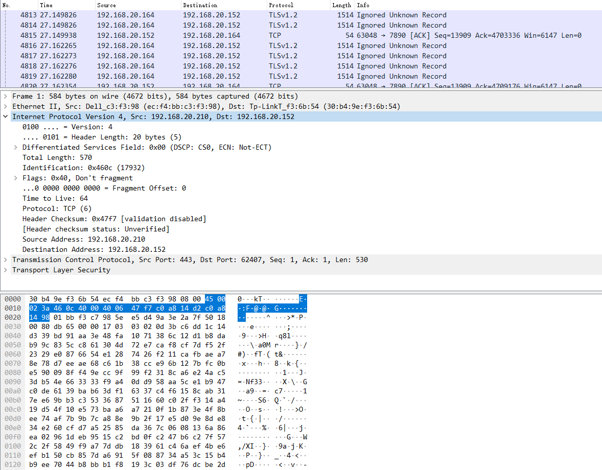

### 2.3.3 ICMP协议


## 2.4 链路层协议

 数据链路：PPP、FR、HDLC、VLAN、MAC （网桥，交换机）  

 数据链路层：将比特组装成帧和点到点的传递（帧Frame） 

## 2.5 会话层

会话层：NFS、SQL、NETBIOS、RPC


# 3、针对网络协议的攻击

HTTP中间人劫持、

[网络攻击技术_城北programmer的博客-CSDN博客_网络攻击技术](https://blog.csdn.net/weixin_45629738/article/details/117588782)

## 3.1 阻塞类

拒绝服务攻击(DenialofService,DoS)是典型的阻塞类攻击,常见的方法有TCP SYN洪泛攻击、Land攻击、Smurf攻击、电子邮件炸弹等。

**ICMP洪水、UDP洪水：**


**Smurf攻击：**

**泪滴攻击：**

## 3.2 探测类

主要包括扫描技术、体系结构刺探、系统信息服务收集等。目前正在发展更先进的网络无踪迹信息探测技术。


## 3.3 欺骗类

[TCP/IP网络协议攻击 - 2017dong - 博客园 (cnblogs.com)](https://www.cnblogs.com/lidong20179210/p/8747654.html)

DNS污染、ARP欺骗、IP欺骗、伪造电子邮件

ICMP 重定向攻击

- ARP缓存欺骗攻击
- ICMP重定向攻击
- SYN FLOOD攻击
- TCP RST攻击
- TCP会话劫持攻击
- Netwox原始报文伪造工具

[DNS的5种攻击形式和应对举措_安全_Michael Soikis_InfoQ精选文章](https://www.infoq.cn/article/99aGZWZLewtVqJvgRtTh)
