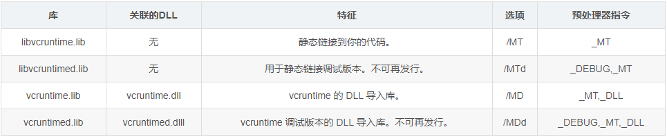
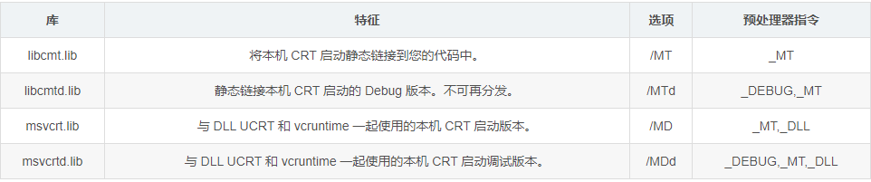
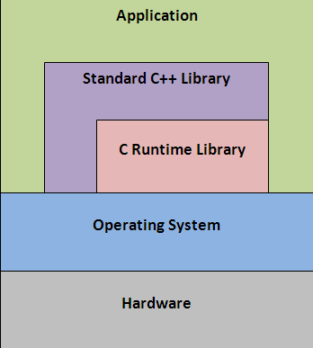
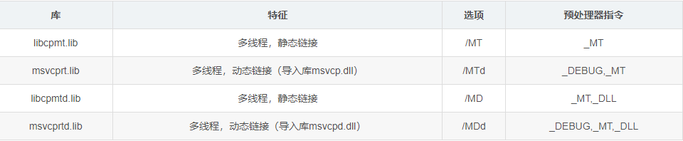

接触C/C++已经有好几年了，但都是在Windows平台下面使用C/C++做开发。对于其中有些问题已知很困惑，本文主要解决C/C++编程语言部分具体由哪些内容、在不同平台下使用C/C++编程的差异性以及与操作系统API之间的关系。

## 1、C/C++内容

### 1.1 C

为了提高C语言的开发效率，C标准定义了一系列常用的函数，称为C库函数。C标准仅仅定义了函数原型，并没有提供实现。因此这个任务留给了各个支持C语言标准的编译器。每个编译器通常实现了标准C的超集，称为C运行时库（C Run Time Library），简称CRT。

#### 1.1.1 C标准库

c标准库，是针对c语言本身来说的，与平台无关。截至c11标准，它共包含29个头文件。

- C89中有15个标准头文件
- C90和C89除排版上的某些细节不同，技术上相同
- C95增加了3个标准头文件
- C99增加了6个标准头文件
- C11增加了5个标准头文件
- C17无

C语言函数手册也称为C标准库。C标准库由在15个头文件中声明的函数、类型定义和宏组成，每个头文件都代表了一定范围的编程功能。C标准库可以分为 3 组，如何正确并熟练的使用它们，可以相应的可区分出 3 个层次的程序员：
合格程序员：<stdio.h>、<ctype.h>、<stdlib.h>、<string.h>
熟练程序员：<assert.h>、<limits.h>、<stddef.h>、<time.h>
优秀程序员：<float.h>、<math.h>、<error.h>、<locale.h>、<setjmp.h>、<signal.h>、<stdarg.h>

| 编号	| 头文件	  |     C标准版本	|   简介    | 
| ---- | ---- | ---- | ----|
|1	    |<assert.h>	  | C89/C90	       |条件编译宏，将参数与零比较|
|2	    |<ctype.h>	  | C89/C90	       |用来确定包含于字符数据中的类型的函数|
|3	    |<errno.h>	  |  C89/C90	       |报告错误条件的宏|
|4	    |<float.h>	  |  C89/C90	       |浮点数类型的极限|
|5	    |<limits.h>	  |  C89/C90	       |基本类型的大小|
|6	    |<locale.h>	  |  C89/C90	       |本地化工具|
|7	    |<math.h>	  |  C89/C90	       |常用数学函数|
|8	    |<setjmp.h>	  |  C89/C90	       |非局部跳转|
|9	    |<signal.h>	  |  C89/C90	       |信号处理|
|10	    |<stdarg.h>	  |  C89/C90	       |可变参数|
|11	    |<stddef.h>	  |  C89/C90	       |常用宏定义|
|12	    |<stdio.h>	  |  C89/C90	       |输入/输出|
|13	    |<stdlib.h>	  |  C89/C90	       |基础工具：内存管理、程序工具、字符串转换、随机数|
|14	    |<string.h>	  |  C89/C90	       |字符串处理|
|15	    |<time.h>	  |  C89/C90	       |时间/日期工具|
|16	    |<iso646.h>	  |  C95	           |符号的替代写法|
|17	    |<wchar.h>	  |  C95	           |扩展多字节和宽字符工具|
|18	    |<wctype.h>	  |  C95	           |用来确定包含于宽字符数据中的类型的函数|
|19	    |<complex.h>|	    C99	       |    复数运算|
|20	    |<fenv.h>	  |  C99	           |浮点数环境|
|21	    |<inttypes.h>|	C99	           |整数类型的格式转换|
|22	    |<stdbool.h>|	    C99	       |    布尔类型|
|23	    |<stdint.h>	  |  C99	           |定宽整数类型|
|24	    |<tgmath.h>	  |  C99	           |泛型数学（包装 math.h 和 complex.h 的宏）|
|25	    |<stdalign.h>|	C11	           |alignas 与 alignof  便利宏|
|26	    |<stdatomic.h>|	C11	           |原子类型|
|27	    |<stdnoreturn.h>	|C11	       |    noreturn 便利宏|
|28	    |<threads.h>	 |   C11	       |    线程库|
|29	    |<uchar.h>	   | C11	           |UTF-16 和 UTF-32 字符工具                        |   

#### 1.1.2 C运行库

CRT(C/C++ Runtime Library)是支持C/C++运行的一系列函数和代码的总称。

不过如果没有了C Run-Time Library，main()就不会被调用，exit()也不能被响应。因为C Run-Time Library包含了C程序运行的最基本和最常用的函数。

c运行库，是和平台相关的，也就说和操作系统相关，windows系统有windows的运行库，linux有linux的运行库。c运行库，也就是c run time library(CRT) 是c语言中的概念，运行时库一般都是用汇编直接实现的。

**1）Windows平台**

**2）UNIX平台**

libc是Linux下原来的标准C库，也就是当初写hello world时包含的头文件#include < stdio.h> 定义的地方。

glibc运行库就是我们常说的Linux下的C运行库，这个库中包含了C 标准库以及其他的东西。C标准库有静态和动态两个/lib/libc.so.6 ， /usr/lib/libc.a. 当然这2个C标准库并不仅仅包含ANSIC定义的东西也包含了像线程之类的扩展的一些东西。glibc是Linux系统中最底层的API，几乎其它任何的运行库都要依赖glibc。 glibc最主要的功能就是对系统调用的封装，所以说 glibc 运行库是 标准C库的扩展。

### 1.2 C++

C++也定义了自己的标准，同时提供相关支持库，称为C++运行时库或C++标准库。由于C++对C的兼容性，C++标准库包括了C标准库，除此之外还包括了IO流和标准模板库STL。

#### 1.2.1 标准库

[C++17 - cppreference.com](https://en.cppreference.com/w/cpp/17)

C++ 标准库可以分为两部分：

- **标准函数库：** 这个库是由通用的、独立的、不属于任何类的函数组成的。函数库继承自 C 语言。
  - 输入/输出 I/O
  - 字符串和字符处理
  - 数学
  - 时间、日期和本地化
  - 动态分配
  - 其他
  - 宽字符函数
- **面向对象类库：** 这个库是类及其相关函数的集合。
  - 标准的 C++ I/O 类
  - String 类
  - 数值类
  - STL 容器类
  - STL 算法
  - STL 函数对象
  - STL 迭代器
  - STL 分配器
  - 本地化库
  - 异常处理类
  - 杂项支持库

在GNU/Linux上，我们使用的C++库都是GNU实现的libstdc++（/usr/lib/gcc/x86_64-linux-gnu/9/libstdc++.so、/usr/lib/gcc/x86_64-linux-gnu/9/libstdc++.a）；

在MacOS、iOS上，我们使用的C++库都是LLVM项目实现的libc++（/usr/lib/libc++.dylib）；

在Android上，我们使用的C++库为LLVM的libc++（NDK r18以前还是支持GNU的libstdc++的，在r18上被完全去除）；注意这可不是系统库，你需要将库文件包含在apk中（Android上的系统库是/system/lib/libstdc++.so，这不是GNU的那个，只包含了最小的C++ runtime实现，如new delete等）；

在Windows上，我们使用的C++库......算了，谁在乎呢，这年头谁还用windows呀。

#### 1.2.2 运行时库

**C++标准库STL**

C++ 世界里，有另外一个概念:Standard C++ Library，它包括了上面所说的C Run-Time Library和STL。包含C Run-Time Library的原因很明显，C++ 是 C 的超集，没有理由再重新来一个 C ++ run-time library。

如**string**、**cstdio**（注意，不带.h）是**C++****标准库**提供的。使用时要用**using namespace std**找开命名空间。

## 2、不同系统中的差异

### 2.1 Windows系统

在最低层的时候，根本连DLL这个概念都没有的，所以CRT的源代码只能做成lib，被静态链接。然后，随着Windows越做越复杂，Microsoft提出了API的概念，它提供Windows开发者一组接口，可以直接操作Windows，这就是Windows API了。当然，Windows API也是在CRT之上编写的。 

VC++完美的支持C和C++标准，因此也就按照C和C++标准定义的函数原型实现了上述运行时库。为了方便有不同需求的客户使用，VC++分别实现了动态链接库DLL版本和静态链接库LIB版本。同时为了支持程序调试且不影响程序的性能，又分别提供了对应的调试版本。调试版本的名称在Release版本名称后添加了字母d。

对于C运行时库CRT，VC6.0、VC2005、VC2008和VC2010均提供了DLL版本和LIB版本。 
上述各个编译器提供的LIB版的CRT库，均实现在libcmt.lib。对应的调试版名称为libcmtd.lib。

而DLL版本名称根据编译器不同而不同，我们可以从名称上加以分辨。 
　　VC6.使用的CRT库的DLL版本在MSVCRT.DLL中实现， 对应调试版本为MSVCRTD.LIB。 
　　VC2005使用的CRT库的DLL版本在MSVCR80.DLL中实现，对应调试版本为MSVCR80.DLL。 
　　VC2008使用的CRT库的DLL版本在MSVCR90.DLL中实现，对应调试版本为MSVCR90D.DLL。 
　　VC2010使用的CRT库的DLL版本在MSVCR100.DLL中实现，对应调试版本为MSVCR100D.DLL。 
　　VC2013使用的CRT库的DLL版本在MSVCR120.DLL中实现，对应调试版本为MSVCR120D.DLL。

#### 2.1.1 微软对C的实现

UCRT的库（通用UCRT）包含通过标准 C99 CRT 库导出的函数和全局函数。UCRT 现在是 Windows 组件，作为 Windows 10 和更高版本的一部分提供。

| 库	|关联的DLL	|特征|	选项|	预处理器指令|
| ---- | ---- | ---- | ----|----|
|libucrt.lib	|无	|将UCRT 静态链接到你的代码。| /MT |_MT|
|libucrtd.lib	|无	|用于静态链接的 UCRT 调试版本。不可再发行| /MTd |_DEBUG,_MT|
|ucrt.lib	|ucrtbase.dll	|UCRT 的 DLL 导入库。| /MD |_MT,_DLL|
|ucrtd.lib	|ucrtbased.dll	|UCRT 调试版本的 DLL 导入库。不可再发行。|/MDd|_DEBUG,_MT,_DLL|

vcruntime/VCRT库包含 Visual C++ CRT 实现特定的代码，例如异常处理和调试支持、运行时检查和类型信息、实现的详细信息和某些扩展的库函数。

实现CRT初始化和终止的库

#### 2.1.2 Visual C++

当您构建项目的发布版本时，默认情况下会链接基本 C 运行时库之一（libcmt.lib、msvcmrt.lib、msvcrt.lib）。如果您在代码中包含C++ 标准库头文件之一，则 C++ 标准库将在编译时由 Visual C++ 自动链接。

VC针对C++ 加入的Standard C++ Library主要包括：LIBCP.LIB, LIBCPMT.LIB和 MSVCPRT.LIB。 

对于C++标准库中的IO流和STL，VC6.0、VC2005、VC2008和VC2010也提供了DLL版本和LIB版本。 
　　LIB版均实现在libcpmt.lib中，对应的调试版本为libcpmtd.lib。 
不同版本的编译器实现的DLL也不相同。 
　　VC6.使用的C++类库的 DLL版本在MSVCP60.DLL中实现， 对应调试版本为MSVCP60D.LIB。 
　　VC2005使用的C++类库的DLL版本在MSVCP80.DLL中实现，对应调试版本为MSVCP80.DLL。 
　　VC2008使用的C++类库的 DLL版本在MSVCP90.DLL中实现，对应调试版本为MSVCP90D.DLL。 
　　VC2010使用的C++类库的DLL版本在MSVCP100.DLL中实现，对应调试版本为MSVCP100D.DLL。

### 2.2 Linux系统

在UNIX世界里，较常用的系统API是基于POSIX（portable operating systemn interface of unix）标准的。

glibc的发布版本主要由两部分组成：

一部分是头文件，比如stdio.h、stdlib.h等，它们往往位于/usr/include

另外一部分则是库的二进制文件部分。二进制部分主要的就是C语言标准库，它有静态和动态两个版本。

动态库位于/lib/libc.so.6；而静态标准库位于/usr/lib/libc.a。事实上glibc除了C标准库之外，还有几个辅助程序运行的运行库，这几个文件可以称得上是真正的“运行库”。它们就是/usr/lib/crt1.o、/usr/lib/crti.o和/usr/lib/crtn.o。

glibc即GNU C Library，是GNU旗下的C标准库。

在glibc成为Linux下的C运行库之前，从Linux内核代码里面分离出了一部分代码，形成了早期Linux下的C运行库。这个C运行库又被称为Linuxlibc。