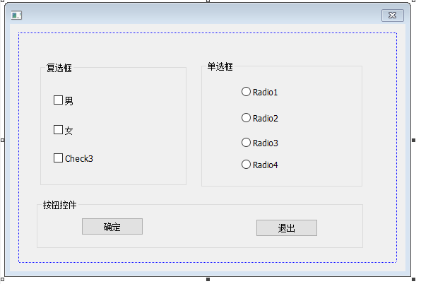
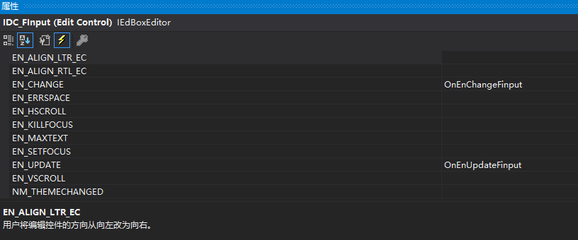
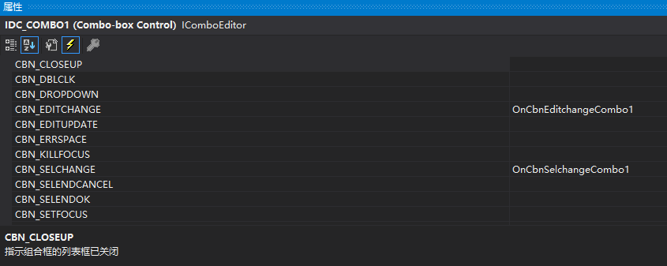
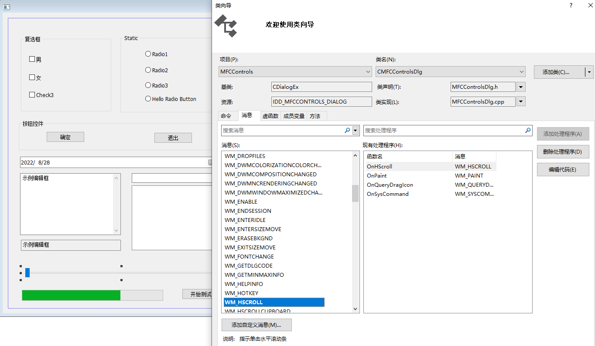
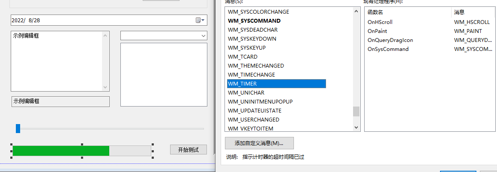
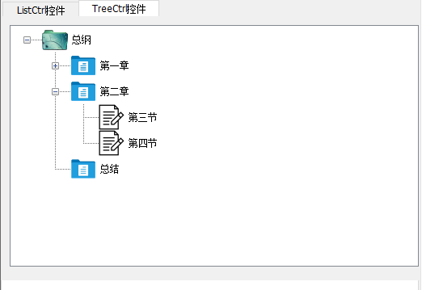
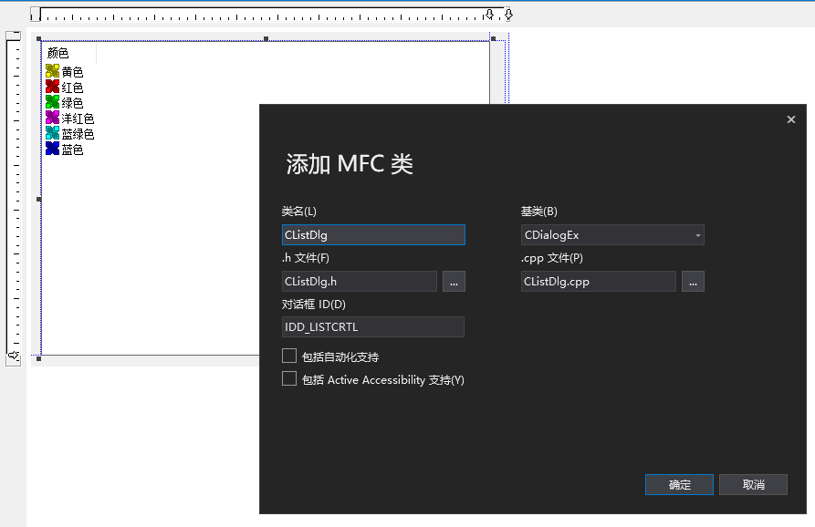
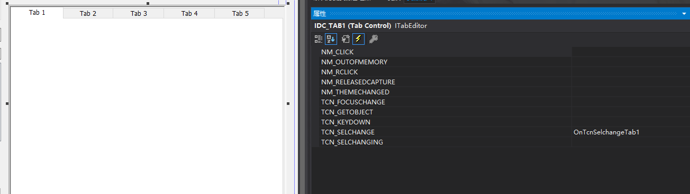

因偶尔会用MFC来开发一些小的工具，常常用到其中一些控件，这里大致梳理一下MFC中常用控件的使用方法和一些示例代码，避免每次都要重新学一遍MFC的尴尬。

[TOC]

**参考资料：**

- [VS2010/MFC编程入门教程之目录和总结](http://www.jizhuomi.com/software/257.html)
- [鸡啄米编程课堂-最适合程序员在线学习和参考的教程站](http://www.jizhuomi.com/school/)


### 1、按钮控件：Button

#### **1.1 控件介绍**

 MFC提供了CButton类封装按钮控件的所有操作。

按钮控件包括命令按钮（Button）、单选按钮（Radio Button）和复选框（Check Box）。具体来说就是下面这个样子：




#### **1.2 控件类常用的方法**

**1）控件支持的消息**

按钮控件会向父窗口发送通知消息，最常用的通知消息莫过于BN_CLICKED和BN_DOUBLECLICKED了。用户在按钮上单击鼠标时会向父窗口发送BN_CLICKED消息，双击鼠标时发送BN_DOUBLECLICKED消息。

**2）CButton类常用方法 **

void SetButtonStyle(UINT nStyle,BOOL bRedraw = TRUE)：设置按钮的风格。参数nStyle指定按钮的风格，bRedraw指定按钮是否重绘，为TRUE则重绘，否则不重绘，默认为重绘。 

**void SetCheck(int nCheck)**：设置按钮的选择状态。参数nCheck为0表示未选中状态，1表示选中状态，2表示不确定状态（仅用于复选框）。

**int GetCheck( ) const**：获取按钮的选择状态。返回值的意义同SetCheck函数的nCheck参数。

**HICON SetIcon(HICON hIcon)：** 设置要在按钮上显示的图标。参数hIcon指定了图标的句柄。返回值为按钮原来图标的句柄。

具体可参考MSDN手册。

#### **1.3 控件的使用步骤 ** 

**1）控件的使用步骤**

a. 在项目中添加按钮控件。可手动创建按钮类性变量（复杂），也可以值直接在工具箱中选择（简单）。

b. 修改控件名称，给控件添加CButton类型变量（选择控件，右键添加变量）

c. 在控件坐在对话框窗口对应的初始化函数OnInitDialog中对控件变量进行一些设置。如使用EnableWindows方法设置窗口是否禁用、使用SetCheck方法设置窗口选中状态等。

d. 给控件添加事件响应，在事件处理函数中完成对应的操作。

**2）为控件添加事件响应**

**对以上按钮控件的操作主要包括：设置按钮的属性、设置/获取按钮的状态值、添加事件响应。在普通的按钮控件上双击就可跳转到其事件响应函数中，编写我们的事件处理函数**（按钮控件的事件处理函数如下）

```c++
void CMFCControlsDlg::OnBnClickedButton1()
{
	// TODO: 在此添加控件通知处理程序代码
	if (m_man.GetCheck()) {
		MessageBox(_T("1"), _T("按中了"), MB_OK);
	}
	if (m_woman.GetCheck())
	{
		MessageBox(_T("2"), _T("按中了"), MB_OK);
	}

}
```


### 2、编辑框：Edit Control

#### **2.1 控件介绍**


MFC为编辑框提供了CEdit类。编辑框的所有操作都封装到了CEdit类中。

编辑框（Edit Control）是一种很常用的控件，我们可以在编辑框中输入并编辑文本。

#### **2.2 控件类常用的方法**

**1）控件支持的消息**

编辑框发生某些事件时会向父窗口发送通知消息。在对话框模板中的编辑框上点右键，选择“Add Event Handler”，为编辑框添加消息处理函数时，可以在“Message type”列表中看到这些消息。

> EN_CHANGE：编辑框的内容被用户改变了，与EN_UPDATE 不同，该消息是在编辑框显示的正文被刷新后才发出的EN_ERRSPACE： 编辑框控件无法申请足够的动态内存来满足需要
> EN_HSCROLL： 用户在水平滚动条上单击鼠标
> EN_KILLFOCUS： 编辑框失去输入焦点
> EN_MAXTEXT：输入的字符超过了规定的最大字符数。在没有ES_AUTOHSCROLL 或
> ES_AUTOVSCROLL： 的编辑框中，当正文超出了编辑框的边框时也会发出该消息
> EN_SETFOCUS： 编辑框获得输入焦点
> EN_UPDATE： 在编辑框准备显示改变了的正文时发送该消息
> EN_VSCROLL： 用户在垂直滚动条上单击鼠标

**2）CEdit类常用方法 **

**int LineFromChar(int nIndex = &ndash;1) const;**返回多行编辑框中指定索引的字符所在行的行号（从零开始），只适用于多行编辑框。nIndex等于-1则返回所选择正文的第一个字符所在行的索引。如果没有选择正文，则返回当前行的行号。

**int LineIndex(int nLine = &ndash;1) const;**返回由nLine指定行的起始字符在编辑框的整个字符串中的索引，只适用于多行编辑框。如果指定行超过编辑框的最大行数，则返回-1，而如果nLine为-1，则返回当前插入符所在行的起始字符的索引。

**void ReplaceSel(LPCTSTR lpszNewText,BOOL bCanUndo = FALSE)**; 用lpszNewText指向的字符串来替换选择的正文。如果bCanUndo为TRUE则替换可以被撤销。

**UINT GetLimitText( ) const**;获取编辑框能够接受的正文的最大字节数。

**void LimitText(int nChars = 0)**:设置用户在编辑框中可以输入的正文的最大长度（字节数）。如果nChars为0，则最大长度为UINT_MAX个字节。

使用编辑框最重要的莫过于，获取和设置编辑框中的正文，它们对应的成员函数分别是GetWindowText和SetWindowText，这两个函数都是继承自CWnd类的成员函数，另外，还可以使用CWnd类的GetWindowTextLength函数获取编辑框中正文的长度。

**在多行编辑中，设置CEdit自动换行：**

- 必须设置Vertical Scrollbar = TRUE
- 必须设置MultiLine = TRUE
- 必须设置Horizontal Scrollbar = FALSE
- 必须设置Auto HScroll = FALSE

#### **2.3 控件的使用步骤** 

a. 在项目中使用工具箱，添加CEDit控件

b. 修改控件名称，给控件添加CEDit类型变量

c. 选中控件右键属性，在消息项中添加对应的消息处理函数

d. 在消息处理函数中实现具体的功能

```C++
void CMFCControlsDlg::OnEnChangeFinput()
{
	// TODO:  如果该控件是 RICHEDIT 控件，它将不
	// 发送此通知，除非重写 CDialogEx::OnInitDialog()
	// 函数并调用 CRichEditCtrl().SetEventMask()，
	// 同时将 ENM_CHANGE 标志“或”运算到掩码中。

	// TODO:  在此添加控件通知处理程序代码
	DWORD  len = m_edit.LineLength(-1);
	CString str1;
	str1.Format(_T("%d"), len);
	m_edit_len.SetWindowTextW(_T("输入文本长度：") + str1);
	UpdateData(FALSE);
}
```


### 3、组合框：Combo Box

#### **3.1 控件介绍**

MFC将组合框控件的所有操作都封装到了CComboBox类中。

组合框其实就是把一个编辑框和一个列表框组合到了一起，分为三种：简易（Simple）组合框、下拉式（Dropdown）组合框和下拉列表式（Drop List）组合框：

-  简易组合框中的列表框是一直显示的
- 下拉式组合框默认不显示列表框，只有在点击了编辑框右侧的下拉箭头才会弹出列表框
- 下拉列表式组合框的编辑框是不能编辑的，只能由用户在下拉列表框中选择了某项后，在编辑框中显示其文本


#### **3.2 控件类常用的方法**

**1）控件支持的消息**

组合框被用户操作时，会向父窗口发送如下的消息：

> CBN_CLOSEUP：组合框的列表框组件被关闭，简易组合框不会发送该通知消息
> CBN_DBLCLK：用户在某列表项上双击鼠标，只有简易组合框才会发送该通知消息
> CBN_DROPDOWN：组合框的列表框组件下拉，简易式组合框不会发送该通知消息
> CBN_EDITUPDATE：在编辑框准备显示改变了的正文时发送该消息，下拉列表式组合框不会发送该消息
> CBN_EDITCHANGE：编辑框的内容被用户改变了，与CBN_EDITUPDATE不同，该消息是在编辑框显示的正文被刷新后才发出的，下拉列表式组合框不会发送该消息
> CBN_ERRSPACE：组合框无法申请足够的内存来容纳列表项
> CBN_SELENDCANCEL：表明用户的选择应该取消，当用户在列表框中选择了一项，然后又在组合框控件外单击鼠标时就会导致该消息的发送
> CBN_SELENDOK：用户选择了一项，然后按了回车键或单击了下滚箭头，该消息表明用户确认了自己所作的选择
> CBN_KILLFOCUS：组合框失去了输入焦点
> CBN_SELCHANGE：用户通过单击或移动箭头键改变了列表的选择
> CBN_SETFOCUS：组合框获得了输入焦点

**2）CComboBox类常用方法 **

**int GetCount( ) const**; 取组合框控件的列表框中列表项的数量。

**int GetCurSel( ) const **;获取组合框控件的列表框中选中项的索引，如果没有选中任何项，该函数返回CB_ERR。

**int SetCurSel(int nSelect);**  在组合框控件的列表框中选择某项。nSelect参数指定了要选择的列表项的索引，如果为-1则列表框中当前选择项被取消选中，编辑框也被清空。

**void GetLBText(int nIndex,CString& rString) const;** 从组合框控件的列表框中获取某项的字符串。nIndex参数指定要获取字符串的列表项的索引，CString参数用于接收取到的字符串。

**int GetLBTextLen(int nIndex) const;** 获取组合框控件的列表框中某项的字符串长度。nIndex参数指定要获取字符串长度的列表项的索引。 

**int AddString(LPCTSTR lpszString);** 组合框控件中的列表框添加新的列表项。lpszString参数是指向要添加的字符串的指针。该函数的返回值如果大于等于0，那么它就是新列表项的索引，而如果有错误发生则会返回CB_ERR，如果没有足够的内存存放新字符串则返回CB_ERRSPACE。

**int DeleteString(UINT nIndex);**除组合框中某指定位置的列表项。nIndex参数指定了要删除的列表项的索引。该函数的返回值如果大于等于0，那么它就是组合框中剩余列表项的数量。如果nIndex指定的索引超出了列表项的数量则返回CB_ERR。

 **int InsertString(int nIndex,LPCTSTR lpszString); **组合框控件的列表框中插入一个列表项。nIndex参数指定了要插入列表项的位置，lpszString参数则指定了要插入的字符串。该函数返回字符串被插入的位置，如果有错误发生则会返回CB_ERR，如果没有足够的内存存放新字符串则返回CB_ERRSPACE。

 **int SelectString(int nStartAfter,LPCTSTR lpszString)**组合框控件的列表框中查找一个字符串，如果查找到则选中它，并将其显示到编辑框中。参数同FindString。如果字符串被查找到则返回此列表项的索引，如果查找失败则返回CB_ERR，并且当前选择项不改变。


#### **3.3 控件的使用步骤** 

添加控件、给控件添加变量。初始化并使用控件。

```c++
//初始化CComboBox变量
m_comboWeb.AddString(_T(``"鸡啄米"``));  
m_comboWeb.AddString(_T(``"百度"``));  
m_comboWeb.InsertString(1, _T(``"新浪"``));  
// 默认选择第一项  
m_comboWeb.SetCurSel(0);  
```


CComboBox常用的事件：CBN_SELCHANGE，当用户通过单击或移动箭头键改变了列表的选择时。




事件处理函数:

```C++
void CMFCControlsDlg::OnCbnSelchangeCombo1()
{
	// TODO: 在此添加控件通知处理程序代码
	UpdateData(TRUE);
	CString CombText;
	int Index;
	Index = m_comb.GetCurSel();
	m_comb.GetLBText(Index, CombText);
	//MessageBox(CombText, L"测试", MB_OK);
	m_edit.SetWindowTextW(CombText);
	//m_edit_len.SetWindowTextW(CombText);
	UpdateData(FALSE);
}
```


### 4、列表试图控件：List Box

#### **4.1 控件介绍**

MFC将列表框控件的所有操作都封装到了CListBox类中。

列表框给出了一个选项清单，允许用户从中进行单项或多项选择，被选中的项会高亮显示。列表框可分为单选列表框和多选列表框，顾名思义，单选列表框中一次只能选择一个列表项，而多选列表框可以同时选择多个列表项。

#### **4.2 控件常用的方法**

**1）控件支持的消息**

列表框也会向父窗口发送通知消息。这些通知消息及含义如下：

> LBN_DBLCLK ：用户用鼠标双击了一列表项，只有具有LBS_NOTIFY 的列表框才能发送该消息
>
> LBN_ERRSPACE ：列表框不能申请足够的动态内存来满足需要
>
> LBN_KILLFOCUS ：列表框失去输入焦点
>
> LBN_SELCANCEL： 当前的选择被取消，只有具有LBS_NOTIFY 的列表框才能发送该消息
>
> LBN_SELCHANGE：单击鼠标选择了一列表项，只有具有LBS_NOTIFY 的列表框才能发送该消息
>
> LBN_SETFOCUS：列表框获得输入焦点
>
> WM_CHARTOITEM：当列表框收到WM_CHAR 消息后， 向父窗口发送该消息， 只有具有LBS_WANTKEYBOARDINPUT 风格的列表框才会发送该消息
>
> WM_VKEYTOITEM：当列表框收到WM_KEYDOWN 消息后，向父窗口发送该消息，只有具有LBS_WANTKEYBOARDINPUT 风格的列表框才会发送该消息

**2）CListBox类常用方法 **

**int GetCount( ) const;**返回值：返回列表框中列表项的数目，如果发生错误则返回LB_ERR。

**int GetSel(int nIndex) const;**参数：nIndex指定某个列表项的索引。返回值：返回nIndex指定列表项的状态。

#### **4.3 控制使用步骤**

对于控件的创建已经是轻车熟路了，后面将不会介绍控件的添加过程，主要介绍一下控件的一些消息处理事件。

我们希望在选中列表项改变时，将最新的选择项实时显示到编辑框中，那么这就要用到LBN_SELCHANGE通知消息。为列表框IDC_WEB_LIST的通知消息LBN_SELCHANGE添加消息处理函数CExample24Dlg::OnLbnSelchangeWebList()，并修改如下：

```c++
//CListBox变量的初始化
m_listBox.AddString(_T("新浪"));        // 在列表框结尾添加字符串“新浪”   
m_listBox.AddString(_T("鸡啄米"));      // 在列表框结尾添加字符串“鸡啄米”   
m_listBox.AddString(_T("猫扑"));        // 在列表框结尾添加字符串“猫扑”   
m_listBox.InsertString(2, _T("百度"));  // 在列表框中索引为2的位置插入字符串“百度”   


void CExample24Dlg::OnLbnSelchangeWebList()  
{  
  // TODO: Add your control notification handler code here  
  CString strText;  
  int nCurSel;  
    
  nCurSel = m_listBox.GetCurSel();       // 获取当前选中列表项  
  m_listBox.GetText(nCurSel, strText);     // 获取选中列表项的字符串  
  SetDlgItemText(IDC_SEL_WEB_EDIT, strText);  // 将选中列表项的字符串显示到编辑框中  
}
```


### 5、图片控件：Picture Control

#### **5.1 控件介绍**

图片控件Picture Control。我们可以在界面某个位置放入图片控件，显示图片以美化界面。

图片控件和前面讲到的静态文本框都是静态文本控件，因此两者的使用方法有很多相同之处，所属类都是CStatic类，

#### **5.2 控件常用的方法**

见类CStatic类。

#### **5.3 控制使用步骤**

**1)静态加载：**

- 准备一张Bitmap图片，名称设为“test.bmp”，放到工程的res文件夹中
- 在Resource View中的“Example27.rc*”节点上点右键，选择“Add Resource...”
- 后在左侧的“Resource Type”中选择“Bitmap”，点按钮“Import”
- 在图片控件的属性页中有一个Type属性，设置图片属性

**2)动态加载：**

- 修改图片控件的ID为IDC_JIZHUOMI_STATIC，然后为其添加CStatic类型控件变量m_jzmPicture

- 在对话框下方添加一按钮控件，Caption属性改为“加载图片”，ID设为IDC_LOAD_PIC_BUTTON。

- 为按钮IDC_LOAD_PIC_BUTTON添加点击消息的处理函数CExample27Dlg::OnBnClickedLoadPicButton()，然后修改此函数的函数实现如下

  ```c++
  void CExample27Dlg::OnBnClickedLoadPicButton()   
  {   
      // TODO: Add your control notification handler code here   
  	CBitmap bitmap;  // CBitmap对象，用于加载位图   
  	HBITMAP hBmp;    // 保存CBitmap加载的位图的句柄   
  
  	bitmap.LoadBitmap(IDB_BITMAP2);  // 将位图IDB_BITMAP1加载到bitmap   
  	//hBmp = (HBITMAP)bitmap.GetSafeHandle();  // 获取bitmap加载位图的句柄 
  
  	CStatic* p = (CStatic*)GetDlgItem(IDC_STATIC222);
  	p->SetBitmap(bitmap);    // 设置图片控件m_jzmPicture的位图图片为IDB_BITMAP1   
  }
  ```

### 6、滑动条控件：Slider Control

#### **6.1 控件介绍**

进度控件的作用就是通过进度条的活动来表示某个动作进展的情况。因此，在创建了进度控件之后，接下来就是要控制进度条的活动了。在控制进度条活动时，首先要设置进度条活动的范围，之后设置其的位置来实现进度条的活动。

MFC用CProgressCtrl类来表示进度控件。

#### **6.2 控件常用的方法**

1、设置、取得滑动范围：
void SetRange( int nMin, int nMax, BOOL bRedraw = FALSE );
void GetRange( int& nMin, int& nMax ) const;

2、设置、取得按下左右箭头滑动间隔：
int SetLineSize( int nSize );
int GetLineSize( ) const;

3、设置、取得按下PgUp、PgDown时滑动间隔：
int SetPageSize( int nSize );
int GetPageSize( ) const;

4、设置、取得滑块位置：
void SetPos( int nPos );
int GetPos( ) const;

5、设置滑动条刻度的频度：
void SetTicFreq( int nFreq );

#### **6.3 控制使用步骤**

Slider控件本身并没有响应滑动的消息函数，但可以通过主窗体的OnHScroll()响应。在类向导中为对话框添加WM_HSCROLL消息。

- 将控件slider control拖放到对话框中；

- 为slider control添加control型变量m_slider;

- 在函数OnInitDialog()中进行初始化：

  ```c++
  BOOL CMyImage::OnInitDialog()、
  {
  	//初始化滑动条
  	m_slider.SetRange(1, 100);//设置滑动范围为1到20
  	m_slider.SetTicFreq(1);//每1个单位画一刻度
  	m_slider.SetPos(0);//设置滑块初始位置为10 
  	m_slider.SetTicFreq(1);
      return TRUE;  
  }
  ```

- 使用类向导，给对话框类添加“消息”，WM_HSCROLL消息

  

- 对OnHScroll函数进行编写， UpdateData(TRUE); UpdateData(FALSE);两句用于刷新Edit Control的值，让它能随滑块的位置而变化。

  ```c++
  void CMFCControlsDlg::OnHScroll(UINT nSBCode, UINT nPos, CScrollBar* pScrollBar)
  {
  	// TODO: 在此添加消息处理程序代码和/或调用默认值
  
  	CDialogEx::OnHScroll(nSBCode, nPos, pScrollBar);
  	CSliderCtrl* pSliderCtrl = (CSliderCtrl*)GetDlgItem(IDC_SLIDER1);
  	int currentpos = pSliderCtrl->GetPos();
  	m_progressbar.SetPos(currentpos);
  }
  ```

  ​	

### 7、进度条控件：Progress Control

#### **7.1 控件介绍**


#### **7.2 控件常用的方法**

create() ——创建Progress Control
针对不是通过资源文件上拖拉进度条控件生成的进度条，需要用此函数创建一个。
SetRange() —— 设置进度条范围
设置进度条的起始值和终止值。（不管拖拽还是创建都要设置此，在初始化中）
SetPos() —— 设置当前值
设置进度条的当前位置（值）。
OffSetPos() —— 偏移一段位置
移动进度条一段距离（动态移动，如果不做延时，默认速度移动）
SetStep() —— 设置步长
设置进度条偏移一次的长度，一般与StepIt搭配使用
StepIt() —— 更新步长位置
按照步长来更新位置。
GetPos() —— 得到当前值
获得进度条当前值。

#### **7.3 控制使用步骤**

初始化：

```c++
   BOOL CDlg::OnInitDialog(void)
   {
      CDialog::OnInitDialog();
      m_proGress.SetRange(0,100);
      m_proGress.SetStep(1);
      m_proGress.SetPos(0);
      return 0;
   }
```


在其他控件中使用进度条信息：

```c++
void CMFCControlsDlg::OnBnClickedButton4()
{
	// TODO: 在此添加控件通知处理程序代码
	m_progressbar.SetBarColor(RGB(100, 125, 200));
	m_progressbar.SetBkColor(RGB(0, 0, 0));
	for (size_t i = 0; i < 100; i++)
	{
		m_progressbar.SetPos(i);

	}
}
```

使用定时器处理WM_TIMER消息。



```C++
void CProgressDemoDlg::OnTimer(UINT_PTR nIDEvent)
{
	// TODO: 在此添加消息处理程序代码和/或调用默认值
	int nPos,nMin,nMax;
	m_progress.GetRange(nMin,nMax);
	//获取进度条当前的位置
	nPos = m_progress.GetPos();
	nPos++;
	if(nPos >= nMax){
		//关闭定时器
		KillTimer(1);
		nPos = 0;
		//激活开始按钮
		GetDlgItem(IDC_BTN_STA)->EnableWindow(true);
	}
	m_progress.SetPos(nPos);
 
	CDialogEx::OnTimer(nIDEvent);
}
```


### 8、列表试图控件：List Control

#### **8.1 控件介绍**

MFC同样为列表视图控件的操作提供了CListCtrl类。

列表视图控件List Control同样比较常见，它能够把任何字符串内容以列表的方式显示出来，这种显示方式的特点是整洁、直观，在实际应用中能为用户带来方便。

列表视图控件是对前面讲到的列表框控件List Box的改进和延伸。列表视图控件的列表项一般有图标（Icon）和标签（Label）两部分。图标是对列表项的图形描述，标签是文字描述。当然列表项可以只包含图标也可以只包含标签。

列表视图控件有4种风格：Icon、Small Icon、List和Report。下面简单说下4种风格各自的特点：

- Icon大图标风格：列表项的图标通常为32×32像素，在图标的下面显示标签。
- Small Icon小图标风格：列表项的图标通常为16×16像素，在图标的右面显示标签。
- List列表风格：与小图标风格类似，图标和文字的对齐方式不同。
- Report报表风格：列表视图控件可以包含一个列表头来描述各列的含义。

#### **8.2 控件常用的方法**

**UINT GetSelectedCount( ) const;**该函数返回列表视图控件中被选择列表项的数量。

**int GetItemCount( ) const;**获取列表视图控件中列表项的数量。

在报表式列表视图控件中插入列。

**int InsertColumn(int nCol,const LVCOLUMN\* pColumn );
int InsertColumn(int nCol,LPCTSTR lpszColumnHeading,int nFormat = LVCFMT_LEFT,int nWidth = -1,int nSubItem = -1 );**

**int InsertItem(int nItem,LPCTSTR lpszItem);**向列表视图控件中插入新的列表项。

**BOOL SetItemText(int nItem,int nSubItem,LPCTSTR lpszText);**设置指定列表项或列表子项的显示文本。


#### **8.3 控制使用步骤**

添加一个List Control控件，ID设置为IDC_PROGRAM_LANG_LIST，View属性设为Report，即为报表风格，Single Selection属性设为True。

为列表视图控件IDC_PROGRAM_LANG_LIST添加CListCtrl类型的控件变量m_programLangList。

在OnInitDialog()函数中进行初始化

```C++
BOOL CListDlg::OnInitDialog()
{
	CDialogEx::OnInitDialog();
	CRect rect;	// 获取编程语言列表视图控件的位置和大小   
	m_programLangList.GetClientRect(&rect);


	// 为列表视图控件添加全行选中和栅格风格   
	m_programLangList.SetExtendedStyle(m_programLangList.GetExtendedStyle() | LVS_EX_FULLROWSELECT | LVS_EX_GRIDLINES);

	// TODO:  在此添加额外的初始化
	m_programLangList.InsertColumn(0, _T("编号"), LVCFMT_LEFT, rect.Width() / 3, 0);
	m_programLangList.InsertColumn(1, _T("语种"), LVCFMT_LEFT, rect.Width() / 3, 1);
	m_programLangList.InsertColumn(2, _T("难度"), LVCFMT_LEFT, rect.Width() / 3, 2);

	m_programLangList.InsertItem(0, _TEXT("1"));
	m_programLangList.SetItemText(0, 1, _T("汉语"));
	m_programLangList.SetItemText(0, 2, _T("高"));

	m_programLangList.InsertItem(1, _TEXT("2"));
	m_programLangList.SetItemText(1, 1, _T("English"));
	m_programLangList.SetItemText(1, 2, _T("中"));
}
```


为控件添加NM_CLICK通知消息处理函数，完成具体逻辑：

```c++
void CListDlg::OnNMClickList1(NMHDR* pNMHDR, LRESULT* pResult)
{
	LPNMITEMACTIVATE pNMItemActivate = reinterpret_cast<LPNMITEMACTIVATE>(pNMHDR);
	// TODO: 在此添加控件通知处理程序代码
	*pResult = 0;

	CString strlang;
	NMLISTVIEW* pNMListView = (NMLISTVIEW*)pNMHDR;
	if (-1 != pNMListView->iItem)
	{
		strlang = m_programLangList.GetItemText(pNMListView->iItem, 1);
		MessageBox(strlang, L"测试", MB_OK);
	}
} 
```


### 9、树形控件：Tree Control

#### **9.1 控件介绍**

**MFC为树形控件提供了CTreeCtrl类，它封装了树形控件的所有操作。**

树形控件在Windows系统中是很常见的，例如资源管理器左侧的窗口中就有用来显示目录的树形视图。树形视图中以分层结构显示数据，每层的缩进不同，层次越低缩进越多。树形控件的节点一般都由标签和图标两部分组成，图标用来抽象的描述数据，能够使树形控件的层次关系更加清晰。



#### **9.2 控件常用的方法**

**1）控件支持的消息**

TVN_SELCHANGING和TVN_SELCHANGED：在用户改变了对树节点的选择时，控件会发送这两个消息。消息会附带一个指向NMTREEVIEW结构的指针，程序可从该结构中获得必要的信息。两个消息都会在该结构的itemOld成员中包含原来的选择项信息，在itemNew成员中包含新选择项的信息，在action成员中表明是用户的什么行为触发了该通知消息(若是TVC_BYKEYBOARD则表明是键盘，若是TVC_BYMOUSE则表明是鼠标，若是TVC_UNKNOWN则表示未知）。两个消息的不同之处在于，如果TVN_SELCHANGING的消息处理函数返回TRUE，那么就阻止选择的改变，如果返回FALSE，则允许改变。

TVN_KEYDOWN：该消息表明了一个键盘事件。消息会附带一个指向NMTVKEYDOWN结构的指针，通过该结构程序可以获得按键的信息。

TVN_BEGINLABELEDIT和TVN_ENDLABELEDIT：分别在用户开始编辑和结束编辑节点的标签时发送。消息会附带一个指向NMTVDISPINFO结构的指针，程序可从该结构中获得必要的信息。在前者的消息处理函数中，可以调用GetEditControl()成员函数返回一个指向用于编辑标题的编辑框的指针。如果处理函数返回FALSE，则允许编辑，如果返回TRUE，则禁止编辑。在后者的消息处理函数中，NMTVDISPINFO结构中的item.pszText指向编辑后的新标题，如果pszText为NULL，那么说明用户放弃了编辑，否则，程序应负责更新节点的标签，这可以由SetItem()或SetItemText()函数来完成。

**2）CTreeCtrl类常用方法 **

**CImageList\* SetImageList(CImageList \* pImageList,int nImageListType)**

如果树节点需要显示图标时，则必须先创建一个CImageList类的对象，并为其添加多个图像组成一个图像序列，然后调用SetImageList函数为树形控件设置图像序列，在用InsertItem插入节点时传入所需图像在图像序列中的索引即可。

**UINT GetCount( ) const;** 获取树形控件中节点的数量。

**DWORD_PTR GetItemData(HTREEITEM hItem) const;**

获取树形控件中某个指定节点的附加32位数据。参数hItem为指定的树节点的句柄。

**BOOL SetItemData(HTREEITEM hItem,DWORD_PTR dwData);**

为树形控件中某个指定节点设置附加的32位数据。参数hItem同上，dwData为要设置的32位数据。

**CString GetItemText(HTREEITEM hItem) const;**

获取树形控件中某个指定节点的标签文本。参数hItem同上。返回值是包含标签文本的字符串。

**BOOL SetItemText(HTREEITEM hItem,LPCTSTR lpszItem);**

为树形控件中某个指定节点设置标签文本。参数hItem同上，lpszItem为包含标签文本的字符串的指针。

**HTREEITEM GetNextSiblingItem(HTREEITEM hItem) const;**

获取树形控件中某个指定节点的下一个兄弟节点。参数hItem同上。返回值是下一个兄弟节点的句柄。

**HTREEITEM GetPrevSiblingItem(HTREEITEM hItem) const;**

获取树形控件中某个指定节点的上一个兄弟节点。参数hItem同上。返回值是上一个兄弟节点的句柄。

**HTREEITEM GetParentItem(HTREEITEM hItem) const;**

获取树形控件中某个指定节点的父节点。参数hItem同上。返回值是父节点的句柄。

**HTREEITEM GetRootItem( ) const;**

获取树形控件根节点的句柄。

#### **9.3 控制使用步骤**

> 树形控件在插入新的树节点时会稍麻烦些，回顾之前的[列表框](http://www.jizhuomi.com/school/c/173.html)，插入新列表项时调用AddString成员函数就可以了，而对于树形控件则需要指定新节点与已有节点的关系。另外，树形控件与列表视图控件一样，可以在每一个节点的左边加入图标。

1. 添加一个Tree Control控件，ID设置为IDC_WEB_TREE，属性Has Buttons、Has Lines和Lines At Root都设为True，为了在鼠标划过某个节点时显示提示信息还需要将Info Tip属性设为True。

2. 导入需要为树形控件的节点添加的图标。

3. 为树形控件IDC_WEB_TREE添加CTreeCtrl类型控件变量m_webTree。加成员对象：CImageList m_imageList;

4. 在初始化函数中初始化Tree Control控件。

   ```C++
   BOOL CTreeDlg::OnInitDialog()
   {
   	CDialogEx::OnInitDialog();
   
   	// TODO:  在此添加额外的初始化
   	HICON  hIcon[3];
   	HTREEITEM  hRoot;
   	HTREEITEM  hCataItem;
   	HTREEITEM  hArtItem;
   
   	hIcon[0] = theApp.LoadIconW(IDI_ICON3_ROOT);
   	hIcon[1] = theApp.LoadIconW(IDI_ICON1_DIR);
   	hIcon[2] = theApp.LoadIconW(IDI_ICON2_FILE);
   	m_imageList.Create(32, 32, ILC_COLOR32, 3, 3);
   
   	// 将三个图标添加到图像序列   
   	for (int i = 0; i < 3; i++)
   	{
   		m_imageList.Add(hIcon[i]);
   	}
   
   	// 为树形控件设置图像序列   
   	m_treelist.SetImageList(&m_imageList, TVSIL_NORMAL);
   
   	//插入数据
   	hRoot = m_treelist.InsertItem(_TEXT("总纲"));
   	hCataItem = m_treelist.InsertItem(_T("第一章"), 1, 1, hRoot, TVI_LAST);
   	m_treelist.SetItemData(hCataItem, 1);
   	hArtItem = m_treelist.InsertItem(_TEXT("第一节"), 2, 2, hCataItem, TVI_LAST);
   	m_treelist.SetItemData(hArtItem, 2);
   	hArtItem = m_treelist.InsertItem(_TEXT("第二节"), 2, 2, hCataItem, TVI_LAST);
   	m_treelist.SetItemData(hArtItem, 3);
   
   	hCataItem = m_treelist.InsertItem(_T("第二章"), 1, 1, hRoot, TVI_LAST);
   	m_treelist.SetItemData(hCataItem, 1);
   	hArtItem = m_treelist.InsertItem(_TEXT("第三节"), 2, 2, hCataItem, TVI_LAST);
   	m_treelist.SetItemData(hArtItem, 2);
   	hArtItem = m_treelist.InsertItem(_TEXT("第四节"), 2, 2, hCataItem, TVI_LAST);
   	m_treelist.SetItemData(hArtItem, 3);
   
   	hCataItem = m_treelist.InsertItem(_T("总结"), 1, 1, hRoot, TVI_LAST);
   	m_treelist.SetItemData(hCataItem, 1);
   	return TRUE;  // return TRUE unless you set the focus to a control
   				  // 异常: OCX 属性页应返回 FALSE
   }
   ```

   

5. 添加控件消息响应函数，以TVN_GETINFOTIP通知消息为例

   ```C++
   void CTreeDlg::OnTvnGetInfoTipTree1(NMHDR* pNMHDR, LRESULT* pResult)
   {
   	LPNMTVGETINFOTIP pGetInfoTip = reinterpret_cast<LPNMTVGETINFOTIP>(pNMHDR);
   	// TODO: 在此添加控件通知处理程序代码
   	*pResult = 0;
   
   	NMTVGETINFOTIP* pTVTipInfo = (NMTVGETINFOTIP*)pNMHDR;   // 将传入的pNMHDR转换为NMTVGETINFOTIP指针类型   
   	HTREEITEM hRoot = m_treelist.GetRootItem();      // 获取树的根节点   
   	CString strText;     // 每个树节点的提示信息   
   
   	if (pTVTipInfo->hItem == hRoot)
   	{
   		// 如果鼠标划过的节点是根节点，则提示信息为空   
   		strText = _T("");
   	}
   	else
   	{
   		// 如果鼠标划过的节点不是根节点，则将该节点的附加32位数据格式化为字符串   
   		strText.Format(_T("%d"), pTVTipInfo->lParam);
   	}
   
   	// 将strText字符串拷贝到pTVTipInfo结构体变量的pszText成员中，这样就能显示内容为strText的提示信息  
   	std::string s((LPCTSTR)strText);
   
   }
   ```

   

### 10、标签控件：Tab Control

#### **10.1 控件介绍**

**MFC为标签控件的操作提供了CTabCtrl类。**

使用标签控件我们可以同时加载多个有关联的页面，用户只需点击标签即可实现页面切换，方便灵活的进行操作。每个标签除了可以显示标签文本，还可以显示图标。

标签控件相当于是一个页面的容器，可以容纳多个对话框，而且一般也只容纳对话框，所以我们不能直接在标签控件上添加其他控件，必须先将其他控件放到对话框中，再将对话框添加到标签控件中。最终我们点击标签切换页面时，切换的不是控件的组合，而是对话框。

标签控件也比较常见。它可以把多个页面集成到一个窗口中，每个页面对应一个标签，用户点击某个标签时，它对应的页面就会显示。

#### **10.2 控件常用的方法**

**1）控件支持的消息**

在对标签控件进行一些操作，比如点击标签时，标签控件也会向父窗口发送一些通知消息。我们可以为这些通知消息添加处理函数，实现各种功能。标签控件的主要通知消息及含义如下所示：

>    TCN_SELCHANGE：通知父窗口控件的标签选择项已经改变
>    TCN_SELCHANGING 通知父窗口控件的标签选择项正在改变
>    TCN_KEYDOWN：通知父窗口在控件范围内键盘被按下
>    TCN_GETOBJECT：具有TCS_EX_REGISTERDROP扩展特性并且对象被拖动时的通知消息
>    TCN_FOCUSCHANGE：通知父窗口控件的按钮聚焦已经改变
>    NM_CLICK：通知父窗口用户在控件区域范围内点击了鼠标左键
>
>    NM_RCLICK：通知父窗口用户在控件区域范围内点击了鼠标右键
>    NM_RELEASEDCAPTURE：通知父窗口在控件区域范围内释放鼠标捕获消息

**2）CTabCtrl类常用方法 **

**int GetCurSel( ) const;**获取标签控件中当前选择标签的索引。如果成功则返回选择标签的索引，否则返回-1。

**BOOL GetItem(int nItem,TCITEM\* pTabCtrlItem) const;**获取标签控件中某个标签的信息。参数nItem为标签索引，pTabCtrlItem为指向TCITEM结构体的指针，用来接收标签信息。若获取成功返回TRUE，否则返回FALSE。

**int GetItemCount( ) const;**获取标签控件中标签的数量。

**int SetCurSel(int nItem);**在标签控件中选择某标签。参数nItem为要选择的标签的索引。如果成功则返回之前选择标签的索引，否则返回-1。

**BOOL SetItem(int nItem,TCITEM\* pTabCtrlItem);**设置某标签的所有或部分属性。参数nItem为标签的索引，pTabCtrlItem为指向TCITEM结构体的指针，包含了新的标签属性。成功则返回TRUE，否则返回FALSE。 **BOOL DeleteAllItems( );** 删除标签控件中所有标签。

**BOOL DeleteItem(int nItem);**删除标签控件中的某个标签。参数nItem为要删除标签的索引。

**LONG InsertItem(int nItem,LPCTSTR lpszItem);**在标签控件中插入新的标签。参数nItem为新标签的索引，lpszItem为标签文本字符串。如果插入成功则返回新标签的索引，否则返回-1。

#### **10.3 控制使用步骤**

1. 添加一个Tab Control控件，并为其关联一个CTabCtrl类型的控件变量m_tab。

2. 创建两个新的对话框，两者都将Border属性设为None，Style属性设为Child。为两个子对话窗口生成两个对话框类。

   

3. 在主窗口添加子窗口类对应的头文件，并添加添加两个成员变量

4. 在主窗口的初始化函数OnInitDialog中对标签控件进行初始化。

   ```c++
   	//Tab控件初始化
   	m_TableCtrl.InsertItem(0, _TEXT("ListCtrl控件"));
   	m_TableCtrl.InsertItem(1, _TEXT("TreeCtrl控件"));
   
   	tab_listdlg.Create(IDD_LISTCRTL, &m_TableCtrl);
   	tab_treedlg.Create(IDD_TREECTRL, &m_TableCtrl);
   	CRect temprect(0, 0, 640, 480);
   	tab_listdlg.SetWindowPos(NULL, 0, 0, temprect.Width(), temprect.Height(), SWP_NOZORDER | SWP_NOMOVE);
   
   	CRect rc;
   	m_TableCtrl.GetClientRect(rc);
   	rc.top += 20;
   	rc.bottom -= 20;
   	rc.left += 0;
   	rc.right -= 0;
   	tab_listdlg.MoveWindow(&rc);
   	tab_treedlg.MoveWindow(&rc);
   	pDialog[0] = &tab_listdlg;
   	pDialog[1] = &tab_treedlg;
   
   	pDialog[0]->ShowWindow(SW_SHOW);
   	pDialog[1]->ShowWindow(SW_HIDE);
   
   	m_CurSelTab = 0;   //用于标记当前选中的子窗口索引
   ```

   

5. 实现标签切换功能，需要给Tab控件添加通知消息TCN_SELCHANGE处理函数。

   

6. 为Tab Control添加消息处理程序，双击Tab Control控件，自动进入消息处理程序代码

   ```c++
   void CMFCControlsDlg::OnTcnSelchangeTab1(NMHDR* pNMHDR, LRESULT* pResult)
   {
   	// TODO: 在此添加控件通知处理程序代码
   
   	pDialog[m_CurSelTab]->ShowWindow(SW_HIDE);
   	//得到新的页面索引
   	m_CurSelTab = m_TableCtrl.GetCurSel();
   	//把新的页面显示出来
   	pDialog[m_CurSelTab]->ShowWindow(SW_SHOW);
   	*pResult = 0;
   }
   ```

   


