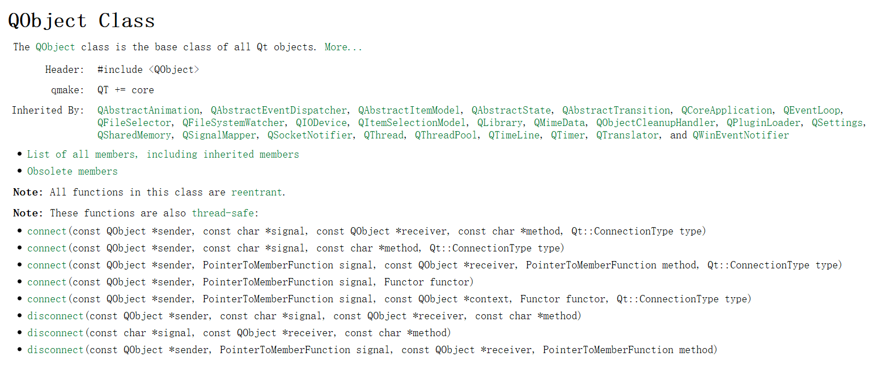

## 1、Qt控件

### 1.1 Qt控件类

Qt 控件又称组件或者部件，指用户看到的所有可视化界面以及界面中的各个元素，比如按钮、文本框、输入框等。

Qt 中的每个控件都由特定的类表示，每个控件类都包含一些常用的属性和方法，所有的控件类都直接或者间接继承自 QWidget 类。实际开发中，我们可以使用 Qt 提供的这些控件，也可以通过继承某个控件类的方式自定义一个新的控件。

- QMainWindow 类生成的窗口自带菜单栏、工具栏和状态栏，中央区域还可以添加多个控件，常用来作为应用程序的主窗口；
- QDialog 类生成的窗口非常简单，没有菜单栏、工具栏和状态栏，但可以添加多个控件，常用来制作对话框。
-  QWidget 类，它的用法非常灵活，既可以用来制作窗口，也可以作为某个窗口上的控件。

> 实际开发中，制作应用程序的主窗口可以用 QMainWindow 或者 QWdiget；制作一个提示信息的对话框就用 QDialog 或 QWidget；如果暂时无法决定，后续可能作为窗口，也可能作为控件，就选择 QWidget。


### 1.2 Qt事件

Qt 事件指的是应用程序和用户之间的交互过程，例如用户按下某个按钮，点击某个输入框等等。实际上除了用户会与应用程序进行交互外，操作系统也会与应用程序进行交互，例如当某个定时任务触发时，操作系统会关闭应用程序，这也是一个事件。

Qt 程序可以接收的事件种类有很多，例如鼠标点击事件、鼠标滚轮事件、键盘输入事件、定时事件等。每接收一个事件，Qt 会分派给相应的事件处理函数来处理。所谓事件处理函数，本质就是一个普通的类成员函数，以用户按下某个 QPushButton 按钮为例，Qt 会分派给 QPushButton 类中的 mousePressEvent() 函数处理。

事件处理函数通常会完成两项任务，分别是：

- 修改控件的某些属性，比如当用户按下按钮时，按钮的背景颜色会发生改变，从而提示用户已经成功地按下了按钮；
- 运用信号和槽机制处理事件。

## 2、信号和槽

信号和槽是 Qt 特有的消息传输机制，它能将相互独立的控件关联起来。信号和槽机制底层是通过函数间的相互调用实现的。**每个信号都可以用函数来表示，称为信号函数；每个槽也可以用函数表示，称为槽函数。**


**1)信号发送者**

**2）发送的信号(信号函数)**

信号函数用 signals 关键字修饰.

信号函数只需要声明，不需要定义（实现），而槽函数需要定义（实现）。

**3）信号接收者**

Qt 中的所有控件都具有接收信号的能力，一个控件还可以接收多个不同的信号。对于接收到的每个信号，控件都会做出相应的响应动作。

在 Qt 中，对信号做出的响应动作就称为槽。

 

**4）接受的信号（槽函数）**

信号函数和槽函数通常位于某个类中。


**5）connect函数**

connect() 是 QObject 类中的一个静态成员函数，专门用来关联指定的信号函数和槽函数。使用Qt助手，查看QObject中connect的定义：



connect函数的两种用法：

**使用宏SIGNAL、SLOT**

```c++
  QLabel *label = new QLabel;
  QScrollBar *scrollBar = new QScrollBar;
  QObject::connect(scrollBar, SIGNAL(valueChanged(int)), label,  SLOT(setNum(int)));
```

**使用指针：**定信号函数和槽函数的语法格式是`&+函数所在类+函数名`。

```c++
  QLabel *label = new QLabel;
  QLineEdit *lineEdit = new QLineEdit;
  QObject::connect(lineEdit, &QLineEdit::textChanged,label,  &QLabel::setText);
```


### 2.1 使用控件自带的信号和槽

为了提高程序员的开发效率，Qt 的各个控件类都提供了一些常用的信号函数和槽函数。

### 2.2 自定义信号和槽

#### 2.2.1 自定义信号函数

信号函数指的是符合以下条件的函数：

- 定义在某个类中，该类直接或间接继承自 QObject 类；
- 用 signals 关键字修饰；
- 函数只需要声明，不需要定义（实现）；
- 函数的返回值类型为 void，参数的类型和个数不限。

```c++
class MyWidget:public QWidget{
    //Q_OBJECT 是一个宏，添加它才能正常使用 Qt 的信号和槽机制
    Q_OBJECT
//修饰信号函数的关键字
signals:
    //自定义的信号函数
    void MySignal(QString message);
};
```


自定义信号函数之后，可以使用QObject::connect来绑定信号和对应的槽函数。此外还需要关注，我们的程序什么时候调用自定义的信号呢？Qt提供了emit关键字来发送信号。具体使用如下：

```c++
class MyWidget:public QWidget{
    //Q_OBJECT 是一个宏，添加它才能正常使用 Qt 的信号和槽机制
    Q_OBJECT
//自定义信号函数
signals:
    void MySignal(QString mess);
public:
    void emitSignal(){
        emit MySignal(message);
    }
private:
    QString message;
};
```


#### 2.2.2 自定义槽函数

#### 2.2.3 自定义信号和槽函数示例

首先创建两个QPushButton对象，分别为两个控件添加信号和槽函数。

```c++
int main(int argc, char *argv[])
{
    QApplication a(argc, argv);
    Dialog w;
    w.setWindowTitle("信号与槽");

    //
    QPushButton  *btn_ok = new QPushButton(&w);
    QPushButton  *btn_cancle = new QPushButton(&w);
    btn_ok->setText("确定");
    btn_cancle->setText("取消");
    btn_ok->move(20,100);
    btn_cancle->move(150,100);
	//为btn_ok绑定按钮点击信号，槽函数为自定义的mes函数
    QObject::connect(btn_ok,&QPushButton::clicked,&w, &Dialog::mes);
    //为btn_cancle绑定按钮点击信号，槽函数为Dialog类的close方法
    QObject::connect(btn_cancle,&QPushButton::clicked,&w, &Dialog::close);

    w.show();
    return a.exec();
}
```

自定义的Dialog::mes

```c++
class Dialog : public QDialog
{
    Q_OBJECT

public:
    Dialog(QWidget *parent = nullptr);
    ~Dialog();

//自定义的槽函数，必须用slots修饰
public slots:
    void mes();

};

//mes功能是弹出一个消息框
void Dialog::mes()
{
    QMessageBox msg ;  
    msg.setText(QString::fromLocal8Bit("infomation"));
    msg.setWindowTitle("MessageBox");
    msg.exec();
}
```


