## 1、开发环境的配置

### 1.1 下载

**官网：http://download.qt.io/**

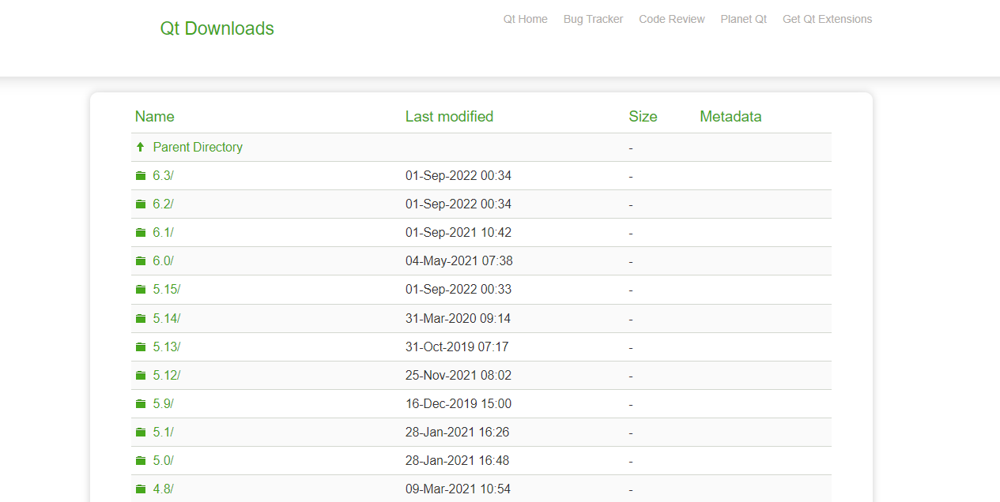

**国内镜像站（较快）：**

- 中国科学技术大学：http://mirrors.ustc.edu.cn/qtproject/
- 清华大学：https://mirrors.tuna.tsinghua.edu.cn/qt/
- 北京理工大学：http://mirror.bit.edu.cn/qtproject/
- 中国互联网络信息中心：https://mirrors.cnnic.cn/qt/

**Qt版本详细信息：**https://wiki.qt.io/Main

### 1.2 安装

安装过程比较简单，需要注意的是Qt安装过程中最关键的一步是组件的选择。

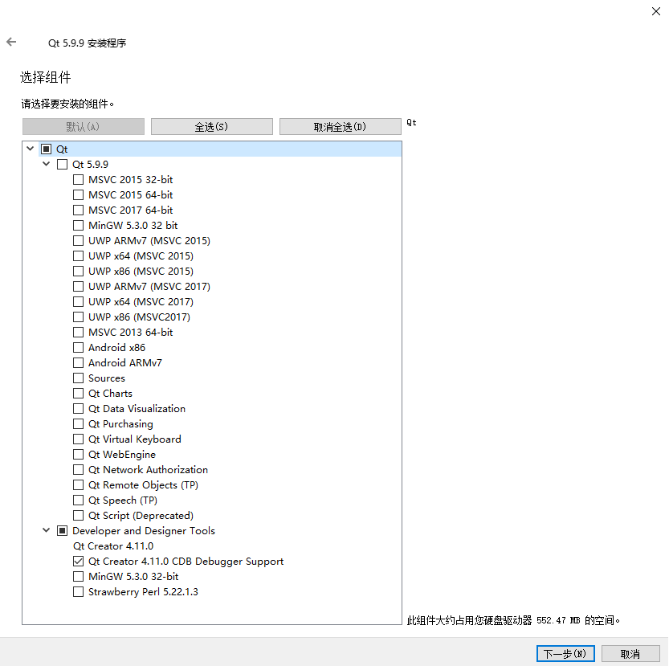

**Qt 5.9 分类下的开发组件**

| 组件               | 说明                                                         |
| ------------------ | ------------------------------------------------------------ |
| MinGW 5.3.0 32 bit | 编译器模块。MinGW 是 Minimalist GNU for Windows 的缩写，MinGW 是 Windows 平台上使用的 GNU 工具集导入库的集合。是本教程使用 MinGW 编译，所以必须安装。 |
| UWP                | UWP 是 Windows 10 中 Universal Windows Platform 的简称，有不同编译器类型的 UWP，属于 MSVC 编译器生成的 Qt 库。如果不是开发 UWP 应用程序，就不需要，直接忽略。 |
| MSVC               | 针对 Windows 平台上的 MSVC 编译器的 Qt 组件，如 msvc2015 32-bit 和 msvc2015 64-bit 等。安装该组件需要计算机上已经安装相应版本的 Visual Studio。如果你不使用 MSVC 编译器进行开发，就不用安装。本教程使用 MinGW 编译组件，所以不用安装 MSVC *** 组件。 |
| Android            | 这是针对安卓应用开发的 Qt 库，如果读者有安卓开发这方面需求可以自己选择安装，一般情况下用不到。 |
| Sources            | Qt 的源代码包，除非你想阅读 Qt 的源码，否则不用安装。        |
| Qt                 | Qt 的附加模块，大部分建议安装，这些附加模块括号里的 TP 是指 Technology Preview ，技术预览模块的意思，还处在功能测试阶段，不是正式版模块；附加模块括号里的 Deprecated 是指抛弃的旧模块，兼容旧代码使用的，一般用不到。这些附加模块读者可以选择部分或都勾选了安装，占用空间不大。  部分组件说明：Qt Charts 是二维图表模块，用于绘制柱状图、饼图、曲线图等常用二维图表。Qt Data Visualization 是三维数据图表模块，用于数据的三维显示，如散点的三维空间分布、三维曲面等。Qt Scritp（Deprecated）是脚本模块，已被抛弃，不建议安装。 |

**Tools 分类下的开发组件**

| 组件                                   | 说明                                                         |
| -------------------------------------- | ------------------------------------------------------------ |
| Qt Creator 4.3.0                       | 这是集成开发环境，强制安装的，以后所有的项目和代码都在 Qt Creator 里面新建和编辑。 |
| Qt Creator 4.3.0 CDB Debugger surpport | 用于和 CDB 调试工具对接，默认安装，一般用于调试 VC 编译的 Qt 程序。 |
| MinGW 5.3.0                            | 这是开源的编译器套件，这本教程必须用到的，需要读者勾选安装。 |
| Strawberry Perl 5.22.1.3               | 用于编译 Qt 源代码的 Perl 开发环境，不需要安装。如果读者以后用到，也可以另外手动安装，在搜索引擎搜索 Strawberry Perl 关键词，去 Strawberry Perl 官网下载最新的安装包是一样用的。 |

### 1.3 Qt工具集

**Qt安装完成后的几个主要模块介绍：**

| 程序                                      | 说明                                                         |
| ----------------------------------------- | ------------------------------------------------------------ |
| Qt Creator 4.6.2 (Enterprise)             | Qt 的集成开发环境，本教程就使用它来创建和管理 Qt 项目。      |
| Assistant（Qt 助手）                      | 用来查看帮助文档，已被集成在 Qt Creator 中。                 |
| Designer（Qt 设计师）                     | 图形界面可视化编辑工具，已被集成在 Qt Creator 中，在 Qt Creator 中编辑或创建界面文件时，就可以自动打开。 |
| Linguist（Qt 语言家）                     | 多国语言翻译支持工具，可以用来编辑语言资源文件，在开发多语言界面的应用程序时会用到。 |
| Qt 5.11.1 for Desktop (MinGW 5.3.0 32bit) | Qt 命令行工具，用来配置 Qt 开发环境（主要是设置 PATH 变量）。 |

**Qt用到的开发工具：**

Qt不是凭空产生的，它是基于现有工具链打造而成的，它所使用的编译器、链接器、调试器等都不是自己的，Qt 官方只是开发了上层工具。

- GNU工具集：gcc、g++、ld(链接器)、ar生成静态库、gdb调试器、ldd查看可执行文件依赖库

- MinGW工具：Windows系统可以使用的GUN工具集。用于生成windows下的exe和dll链接库。MinGW-64支持64位系统、MSYS-windows系统中的Unix环境，支持文件、系统管理之类的shell环境

  - MinGW 项目主页（含 MSYS）：http://www.mingw.org/
  - MinGW-w64 项目主页： https://sourceforge.net/projects/mingw-w64/

- cmake: 一个跨平台的自动化构建工具，支持利用各种编译工具生成可执行程序或链接库。

- Qt工具集：Qt自己的开发工具。常用的 Qt 开发工具列表如下：

  | 工具      | 说明                                                         |
  | --------- | ------------------------------------------------------------ |
  | qmake     | 核心的项目构建工具，可以生成跨平台的 .pro 项目文件，并能依据不同操作系统和编译工具生成相应的 Makefile，用于构建可执行程序或链接库。 |
  | uic       | User Interface Compiler，用户界面编译器，Qt 使用 XML 语法格式的 .ui 文件定义用户界面，uic 根据 .ui 文件生成用于创建用户界面的 C++ 代码头文件，比如 ui_*****.h 。 |
  | moc       | Meta-Object Compiler，元对象编译器，moc 处理 C++ 头文件的类定义里面的 Q_OBJECT 宏，它会生成源代码文件，比如 moc_*****.cpp ，其中包含相应类的元对象代码，元对象代码主要用于实现 Qt 信号/槽机制、运行时类型定义、动态属性系统。 |
  | rcc       | Resource Compiler，资源文件编译器，负责在项目构建过程中编译 .qrc 资源文件，将资源嵌入到最终的 Qt 程序里。 |
  | qtcreator | 集成开发环境，包含项目生成管理、代码编辑、图形界面可视化编辑、 编译生成、程序调试、上下文帮助、版本控制系统集成等众多功能， 还支持手机和嵌入式设备的程序生成部署。 |
  | assistant | Qt 助手，帮助文档浏览查询工具，Qt 库所有模块和开发工具的帮助文档、示例代码等都可以检索到，是 Qt 开发必备神器，也可用于自学 Qt。 |
  | designer  | Qt 设计师，专门用于可视化编辑图形用户界面（所见即所得），生成 .ui 文件用于 Qt 项目。 |
  | linguist  | Qt 语言家，代码里用 tr() 宏包裹的就是可翻译的字符串，开发人员可用 lupdate 命令生成项目的待翻译字符串文件 .ts，用 linguist 翻译多国语言 .ts ，翻译完成后用 lrelease 命令生成 .qm 文件，然后就可用于多国语言界面显示。 |
  | qmlscene  | 在 Qt 4.x 里是用 qmlviewer 进行 QML 程序的原型设计和测试，Qt 5 用 qmlscene 取代了旧的 qmlviewer。新的 qmlscene 另外还支持 Qt 5 中的新特性 scenegraph 。 |

**Qt编程基本概念和术语**

* Project: Qt项目或者工程，Qt使用.pro文件管理项目
* Makefile: Qt生成器qmake可以依据规范的Makefile自动生成目标程序或者库文件
* Debug和release: 调试版本和发行版本
* C++标准：Qt 官方在编译 Qt5 库的时候都是开启 C++11 特性。也可以通过修改.pro文件添加对C++最新标准的支持,如 CONFIG += c++11
* 动态链接和静态链接: 链接库的代码编译链接到自己代码的方式。
* 显示链接和隐式链接：动态链接库的使用方式。隐式链接是最为常见的，所有的编译环境默认都是采用隐式链接的方式使用动态库。

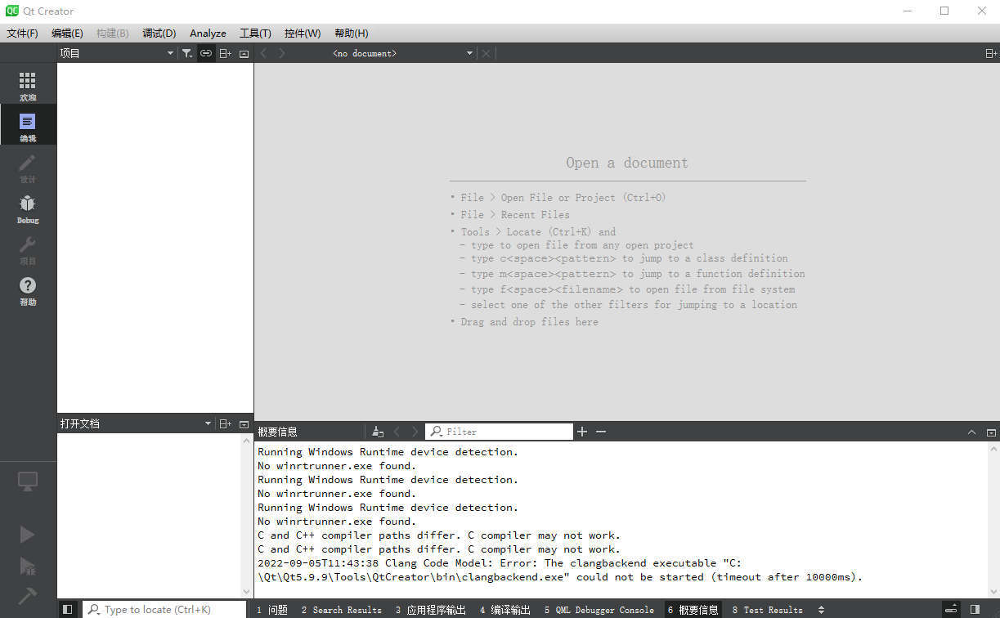

## 2、第一个Qt程序

### 2.1 Qt的设置

- 设置语言：在 Interface 页面可以设置语言和主题
- 设置文本编辑：设置各种类型文字的字体颜色，如关键字、数字、字符串、注释等字体颜色，也可以选择不同的配色主题。
- 构建和运行：
  - Kits（构建套件）页面显示 Qt Creator 可用的编译工具。
  - Qt Versions 页面显示安装的 Qt 版本。
  - Compliers（编译器）页面显示系统里可用的 C 和 [C++](http://c.biancheng.net/cplus/) 编译器，由于安装了 MinGW 和 Visual Studio 2015，Qt Creator 会自动检测出这些编译器。
  - Debuggers 页面显示 Qt Creator 自动检测到的调试器，有 GNU gdb for MinGW 调试器和 Windows 的 CDB 调试器。

### 2.2 第一个Qt开发流程

**新建工程，Qt Creator 可以创建多种项目**

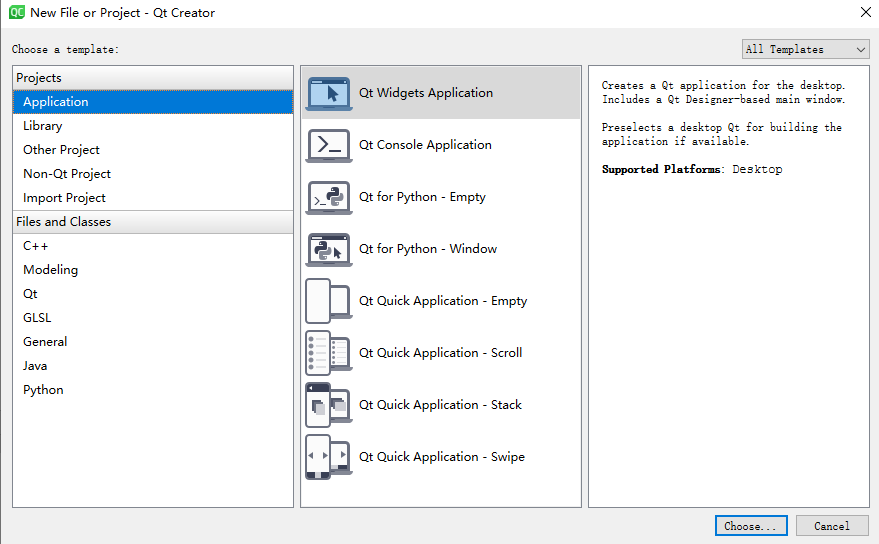

- Qt Widgets Application，支持桌面平台的有图形用户界面（Graphic User Interface，GUI） 界面的应用程序。GUI 的设计完全基于 C++ 语言，采用 Qt 提供的一套 C++ 类库。
- Qt Console Application，控制台应用程序，无 GUI 界面，一般用于学习 C/C++ 语言，只需要简单的输入输出操作时可创建此类项目。
- Qt Quick Application，创建可部署的 Qt Quick 2 应用程序。Qt Quick 是 Qt 支持的一套 GUI 开发架构，其界面设计采用 QML 语言，程序架构采用 C++ 语言。利用 Qt Quick 可以设计非常炫的用户界面，一般用于移动设备或嵌入式设备上无边框的应用程序的设计。
- Qt Quick Controls 2 Application，创建基于 Qt Quick Controls 2 组件的可部署的 Qt Quick 2 应用程序。Qt Quick Controls 2 组件只有 Qt 5.7 及以后版本才有。
- Qt Canvas 3D Application，创建 Qt Canvas 3D QML 项目，也是基于 QML 语言的界面设计，支持 3D 画布。

**选择Define build System:  Cmake方式还是qmake;**

**选择窗口基类：**

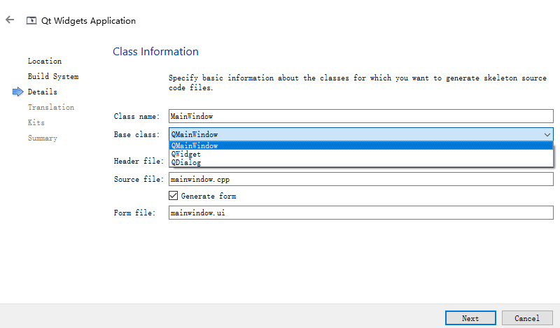

- QMainWindow 是主窗口类，主窗口具有主菜单栏、工具栏和状态栏，类似于一般的应用程序的主窗口；
- QWidget 是所有具有可视界面类的基类，选择 QWidget 创建的界面对各种界面组件都可以 支持；
- QDialog 是对话框类，可建立一个基于对话框的界面；

**选择编译工具套件：**

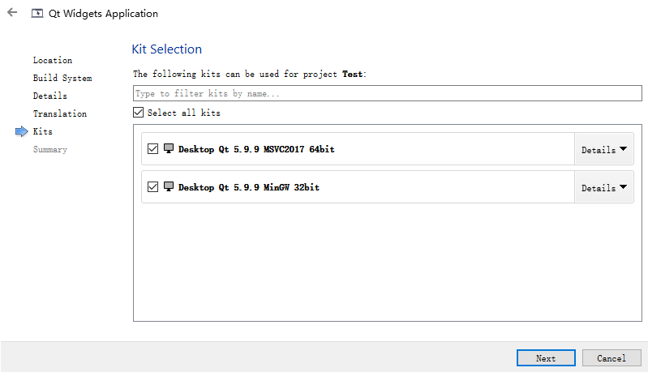


**Qt工程目录结构：**

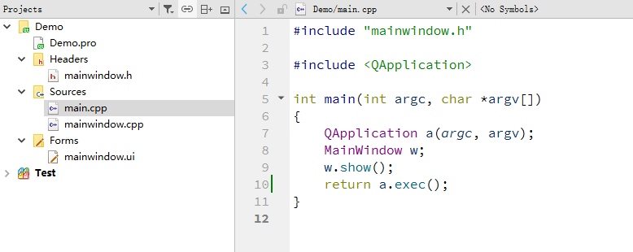

在项目名称节点下面，分组管理着项目内的各种源文件，几个文件及分组分别为以下几项：

- Demo.pro 是项目管理文件，包括一些对项目的设置项。
- Headers 分组，该节点下是项目内的所有头文件（.h）。mainwindow.h，是主窗口类的头文件。
- Sources 分组：该节点下是项目内的所有 C++源文件（.cpp），mainwindow.cpp 是主窗口类的实现文件，与 mainwindow.h 文件对应。main.cpp 是主函数文件，也是应用程序的入口。
- Forms 分组：该节点下是项目内的所有界面文件（.ui）。

**UI界面设计**：双击.UI即可进入界面编辑设计窗口，进行窗口的设计。

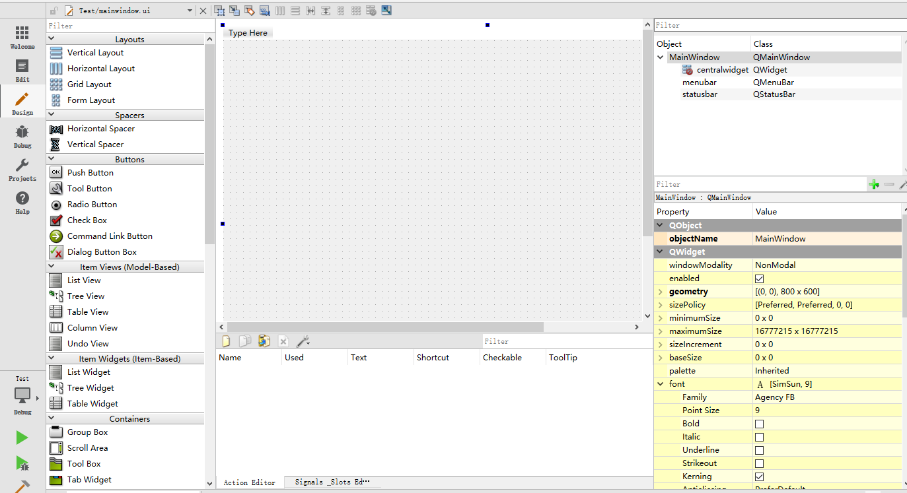


**项目的编译、调试与运行**

单击主窗口左侧工具栏上的“项目”按钮，

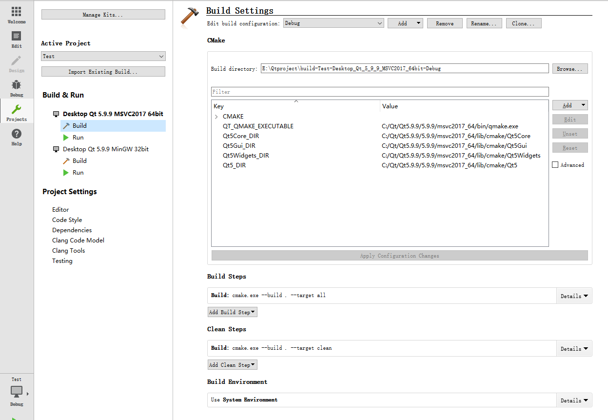

界面左侧一栏的“Build & Run”下面显示了本项目中可用的编译器工具，要使用哪一个编译器用于项目编译，单击其名称即可，选择的编译器名称会用粗体字表示。在此界面设置一些和调试相关的配置。然后执行编译、调试等操作。

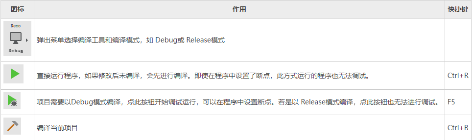


### 2.3 Qt应用的发布

Qt应用的发布有两种方式：静态链接和共享库方式。

* 静态链接：Q他编译应用程序时，将Qt的运行库等所需的支持文件全部静态编译到应用程序中，生成一个独立的可执行文件，程序的发布使用很少的文件。缺点是：可执行文件体积很大，缺少灵活性。有更新及插件时需要重新编译整个程序。如果要使用静态链接方式编译程序，需要将Qt以静态的方式重新编译生成静态版本的Qt，然后使用静态版本的Qt编译和链接应用程序才能生成静态链接的应用程序。
* 共享库：按照正常的方式编译生成的应用程序，将应用程序所需的各种共享库与应用程序一同发布给用户。支持单独的插件更新。

**因此推荐以动态库的方式发布Qt应用。Windows平台具体发布流程：**

1、编写代码，开发程序

2、编译程序，测试程序能否正常运行及逻辑是否正确。

3、使用Windeployqt.exe(Qt自带的Windows平台发布工具，可以自动为一个应用程序复制其所需要的各种库文件、插件和翻译文件，生成可发布的目录)。

编译号的程序由于缺少依赖，是不能直接运行的（双击可执行文件报错）：

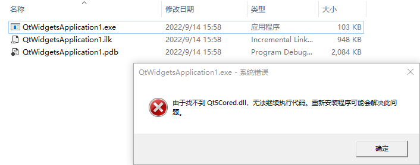


使用Windeployqt.exe补全缺少的依赖文件：

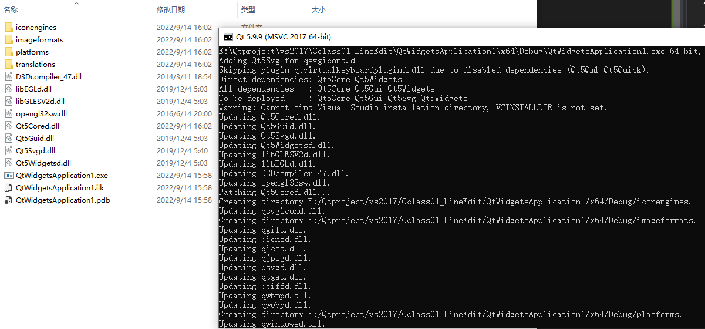


双击可直接运行

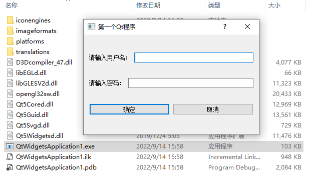


4、制作安装文件。将该目录下的文件打包到安装包。

* [Advanced Installer 11.0实战教程](https://blog.csdn.net/neweastsun/article/details/43729983)

* [使用VS 2019制作桌面程序的安装包](https://blog.csdn.net/hbwhypw/article/details/103680001)


## 3、Qt程序执行流程

以上述Demo项目为例，根据工程架构，详细说说Qt程序的执行流程。


**1）程序入口** ：main.cpp

```C++
#include "mainwindow.h"

#include <QApplication>  //Qt定义的头文件

int main(int argc, char *argv[])
{
    QApplication a(argc, argv);
    //MainWindow 是自定义的类，继承自QMainWindow主窗口类。
    MainWindow w;
    //Qt 提供的所有组件（控件、部件）都是隐藏的，不会自动显示。调用show方法才会显示
    w.show();
    return a.exec();
}
```

**2）QMainWindow 的主窗口类**

MainWindow 是自定义的类，继承自QMainWindow主窗口类。该类的定义部分位于 mainwindow.h 头文件中，实现部分位于 mainwindow.cpp 源文件中。

```c++
#ifndef MAINWINDOW_H
#define MAINWINDOW_H

#include <QMainWindow>

QT_BEGIN_NAMESPACE
namespace Ui { class MainWindow; }
QT_END_NAMESPACE

class MainWindow : public QMainWindow
{
    Q_OBJECT

public:
    MainWindow(QWidget *parent = nullptr);
    ~MainWindow();

private:
    Ui::MainWindow *ui;
};
#endif // MAINWINDOW_H
```

初始状态下，MainWindow 类由 Q_OBJECT、构造函数和析构函数组成。其中的Q_OBJECT:

- Q_OBJECT：本质是一个已定义好的宏，**所有需要“信号和槽”功能的组件都必须将 Q_OBJECT 作为 private 属性成员引入到类中**。
- 带参的构造函数：QWidget 是所有组件的基类，借助 parent 指针，可以为当前窗口指定父窗口。例如QLabel 文本框位于主窗口中，主窗口就是它的父窗口。当父窗口被删除时，所有子窗口也会随之一起删除。当然也可以不指定父窗口，那么当前窗口就会作为一个独立的窗口，不会受到其它窗口的影响。

**3)添加组件**

我们通过修改MainWindow 类尝试向 w 主窗口添加一个文本框：

a. 首先的中添加一个组件变量： QLabel *lab;        // 定义一个私有的 QLabel 指针对象

```c++
#ifndef MAINWINDOW_H
#define MAINWINDOW_H

#include <QMainWindow>
#include<QPushButton>
#include <QLabel>

QT_BEGIN_NAMESPACE
namespace Ui { class MainWindow; }
QT_END_NAMESPACE

class MainWindow : public QMainWindow
{
    Q_OBJECT

public:
    MainWindow(QWidget *parent = nullptr);
    ~MainWindow();
     QPushButton *m_buttoon;

private slots:
     void on_pushButton_clicked();

private:
    Ui::MainWindow *ui;
     QLabel *lab;        // 定义一个私有的 QLabel 指针对象

};
#endif // MAINWINDOW_H
```

b. 在构造函数中设置其属性：

```c++
#include "mainwindow.h"
#include "ui_mainwindow.h"

MainWindow::MainWindow(QWidget *parent)
    : QMainWindow(parent)
    , ui(new Ui::MainWindow)
{
    ui->setupUi(this);
    this->lab = new QLabel("Hello,World!",this);
    this->lab->move(200,200);
}
```

