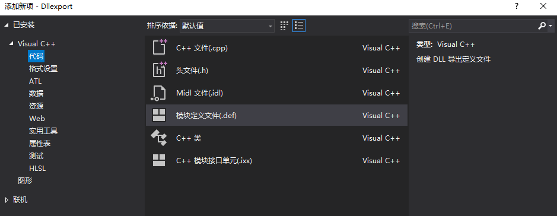
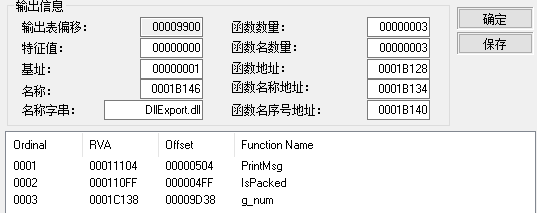
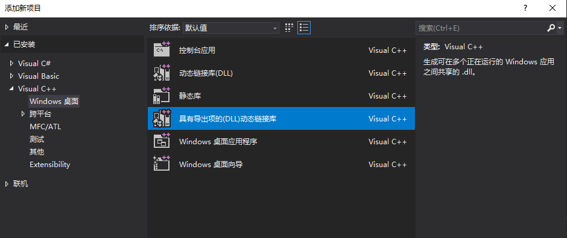
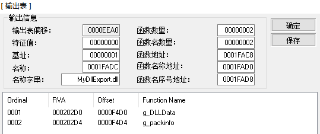
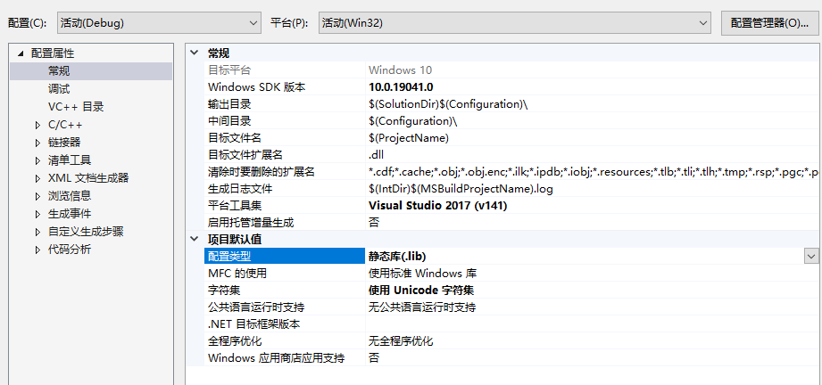
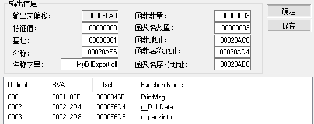
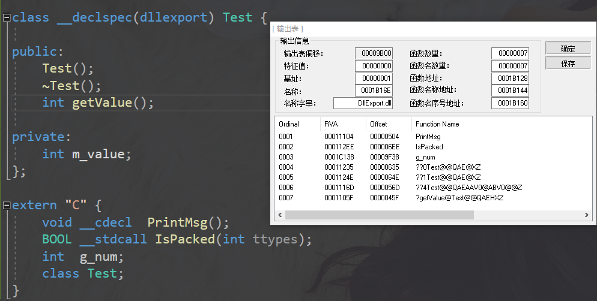
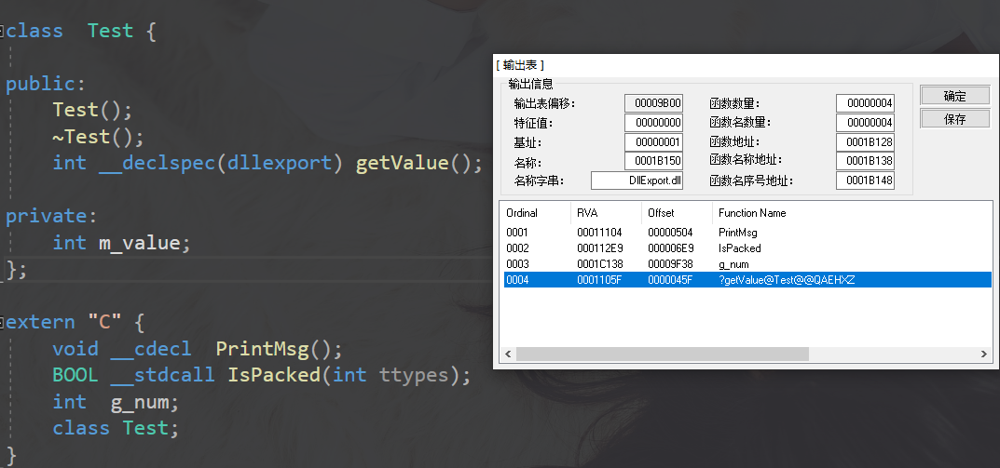

## 1、DLL导出变量的方法

DLL导出函数的声明有两种方式：一种是在函数声明中加上__declspec(dllexport)，另一种是采用模块定义(.def)文件声明，(.def)文件为链接器提供了有关被链接程序的导出、属性及其他方面的信息。

这两种方式的主要区别是导出函数的名字上，其次还有一些操作的灵活性以及功能的强弱。

### 1.1 用__declspec进行导出声明

**1）导出函数关键字**

DLL可以通过在函数声明中加上`__declspec(dllexport)`导出函数。__declspec（dllexport）表示该函数为DLL输出函数，即其他应用程序可以调用该函数。DLL导出项示例：

```c++
#ifndef _DLL_SAMPLE_H
#define _DLL_SAMPLE_H

// 如果定义了C++编译器，那么声明为C链接方式
#ifdef __cplusplus
extern "C" {
#endif

// 通过宏来控制是导入还是导出
#ifdef _DLL_SAMPLE
#define DLL_SAMPLE_API __declspec(dllexport)
#else
#define DLL_SAMPLE_API __declspec(dllimport)
#endif

// 导出/导入变量声明
DLL_SAMPLE_API extern int DLLData;

#undef DLL_SAMPLE_API

#ifdef __cplusplus
}
#endif
#endif
```

### 1.2 用模块定义文件（.def）进行导出声明

.def文件为链接器提供了有关被链接程序的导出、属性及其他方面的信息。

```C++
LIBRARY DLLSample    //说明DEF对应哪个DLL文件
DESCRIPTION "my simple DLL"  //描述信息
EXPORTS              //关键字
    DLLData DATA ；   //DATA表示这是数据（变量）
```


### 1.3 名字修饰对导出函数的影响

**名字修饰约定和函数调用约定只会对显式加载有影响。**

**1）函数调用约定**

WINAPI采用_stdcall的方式，而C/C++ 缺省的调用方式却为__cdecl。__stdcall方式与__cdecl对函数名最终生成符号的方式不同。

**2）C编译器的函数名称修饰规则**

使用C方式编译（.c）,并且使用extern "C"方式导出函数时：

- _stdcall调用约定：输出名称在原名称前加一下划线，后面再加上一个“@”和其参数的总字节数
- __cdecl调用约定：与原名称相同

**3）C++编译器的函数名修饰规则**

使用C方式编译（.cpp）,并且使用extern "C++"方式导出函数时：

- __stdcall调用约定：输出名称以“?”开始，后跟原名称，原名称后再跟“@@YG”，后面再跟返回值代号和参数表代号_
- __cdecl调用约定：与_stdcall调用约定基本一致，只是参数表的开始标识由上面的“@@YG”变为“@@YA”。
- 如果希望编译c++后的名字不发生改变，可以在定义导出函数时加上限定符`extern "C"`，且采用`__cdecl`调用约定，这样显式加载dll就不会出问题。

**4)使用DEF方式导出项**

**extern "C"只解决了C和C++语方之间调用的问题(extern "C" 是告诉编译器，让它按C的方式编译)，它只能用于导出全局函数这种情况 而不能导出一个类的成员函数。同时如果导出函数的调用约定发生改变，即使使用extern "C"，编译后的函数名还是会发生改变。正确建议是使用自定义def文件，直接指定导出的函数名**。

首先,在头文件中申明导出变量:

```C++
extern "C" {
	void __cdecl  PrintMsg();
	BOOL __stdcall IsPacked(int ttypes);
	int  g_num;
}
```

其次，新建一个def文件并添加到项目工程中，在该文件中添加”EXPORTS“关键字，表示dll导出函数的位置，然后在 “EXPORTS” 字段下面添加要导出函数的名称即可。如下：



```c++
LIBRARY "DLLTestDef"  //说明def文件对应哪一个dll
EXPORTS         //后面列出了要导出函数的名称         
Add_stdcall @1          //函数名@n，其中n表示要导出函数的序号
Add_cdecl @2
```

同样的，我们对__stdcall和__cdecl进行测试，看导出函数名是否改变，测试结果表示均为改变。



**其实def文件的功能相当于extern “C” __declspec(dllexport)**

## 2、链接库中变量的使用方法

| 链接库类型 | 使用中所需文件                          | 优点                                                  | 缺点                                             |
| ---------- | --------------------------------------- | ----------------------------------------------------- | ------------------------------------------------ |
| 动态链接库 | 隐式加载： .h /.lib/.dll 显式加载：.dll | 1.可执行文件的体积小 </br>2.内存占用小 3.易维护和扩展 | 加载速度慢                                       |
| 静态链接库 | .h /.lib                                | 加载速度快                                            | 1.可执行文件的体积大 2.空间浪费 3.不易维护和扩展 |

### 2.1 静态库链接

静态库使用只需要lib文件和.h头文件。使用时将lib文件和头文件（.h）拷贝到当前项目中使用。

```c++
#include <stdio.h>
#include "DLLSample.h"
#pragma comment(lib,"DLLSample.lib")

int main(int argc, char *argv[])
{
　printf("%d ", DLLSample);  //DLLSample是导出的变量
　return 0;
}
```

### 2.2 动态库显示链接

动态库显示链接需要知道动态链接库（dll文件）的全路径即可。使用GetProcAddress获取变量地址，根据类型需要对地址解引用（对导出函数需要先定义函数指针和变量）。

```c++
#include <iostream>
#include <windows.h>
 
int main()
{
    int my_int;
    HINSTANCE hInstLibrary = LoadLibrary("DLLSample.dll");

    if (hInstLibrary == NULL)
    {
        FreeLibrary(hInstLibrary);
    }
    my_int = *(int*)GetProcAddress(hInstLibrary, "DLLData");
    if (dllFunc == NULL)
    {
        FreeLibrary(hInstLibrary);
    }
    std::cout<<my_int;
    std::cin.get();
    FreeLibrary(hInstLibrary);
    return(1);
}
```

### 2.3 动态库隐式链接

隐式加载方式将使用到.h、.lib、.dll。MyDll三个文件。lib需放置于项目的库搜索路径下，MyDll.dll需放置于项目生成的可执行文件同一目录下。

```c++
#include <iostream>
#include <Windows.h>
#include "DllExport.h"

#pragma comment(lib,"D:\\Dllexport\\Debug\\Dllexport.lib") 

using namespace std;

int main()
{
	std::cout << g_num << endl;  //直接使用DLL中导出的变量
	PrintMsg();                  //直接使用DLL中导出的函数
	return 0;
}
```

* 除了使用pragma comment根据全路径引入lib库外，还可以在项目属性中附加依赖项里添加dll对应的.lib文件名
* 头文件可以拷贝至项目文件同一目录下，也可以在项目属性中附加包含目录中添加头文件全路径

## 3、DLL导出项实战

**Visual Studio创建DLL项目时，可以选择带有导出项的动态链接库**



**默认生成的头文件：**

```C++
// 下列 ifdef 块是创建使从 DLL 导出更简单的
// 宏的标准方法。此 DLL 中的所有文件都是用命令行上定义的 DLLEXPORT_EXPORTS
// 符号编译的。在使用此 DLL 的
// 任何项目上不应定义此符号。这样，源文件中包含此文件的任何其他项目都会将
// DLLEXPORT_API 函数视为是从 DLL 导入的，而此 DLL 则将用此宏定义的
// 符号视为是被导出的。
#ifdef DLLEXPORT_EXPORTS
#define DLLEXPORT_API __declspec(dllexport)
#else
#define DLLEXPORT_API __declspec(dllimport)
#endif

// 此类是从 dll 导出的
class DLLEXPORT_API CDllExport {
public:
	CDllExport(void);
	// TODO: 在此处添加方法。
};

extern DLLEXPORT_API int nDllExport;

DLLEXPORT_API int fnDllExport(void);
```

**默认生成的源文件：**

```c++
// DllExport.cpp : 定义 DLL 的导出函数。
//

#include "pch.h"
#include "framework.h"
#include "DllExport.h"

// 这是导出变量的一个示例
DLLEXPORT_API int nDllExport=0;

// 这是导出函数的一个示例。
DLLEXPORT_API int fnDllExport(void)
{
    return 0;
}

// 这是已导出类的构造函数。
CDllExport::CDllExport()
{
    return;
}
```


### 3.1 导出变量

**1）变量的导出**

在DLL头文件中申明导出变量

```C++
#define WIN32_LEAN_AND_MEAN             // 从 Windows 头文件中排除极少使用的内容
// Windows 头文件
#include <windows.h>
//测试导出一个结构体
typedef struct _PackInfo
{
	DWORD  OPE;
	std::string secname;
	bool Ispacked;

}PackInfo;

#ifndef _DLL_SAMPLE_H
#define _DLL_SAMPLE_H

//申明导出函数为C链接方式（不修改函数名）
#ifdef __cplusplus
extern "C" {
#endif

//通过宏来控制导出和导出
#ifdef _DLL_SAMPLE_H
#define  DLL_SAMPLE_API __declspec(dllexport)
#else
#define DLL_SAMPLE_API  __declspec(dllimport)
#endif


//申明导出/入变量
DLL_SAMPLE_API  extern int g_DLLData;
DLL_SAMPLE_API  extern PackInfo g_packinfo;

#undef DLL_SAMPLE_API

#ifdef __cplusplus
}
#endif

#endif
```

在源文件中初始化导出变量

```C++
int g_DLLData;
PackInfo  g_packinfo;

BOOL APIENTRY DllMain( HMODULE hModule,
                       DWORD  ul_reason_for_call,
                       LPVOID lpReserved
                     )
{
    switch (ul_reason_for_call)
    {
	case DLL_PROCESS_ATTACH: {
		g_packinfo.Ispacked = FALSE;
		g_packinfo.OPE = 0x124536;
		g_packinfo.secname = ".text";
		g_DLLData = 2022;
	}
    case DLL_THREAD_ATTACH:
    case DLL_THREAD_DETACH:
    case DLL_PROCESS_DETACH:
        break;
    }
    return TRUE;
}
```

通过PELoader查看导出变量



**2）导出变量的使用**

静态链接：可直接只用lib库中的项目。

首先配置链接库项目属性为静态库.lib



在项目中引入头文件和库文件：

```C++
#include <windows.h>
#include <iostream>
#include "framework.h"

#pragma comment(lib, "MyDllExport.lib")

using namespace std;
int main()
{
	cout << g_packinfo.Ispacked << g_packinfo.OPE << g_packinfo.secname.c_str() << endl;
	cout << g_DLLData << endl;
	return 0;
}
```

**动态链接**

动态链接需要DLL全路径以及需要定义相关的数据类型:比如自定义的数结构、函数指针等来使用具体变量。

```c++
#include <iostream>
#include <windows.h>
#include <iostream>

using namespace std;
typedef struct _PackInfo
{
	DWORD  OPE;
	std::string secname;
	bool Ispacked;

}PackInfo;

int main()
{
	HMODULE   hdll = LoadLibrary(L"./MyDllExport.dll");
	if (INVALID_HANDLE_VALUE  == hdll)
	{
		cout << "Dll Load Error:" << GetLastError() << endl;
		return 0;
	}
    //先申明一个同导出变量类型相同的变量
	int dlldata;
	dlldata = *(int*)GetProcAddress(hdll, "g_DLLData");
	cout << "g_DllData: " << dlldata << endl;

	PackInfo g_packinfo;
	g_packinfo = *(PackInfo*)GetProcAddress(hdll, "g_packinfo");
	cout <<"OEP: "<<g_packinfo.OPE
		<<" name: "<<g_packinfo.secname.c_str()
		<<" isPacked: "<<g_packinfo.Ispacked<< endl;
	return 0;
}
```


### 3.2 导出函数

**1）函数导出步骤**

导出函数申明

```c++
//申明导出/入变量
	DLL_SAMPLE_API  extern int g_DLLData;
	DLL_SAMPLE_API  extern PackInfo g_packinfo;
	DLL_SAMPLE_API  extern BOOL PrintMsg(string Msg, DWORD  len);
```

导出函数实现：

```c++
BOOL PrintMsg(string Msg, DWORD len)
{
	cout << "----------------------------" << endl;
	cout << "g_DLLData: " << g_DLLData << endl;
	cout << "g_packinfo.Ispacked: " << g_packinfo.Ispacked << endl;
	cout << "g_packinfo.OPE: " << hex<< g_packinfo.OPE << endl;
	cout << "len: " << Msg.c_str() << endl;
	cout <<"len: "<< len << endl;
	cout << "----------------------------" << endl;
	return TRUE;
}
```

查看导出项



**2）导出函数的使用**

```C++
int main()
{
	//1、先申明一个函数指针,使用函数指针定义一个变量
	typedef BOOL(*lpAddFun)(string, DWORD); 
	lpAddFun add;

	//2、动态加载DLL
	HMODULE   hdll = LoadLibrary(L"./MyDllExport.dll");
	if (INVALID_HANDLE_VALUE == hdll)
	{
		cout << "Dll Load Error:" << GetLastError() << endl;
		return 0;
	}

	//3.获取DLL中的函数地址
	add = (lpAddFun)GetProcAddress(hdll, "PrintMsg");//获得dll中的add函数指针
	string  name("PrintMsg from dll");
	add(name, 10);
	return 0;
}
```


### 3.3 导出类

几乎所有的Windows平台的C++编译器都支持从DLL中导出C++类，导出C++类与导出C函数非常相似。如果需要导出整个类，就是在类名前面使用说明符`__declspec(dllexport/dllimport)`，如果只需要在导出特定类方法，则只需在方法声明之前使用说明符。

#### 3.3.1 导出类的方法比较

**1）使用__declspec(dllexport）**

如果需要导出整个类，就是在类名前面使用说明符`__declspec(dllexport/dllimport)`，如果只需要在导出特定类方法，则只需在方法声明之前使用说明符：

导出整个类：



只导出类的方法



**优点：**该导出C++类的使用方式与任何其他C++类的用法几乎相同。

**缺点：**后期维护会很麻烦，导出的东西太多、使用者对类的实现依赖太大,必须保证使用同一种编译器，导出类的本质是导出类里的函数，因为语法上直接导出了类，没有对函数的调用方式、重命名进行设置，导致了产生的dll并不通用dll地狱问题。**开发人员必须导出所有相关的基类和所有用于定义数据成员的类.**

**2）使用抽象接口**

定义一个抽象类（都是纯虚函数），调用者跟dll共用一个抽象类的头文件，dll中实现此抽象类的派生类，dll最少只需要提供一个用于获取抽象类对象指针的接口。产生的DLL通用没有特定环境限制。

优点：导出的C++类可以通过抽象接口与任何C++编译器一起使用，这是因为抽象接口作为模块之间的接口采用的是COM技术，该技术可以与其他编译器一起使用。实现了真正的模块分离，可以重新设计和重新生成DLL模块，而不会影响其他部分。这种导出方法和智能指针一起使用与任何其他C++类的用法几乎相同，推荐使用这种方法。
缺点：创建对象的时候将其删除必须显示函数调用，但是可以用智能指针来解决。抽象接口方法不能将C++对象作为入参或者返回值。

#### 3.3.2 使用虚函数导出

在抽象类头文件a.h中定义接口类：

```C++
class ATest {

public:
	virtual int  getValue() = 0;
	virtual void prints() = 0;
};
extern "C" _declspec(dllexport) ATest * APIENTRY  GetClass();   //获取类的接口
extern "C" {
	void __cdecl  PrintMsg();
	BOOL __cdecl IsPacked(int ttypes);
	int  g_num;
	//class Test;
}
```

实现真正的类。创建b.h和b.c。在b.h中包含a.h文件。

```c++
//b.h
#pragma once
#include"DllExport.h"
class Test :public ATest {
public:
	Test();
	virtual  int getValue();
	virtual  void prints();
private:
	int m_value;
};


//b.c
int  Test::getValue() {
	return m_value;
}
void Test::prints() {
	std::cout << "=====class Test========" << std::endl;
	std::cout << "Calss Test inheriget ATest" << std::endl;
}

extern "C" _declspec(dllexport) ATest * APIENTRY  GetClass() {
	return new Test();
}
```

使用静态方式调用

```c++
#include "../Dllexport/DllExport.h"
#pragma comment(lib, "D:\\Dllexport\\Debug\\Dllexport.lib")

using namespace std;

int main()
{	std::cout << g_num << endl;
	PrintMsg();
	ATest* test = GetClass();
	std::cout << test->getValue() << endl;
	test->prints();
	return 0;
}
```


