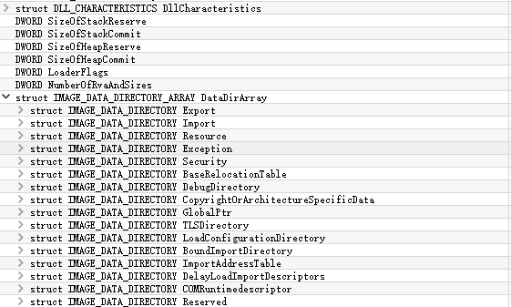
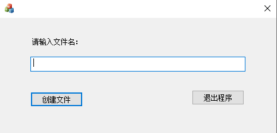
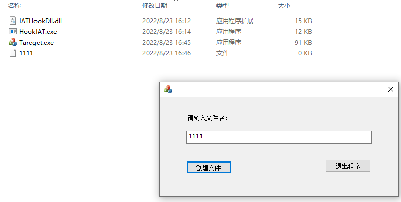
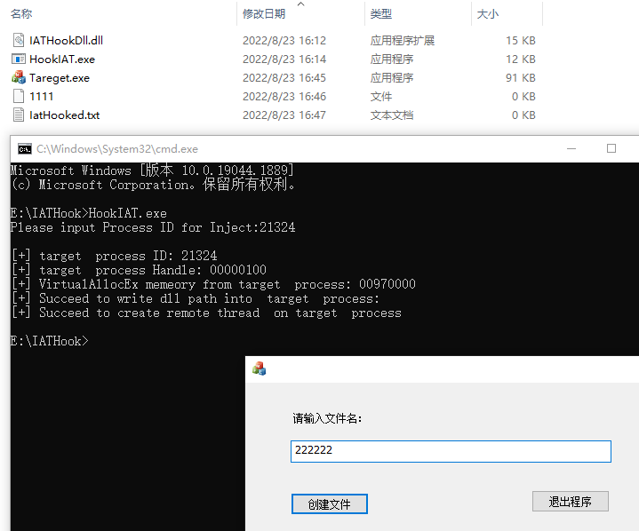

## １、IAT Hook原理

### 1.1 PE文件中的IAT表

导入表的位置：位于PE文件NT头部、扩展头中数据目录表第二项。IMAGE_DATA_DIRECTORY数据结构包含一个虚拟地址和一个大小：



PE文件中的IAT表格式：IMAGE_IMPORT_DESCRIPTOR大小为20字节。

```c++
typedef struct _IMAGE_IMPORT_DESCRIPTOR {
    union {
        DWORD   Characteristics;            
        DWORD   OriginalFirstThunk;       指向INT表 4个字节一组.是RVA指向名字跟序号  
    } DUMMYUNIONNAME;
    DWORD   TimeDateStamp;           
       

    DWORD   ForwarderChain;                 
    DWORD   Name;
    DWORD   FirstThunk;                  在文件中跟INT表一样.这是IAT                 
} IMAGE_IMPORT_DESCRIPTOR;
typedef IMAGE_IMPORT_DESCRIPTOR UNALIGNED *PIMAGE_IMPORT_DESCRIPTOR;
```


**PE文件加载前，IAT和INT表一样都是函数名成.PE加载后INT不变，IAT表变成了存储函数地址的地址表了.**

### 1.2 IAT HOOK原理

IAT Hook属于Address Hook的一种, 实质时通过修改目标函数的地址来进行Hook,具体操作流程:

1. 编写DLL注入到你想HOOK的程序中.
2. 编写DLL,DLL里面获取你HOOK程序的 ImageBase以及各种头(DOS,NT,FILE,OPT)
3. DLL里面通过扩展头的数据目录第一项.得到导入表RVA.加上ImageBase定位到导入表
4. 循环遍历导入表.导入表是一行04个字节.最后一项为0
5. 过导入表找到IAT表.继续遍历IAT表.
6. 判断IAT中的函数地址,是否是你要进行HOOK的函数地址
7. 替换原始的函数地址为我们自定义的函数地址

## 2、用户层IAT 实验

### 2.1 实验目的

本次实验目的：对目标程序进行IAT Hook，修改其创建文件的文件名。



备注： 该程序输入文件名后会在磁盘上创建一个文件。

### 2.2 实验过程

#### 2.2.1 编写测试注入的DLL

先编写一个用于测试的DLL，后续的IAT Hook的逻辑主要在该Dll中实现。具体代码：

```c++
#include "pch.h"
VOID IATHook() {
	MessageBox(NULL, L"You are Hooked!!!", L"IAT Hook Test", MB_OKCANCEL);
}

// dll主函数
BOOL APIENTRY DllMain(HMODULE hModule,
	DWORD  ul_reason_for_call,
	LPVOID lpReserved
)
{
	switch (ul_reason_for_call)
	{
	case DLL_PROCESS_ATTACH:
		IATHook();   //在加载dll时调用IATHook
	case DLL_THREAD_ATTACH:
	case DLL_THREAD_DETACH:
	case DLL_PROCESS_DETACH:
		break;
	}
	return TRUE;
}
```


#### 2.2.2 编写注入进程

实验使用过dll注入的方式在目标进程中执行IAT Hook的代码。dll注入有很多方式，这里选择最普通的远程线程注入。远程线程注入的流程：

- 根据进程名获取进程ID（CreateToolhelp32Snapshot、Process32First、Process32Next）
- 根据进程ID获取进程句柄（OpenProcess）
- 在目标进程中申请内存空间（VirtualAllocEx）
- 将要注入的DLL全路径写入上一步骤中申请的内存空间中（WriteProcessMemory）
- 在目标进程中创建远程线程，调用Loadlibrary加载需要注入的DLl（CreateRemoteThread）

```C++
#include <iostream>
#include <windows.h>
#include <iostream>

using namespace std;

int main()
{
	//输入进程ID：
	cout << "Please input Process ID for Inject:";
	DWORD proID;
	cin >> proID;
	cout << endl;
    cout << "[+] target  process ID: " << proID << endl;
 
    // 1.使用进程PID打开进程,获得句柄
    HANDLE hTarpro = OpenProcess(PROCESS_ALL_ACCESS, NULL, proID);
    if (hTarpro == INVALID_HANDLE_VALUE) {
        return 0;
    }
    cout << "[+] target  process Handle: " << hTarpro << endl;
    //2.使用进程句柄申请内存空间
    int nLen = sizeof(WCHAR) * (wcslen(L"./IATHook.dll") + 1);
    LPVOID pBuf = VirtualAllocEx(hTarpro, NULL, nLen, MEM_RESERVE | MEM_COMMIT,                               PAGE_READWRITE);
    if (!pBuf)
    {
        return false;
    }
    cout << "[+] VirtualAllocEx memeory from target  process: " << pBuf << endl;

    //3.把dll路径写入内存
    SIZE_T dwWrite = 0;
    if (!WriteProcessMemory(hTarpro, pBuf, L"E:\\IATHook.dll", nLen, &dwWrite))
    {
        return false;
    }
    cout << "[+] Succeed to write dll path into  target  process" << endl;

    //	4.创建远程线程, 调用LoadLibrary
    HANDLE hRemoteThread = CreateRemoteThread(hTarpro, NULL, NULL,
        (LPTHREAD_START_ROUTINE)LoadLibrary, pBuf, 0, 0);
    if (hRemoteThread == INVALID_HANDLE_VALUE) {
        return false;
    }
    cout << "[+] Succeed to create remote thread  on target  process" << endl;

    //5.等待线程结束返回,释放资源
    WaitForSingleObject(hRemoteThread, -1);
    CloseHandle(hRemoteThread);
    VirtualFreeEx(hTarpro, pBuf, 0, MEM_FREE);

    return 0;
}
```


#### 2.2.3 编写IAT Hook具体的实现

在DLL实现IAT HOOK的具体逻辑。具体步骤如下：

**1)准备自定义CreateFile函数**

该函数与原生CreateFileW参数、返回值等保持一致。具体功能：替换原始调用中第一个参数值：

```c++
HANDLE My_CreateFileW(
	LPCSTR                lpFileName,
	DWORD                 dwDesiredAccess,
	DWORD                 dwShareMode,
	LPSECURITY_ATTRIBUTES lpSecurityAttributes,
	DWORD                 dwCreationDisposition,
	DWORD                 dwFlagsAndAttributes,
	HANDLE                hTemplateFile
) {

	CString hfilename = "E:\\IatHooked.txt";
	if (g_OldCreateFile != nullptr) {
        //调用原始的CreateFileW函数，修改其中第一个参数
		return CreateFile(hfilename, dwDesiredAccess,
			dwShareMode,
			lpSecurityAttributes,
			dwCreationDisposition,
			dwFlagsAndAttributes,
			hTemplateFile);
	}
	return 0;
}
```

**2）准备被一个指向原始CreateFileW函数的函数指针和变量**

函数指针变量用于保存原始的函数地址

```c++
//函数指针
typedef void* (WINAPI* p_createfile)(
	LPCSTR lpFileName,
	DWORD  dwDesiredAccess,
	DWORD  dwShareMode,
	LPSECURITY_ATTRIBUTES lpSecurityAttributes,
	DWORD  dwCreationDisposition,
	DWORD  dwFlagsAndAttributes,
	HANDLE  hTemplateFile
	);
// 保存kernel32.dll中createfile函数地址
p_createfile  g_OldCreateFile = NULL; 

VOID SetIATHook(){
    //....
    //1. 需要Hook 的函数地址
	PVOID pHookAddress = nullptr;
	pHookAddress = GetProcAddress(GetModuleHandle(L"kernel32.dll"), "CreateFileW");
	if (pHookAddress == nullptr)
	{
		MessageBox(NULL, L"2: Failed to get Fun address ", L"IAT Hook Test", MB_OKCANCEL);
		return;
	}

	//2.保存旧的函数地址
	g_OldCreateFile = (p_createfile)pHookAddress;
    
    //....
}
```

**3)解析IAT表,替换函数地址**

通过遍历当前模块的IAT表来获取目标函数的地址，进行替换。注意事项：

- 通常输入表所在的内存页为只读的，首先要使用VirtualProtect函数将待修改内存属性为可写
- 保存原始的内存属性
- 修改IAT表中API的地址为自定义的函数地址
- 恢复内存也属性


```c++
VOID SetIATHook(){
//....
    //3. 解析PE，获取IAT表
    HMODULE hModue = GetModuleHandle(NULL);
	PIMAGE_DOS_HEADER  pDosHeader = (PIMAGE_DOS_HEADER)(DWORD)hModue;  //Dos 头
	DWORD dwTemp = (DWORD)pDosHeader + (DWORD)pDosHeader->e_lfanew;
	PIMAGE_NT_HEADERS pNtHead = (PIMAGE_NT_HEADERS)dwTemp;   //NT 头
	PIMAGE_FILE_HEADER pFileheader = (PIMAGE_FILE_HEADER)&pNtHead->FileHeader;
	PIMAGE_OPTIONAL_HEADER pOptionHead = (PIMAGE_OPTIONAL_HEADER)&pNtHead->OptionalHeader;
    //导出表位置
    DWORD dwExportLocal = pOptionHead->DataDirectory[1].VirtualAddress;
    dwTemp = (DWORD)GetModuleHandle(NULL) + dwExportLocal;
    PIMAGE_IMPORT_DESCRIPTOR  pImport = (PIMAGE_IMPORT_DESCRIPTOR)dwTemp;
    PIMAGE_IMPORT_DESCRIPTOR  pCurrent = pImport;
    DWORD* pFirstThunk;
    while (pCurrent->Characteristics && pCurrent->FirstThunk != NULL)
    {
        dwTemp = pCurrent->FirstThunk + (DWORD)GetModuleHandle(NULL);
        pFirstThunk = (DWORD*)dwTemp;
        while (*(DWORD*)pFirstThunk != NULL)
        {
            //遍历子表
            if (*(DWORD*)pFirstThunk == (DWORD)g_OldCreateFile)
            {
                //找到了要HOOK的函数地址
                DWORD oldprotected;
                VirtualProtect(pFirstThunk, 0x1000, PAGE_EXECUTE_READWRITE, &oldprotected);
                dwTemp = (DWORD)My_CreateFileA;   //替换自定的CreateFile函数
                memcpy(pFirstThunk, (DWORD*)&dwTemp, 4);
                VirtualProtect(pFirstThunk, 0x1000, oldprotected, &oldprotected);
            }
            pFirstThunk++;
        }
        pCurrent++;
    };
```


#### 2.3.4 实验效果

进行IAT Hook之前：



进行IAT Hook之后：



## 3、内核层IAT HOOK实验

### 3.1 实验目的


### 3.2 实验过程
