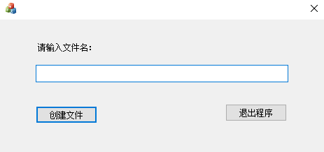
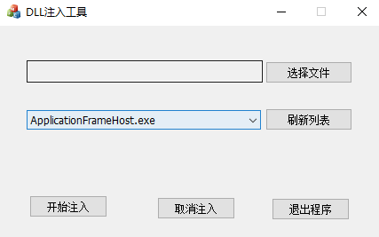

## 1、InlineHook原理

### 1.1 Windows API 调用过程

在Windows系统中，微软提供的API函数都保存在DLL文件中。当程序中使用某个API函数时，首先会通过隐式/显式的加载DLL到进程中。这样进程就可以向调用自己的函数一样调用API。以CreateFile（)函数为例：进程notepad.exe模块中调用可CreateFile函数，会调用kernel32.dll某块中的CreateFile。

系统API的实现都是在对应的DLL文件中。

### 1.2 Inline Hook原理

以CreateFile函数为例，说明Inline Hook的原理：

假设某进程要对kernel32.dll中的CreateFile函数进行Inline Hook, 首先需要在指定的进程中的内存中找到CreateFile函数的地址。然后修改CreateFile函数的首地址的代码为Jmp MyProc的指令，这样指定的进程调用CreateFile函数时就会首先跳转到我们自定义的函数中去执行流程了。

由于这种方法是在程序流程中直接进行嵌入jmp 指令来改变流程，所以就叫做Inline Hook。

## 2、InlineHook实现

既然Inline Hook是修改API函数首地址前几个字节实现执行流程的劫持，那么就有两种跳转的方式：

- 五字节Inline Hook: 通过构造一个jmp指令来修改目标函数入口。
- 七字节Inline Hook: 由于使用jmp来完成跳转需要计算偏移量，既然时修改目标函数入口，我们也可以通过多修改几条指令来避免计算跳转偏移。思路是：把目标地址保存到寄存器EAX,然后直接跳转到EAX中的地址处。

**Inline Hook流程：**

1. 构造跳转指令。

2. 在内存中找到欲Hook函数地址，并保存欲Hook位置处的前5字节。

3. **将构造的跳转指令写入需Hook的位置处。**

   **JMP 后的偏移量 = 目标地址 - 原地址-5**

4. 当被Hook位置被执行时会转到自己的流程执行。

5. 如果要执行原来的流程，那么取消Hook，也就是还原被修改的字节。

6. 执行原来的流程。

7. 继续Hook住原来的位置

### 2.1 五字节Inline Hook

仍以IATHook实验中的目标程序为例，通过Inline Hook实现修改CreateFileW函数第一个参数，篡改生成文件的路径；

介绍一下项目的架构：

- 目标程序：MFC程序，调用CreateFileW在当前目录生成输入参数指定的文件。

  

- DLL注入器：用于将DLL注入到目标进程（DLL注入使用远程线程注入方式）

  

- DLL文件：实现inline Hook的具体逻辑


下面主要讲述DLL中Inline Hook的具体实现；

首先定义一个niline Hook类

```C++
class InlineHook : public CHookTool {
private:
	PROC    m_pfrOrigin;     //替换函数的函数地址
	BYTE    m_pOldBytes[5];  //保存原始函数首地址5字节数据
	BYTE    m_pNewBytes[5];  //新的跳转地址

public:
	InlineHook();
	~InlineHook();
	BOOL  SetHook(LPCTSTR hmodule, LPCTSTR funame, PROC funadd);   //设置钩子
	VOID  UnSetHook();   //取消钩子
	BOOL  ReHook();      //重新挂钩
};
```

在SetHook函数中实现inline hook，最重要的就是计算跳转后的地址：

**JMP 后的偏移量 = 目标地址 - 源地址  -5**

```C++
BOOL InlineHook::SetHook(LPCTSTR hmodule, LPCTSTR funame, PROC  funadd)
{
	BOOL Ret = FALSE;
	//1. 获取模块中函数地址
	m_pfrOrigin = (PROC)GetProcAddress(GetModuleHandle(hmodule), funame);
	if (m_pfrOrigin != NULL)
	{
		//2. 保存目标函数地址前五个字节
		DWORD dwNum = 0;
		ReadProcessMemory(GetCurrentProcess(), m_pfrOrigin, m_pOldBytes, 5, &dwNum);

		//3. 构造JMP 指令
		m_pNewBytes[0] = '\xe9';   //JMP 对应的opcode
		*(DWORD*)(m_pNewBytes + 1) = (DWORD)funadd - (DWORD)m_pfrOrigin - 5;

		//4. 将构造好的地址写入
		WriteProcessMemory(GetCurrentProcess(), m_pfrOrigin, m_pNewBytes, 5, &dwNum);
		Ret = TRUE;
	}
	return Ret;
}
```

UnSetHook和ReHook函数实现

```C++
VOID InlineHook::UnSetHook()
{
	if (m_pfrOrigin !=0)
	{
		DWORD dwNum = 0;
		WriteProcessMemory(GetCurrentProcess(), m_pfrOrigin, m_pOldBytes, 5, &dwNum);
	}
}

BOOL InlineHook::ReHook()
{
	BOOL ret = FALSE;
	if (m_pfrOrigin !=0)
	{
		DWORD dwNum = 0;
		WriteProcessMemory(GetCurrentProcess(), m_pfrOrigin, m_pNewBytes, 5, &dwNum);
		ret = TRUE;
	}
	return ret;
}
```

此外，还需要准备一个自定义的CreateFileW函数实现我们修改文件路径的功能

```c++
HANDLE WINAPI My_CreateFile(
	LPCSTR                lpFileName,
	DWORD                 dwDesiredAccess,
	DWORD                 dwShareMode,
	LPSECURITY_ATTRIBUTES lpSecurityAttributes,
	DWORD                 dwCreationDisposition,
	DWORD                 dwFlagsAndAttributes,
	HANDLE                hTemplateFile
) {

	Creat.UnSetHook();
	//调用原始的CreateFileW函数，修改其中第一个参数
	return CreateFileW(L"D:\\inlinehook.txt", dwDesiredAccess,
		dwShareMode,
		lpSecurityAttributes,
		dwCreationDisposition,
		dwFlagsAndAttributes,
		hTemplateFile);
}
```

最后在DLL main函数中定义InlineHook类型变量，调用SetHook

```C++
BOOL APIENTRY DllMain( HMODULE hModule,
                       DWORD  ul_reason_for_call,
                       LPVOID lpReserved
                     )
{
    switch (ul_reason_for_call)
    {
	case DLL_PROCESS_ATTACH: {
		
		Creat.SetHook("kernel32.dll", "CreateFileW", (PROC)My_CreateFile);
		//MessageBox(NULL, "inlinehook", "测试", 0);
	}

    case DLL_THREAD_ATTACH:
    case DLL_THREAD_DETACH:
    case DLL_PROCESS_DETACH:
        break;
    }
    return TRUE;
}
```


### 2.2 七字节Inline Hook

由于使用jmp来完成跳转需要计算偏移量，既然时修改目标函数入口，我们也可以通过多修改几条指令来避免计算跳转偏移。思路是：把目标地址保存到寄存器EAX,然后直接跳转到EAX中的地址处。

```c++
mov  eax, 0x12345678
jmp eax
```

根据mov机器码及jmp eax的机器码，可以定义一个字节数组：

Byte bJmpCode[] = {'\x8','\0', '\0','\\','\0', 'xFF','xE0'}

这样可以直接把目标函数的地址保存到第一至第四个字节的位置。