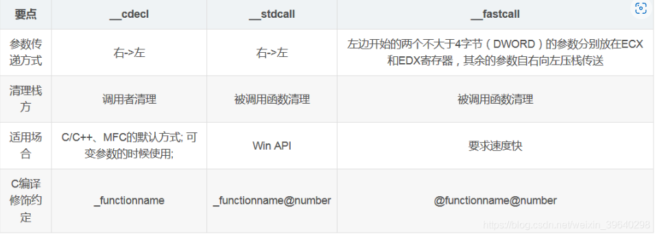
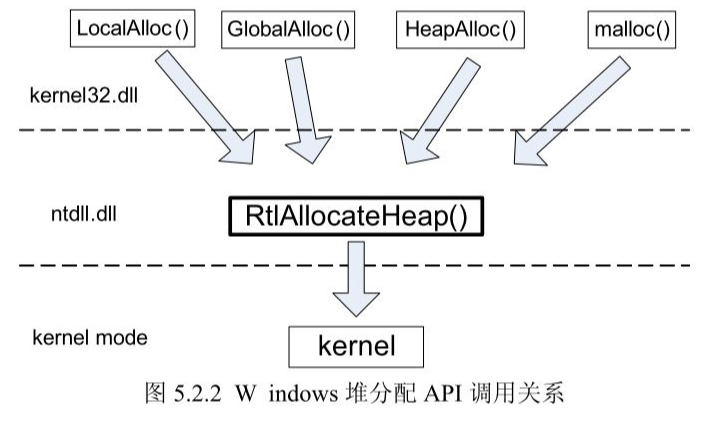
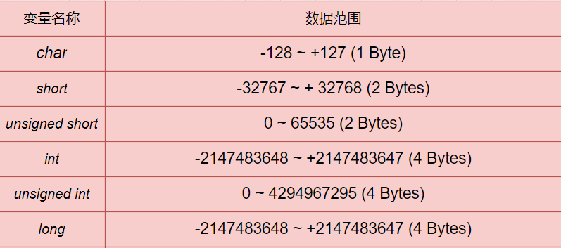
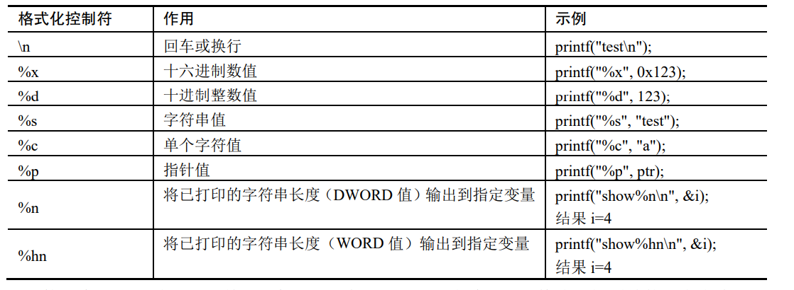

# 一、二进制漏洞原理分析

二进制漏洞原理，利用方法，缓解方法和平时分析和挖掘利用等过程;

## 1.1 栈溢出攻击原理

缓冲区溢出就是在大缓冲区的数据向小缓冲区复制过程中，由于没有注意小缓冲区得到边界，”撑爆“小缓冲区。从而冲掉了和小缓冲区相邻内存的其他数据而引起的内存问题。

危害：成功利用缓冲区溢出漏洞可以修改内存中的变量值，甚至可以劫持进程，执行恶意代码，最终获得主机的控制权。

### 1.1.1 函数调用过程-函数栈

#### **1）系统栈的原理**

**内存的不同用途：**

- 代码区：这个区域存储着被装入执行的二进制机器码，处理器会到这个区域取指令并执行。
- 数据区：用于存储全局变量。
- 堆区：进程可以在堆区动态的申请一定大小的内存，并在使用完之后归还给堆区。动态分配和回收是其主要的特点。
- 栈区：用于动态的存储函数之间的调用关系。以保证被调用函数在返回时恢复到母函数中继续执行。

**与栈相关的寄存器：**

- ESP: 栈指针寄存器，存放一个指向系统栈最上面的一个栈帧的顶部的指针
- EBP: 基址指针寄存器，存放一个指向系统栈最上面一个栈帧的底部
- EIP:指令指针寄存器， 永远存放着下一条等待执行的指针地址指针。

#### **2）函数的调用约定**



thiscall是唯一一个不能明确指明的函数修饰，因为thiscall只能用于C++类成员函数的调用，同时thiscall也是C++成员函数缺省的调用约定。由于成员函数调用还有一个this指针，因此必须特殊处理。

__thiscall调用方式规定：

采用桟传递参数，参数从右向左入栈。
如果参数个数确定，this指针通过ecx传递给被调用者；如果参数个数不确定，this指针在所有参数压栈后被压入堆栈；
对参数个数不定的，调用者清理堆栈，否则由被调函数清理堆栈。

#### **3）函数的调用过程**

**函数调用过程大致包括以下结构步骤：**

- 参数入栈：将参数按照调用约定（从右向左一次压入系统栈中）
- 返回地址入栈：将当前代码区域调用指令的下一条地址压入栈中，供函数返回时继续执行
- 代码区跳转：处理器从当前代码区跳转到被调用函数的入口处(call  xxxxxxxx)
- 栈帧调整：
  - 保存当前栈帧状态值，以备后面恢复栈帧时使用（EBP入栈， push  ebp）
  - 将当前栈帧切换到新栈帧（将ESP值装入EBP，更新栈帧底部, ）
  - 给新的栈帧分配空间（把ESP减去所需空间的大小， 提高帧顶）

**函数返回过程：**

- 保存返回值。通常将函数的返回值保存到寄存器EAX中。
- 弹出当前栈帧，恢复上一个栈帧
  - 在堆栈平衡的基础上，给ESP加上栈帧大小降低帧顶回收当前栈帧的空间（add  esp，xxx）
  - 将当前栈帧底部保存的前栈帧EBP值弹入EBP寄存器，恢复上一个栈帧（pop ebp）
  - 将函数返回地址弹给EIP寄存器（ret, 弹出栈顶和修改EIP为函数返回地址）
- 跳转：按照函数返回地址跳转到主调函数中继续执行

### 1.1.2 栈溢出漏洞原理分析

### 1.1.3 栈溢出利用技术

**Pop pop ret**

**ret2libc**

**ROP**

## 1.2 堆溢出攻击原理

### 1.2.1 堆的工作原理

#### **1） Windows系统堆管理机制的发展阶段：**

- Windows2000~Windows XP SP1: 堆管理系统只考虑了完成分配任务和性能因素。没有任何安全因素的考虑。
- Windows XP2 ~Windows2003：加入了安全因素。如修改了块首格式并加入安全cookie，双向链表节点在删除时会做指针验证等。
- Windows Vista~Windows7: 不论在对分配效率还是安全因素上都是堆管理系统算法的一个里程碑。

**堆的特性：**

* 堆是一种在程序运行时动态分配的内存。动态是指所需的内存大小不能在程序设计时预先决定。
* 堆在使用时需要程序员用专用的函数进行申请，如C语言malloc函数、C++中New函数。堆申请不一定成功，者取决于申请内存的大小、机器性能和当前运行环境。
* 一般用一个堆指针来使用申请到的内存。读写释放都是用这个指针来完成。
* 使用完毕后需要把堆指针传给堆释放函数回收这片内存， 否则会造成内存泄漏。典型的释放函数包括：free、delete

**堆的数据结构和分配策略：**

现代操作系统的堆数据结构一般包括堆块和堆表：

* 堆块：堆区的内存按照不同大小组织成块，堆以块为单位进行标识，而不是按照传统的字节标识。一个堆块包括块首和块身。堆管理系统所返回的指针一般是指向块身的起始位置。
* 堆表：堆表一般位于堆区的起始位置，用于索引堆区中的所有堆块的重要信息，包括堆块的位置、大小、空闲还是占用等状态。堆表的数据结构决定了整个堆区的组织方式。堆表在设计时可能会考虑采用平衡二叉树等高级数据结构用于优化查找效率，现在操作系统往往不止一种数据结构。占用态的堆块被使用他的程序索引，而堆表之索引所有的空闲状态的堆块。最重要的两种堆表：空闲双向链表Freelist（空表）和快速单向链表Lookaside（快表）
  * 空表：
  * 快表：

**堆分配函数：**



**堆操作**

堆的操作可以分为堆块分配、堆块释放和堆块合并三种。前两个是在程序提交申请和执行的是时候分配的，合并是由对管理器自动完成的。

* 堆块分配：
* 堆块释放：
* 堆块合并：

### 1.2.2 堆溢出漏洞原理分析

### 1.2.3 堆溢出利用技术

## **1.3 整数溢出**

### 1.3.1 整数溢出原理

整数分为有符号和无符号两种：

* 有符号：最高位为符号位即正整数为1，负整数为0。
* 无符号：负整数无符号位。

常用的整形变量short int、unsigned int、int、long int。不同类型的整数在内存中均有不同的固定取值范围。当我们向其存储的数值超过该类型整数的最大时时就会出现整数溢出。



### 1.3.2 整数溢出利用技术

与堆、栈溢出的防范类似，主要是先构造相应数值造成整数溢出，然后根据溢出内存是在堆上还是栈上采取不同利用方法。

#### 1）基于栈的整数溢出

#### 2）基于堆的整数溢出

## 1.4 格式化字符串

相对于缓冲区而言，格式化字符串漏洞更容易在源码和二进制分析中被发现，也容易在自动化检测过程中被发现，因此其产量较低。

### 1.4.1 格式化字符串漏洞原理

格式化字符串漏洞的产生主要源于堆用户输入内容未进行过滤，这些输入数据都是作为参数传递给某些执行格式化操作的函数，如printf、fprintf、vprintf、sprintf等。

恶意的用户可以使用”%s“和”%x“等格式符，从堆或者其他内存输出数据，也可以使用格式符”%n“向任意地址写入任意数据，配合printf()函数和其他类似功能的函数就可以向任意地址写入被格式化的字节数，也可能导致任意代码执行或者从漏洞程序中读取敏感信息。程序示例(VC6编译)：

```c++
#include<string.h>
#include<stdio.h>

int main(int argc, char* argv[]) {
	char buff[1024];
	strncpy(buff, argv[1], sizeof(buff) - 1);
	printf(buff);
	return 0;
}
```

常见的格式化控制符



## 1.5 双重释放

### 1.5.1 双重释放漏洞原理

双重释放漏洞主要时由于对同一块内存进行二次重复释放导致。利用该漏洞可以执行任意代码。

### 1.5.2 双重释放漏洞利用


## 1.6 释放重引用漏洞

### 1.6.1 释放重引用漏洞

释放重引用漏洞（Use After Free，UAF），顾名思义就是使用到已被释放的内存，最终导致内存崩溃或任意代码执行的 漏洞。U。

```c++
int size=32;
char* buf1;
char* buf2;

buf1 = (char*)malloc(size);
printf("buf1：0x%p\n", buf1);
free(buf1); // 释放 buf1,使得 buf1 成为悬挂指针
// 分配 buf2“占坑”buf1 的内存位置
buf2 = (char*)malloc(size);
printf("buf2：0x%p\n\n", buf2);

// 对 buf2 进行内存清零
memset(buf2, 0, size);
printf("buf2：%d\n", *buf2);
// 重引用已释放的 buf1 指针，但却导致 buf2 值被篡改
printf("==== Use After Free ===\n");
strncpy(buf1, "hack", 5);
printf("buf2：%s\n\n", buf2);
free(buf2);
```


**分析：** 程序通过分配与buf1大小相等的堆块buf2实现”占坑“。使得buf2分配到已释放的buf1的内存位置，但由于buf1指针依然有效，并指向的内存数据时不可预测的，可能被对管理器回收，也可能被其他数据占用填充。由于其不确定性buf1被称为"悬挂指针"。通过堆悬挂指针进行赋值可以篡改buf2的内存。如果原有的漏洞程序引用到悬念指针指向的数据用于执行指令或作 为索引地址去执行，就可能导致任意代码执行，前提是用可控数据去“占坑”释放对象。

### 1.6.2 

## 1.7 数组越界

与整数溢出漏洞不同的是，数组越界访问时由于数组下标值超出数组元素个数导致的。数组越界访问包含读写类型、而溢出属于数据写入。

### 1.7.1 数组越界原理

```c++
#include "stdio.h"
int main(){
    int index;
    int array[3] = {111, 222, 333};

     printf("输入数组索引下标：");
     scanf("%d", &index);
     printf("输出数组元素：array[%d] = %d\n", index, array[index]); //数组越界读操作
     // array[index] = 1; // 数组越界写操作
     return 0;
}
```

**当下标输入3时，就会越界访问array数组，导致读取到不在程序控制范围内的数值。如果越界访问距离过大，就可能导致访问到不可访问的内存，导致程序崩溃**

## 1.8 内核漏洞

### 1.8.1 内核漏洞调试环境


# 二、经典高危二进制漏洞

## 2.1 windows 系统漏洞

MS08-067 RCE漏洞；

MS12-020 DoS/蓝屏/RCE漏洞；

MS15-034 HTTP sys RCE漏洞；

MS16-114 SMB RCE；

MS17-010 Eternal Blue永恒之蓝漏洞

Meltdown/Spectre CPU特性漏洞、黑客奥斯卡神洞、公式编辑器漏洞、

CVE-2017-7269 IIS RCE漏洞；

CVE-2019-0708 Remote Desktop RCE漏洞；