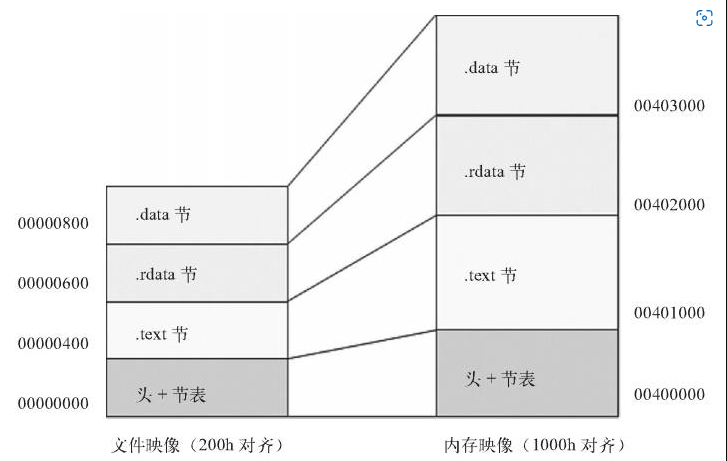
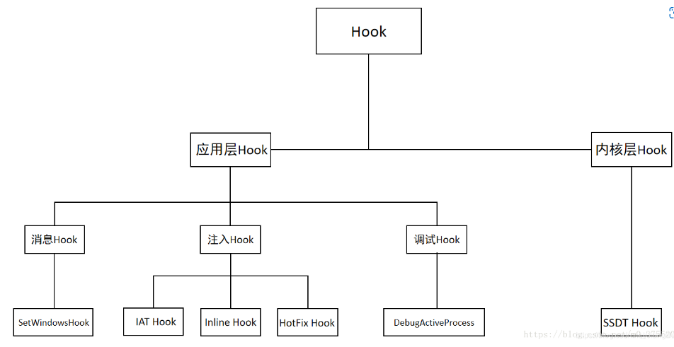
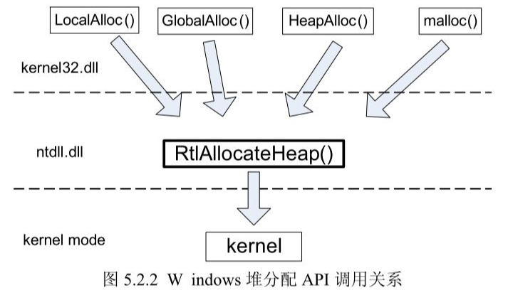

# 1、Windows系统篇

## 2.1 PE文件格式

#### 1）PE文件格式

- DOS头（IMAGE_DOS_HEADER）：e_magic（MZ，5A4DH)、e_lfanew指向PE文件头的偏移量。
- PE头（NT_HEADER)：Signature:0x00004550（PE00， PE文件头的开始）
  * PE文件头：IMAGE_FILE_HEADER: 文件属性（Characteristics，EXE:010fh, DLL:2102h）
  * 扩展头IMAGE_OPTIONAL_HEADER：OPE、ImageBase、数据目录表（导入表、导出表、重定位表、TLS等）
- 节/区块表：IMAGE_SECTION_HEADER结构，包含区块的信息：位置、长度、属性等。分别对应每个块。
- 节/块数据：.data、.reloc、.text、
- 调试信息：COFF行号、COFF符号表

#### 2）PE的加载过程


- 调用CreateProcess启动，生产内核对象，分配4GB进程空间，系统加载器加载dll文件（调用例程是LdrpRunInitializeRoutines）、完成重定位、IAT,接着创建进程的主线程，
- 主线程为每个DLL调用_DLLMainCRTStartup函数，然后主线程根据EXE是GUI（图形化）程序还是CUI（控制台）程序执行MainCRTStartup，最后一步执行WinMain(或者main函数)
- `ReadFile`读取文件头信息，判断是否是PE文件获取映像总大小，申请可读可写可执行的内存全部填为0获取区段信息，循环读取每一个区段内容，将`ReadFile`读取的数据映射到内存中
- 修复重定位：
- 修复IAT：
- 创建线程，线程回调指向OEP




#### 3）常见问题汇总

1. **怎么判断PE是EXE还是DLL?**

​	文件头中有一个字段：pNtHeader->FileHeader.Characteristics&IMAGE_FILE_DLL)==IMAGE_FILE_DLL

2. **什么是基地址**

3. **什么是虚拟地址Virtual Address？**

   Windows系统中，PE文件被系统加载器映射到内存中，每个程序都有自己的虚拟地址空间。这个虚拟地址空间的内存地址称为虚拟地址。

4. **什么是相对虚拟地址，相对虚拟地址和虚拟地址之间的关系？**

   在可执行文件中需要使用指定内存空间的地址，由于PE文件的加载基址不是一个固定的值，因此根据该值不能准确的定位当前程序中的变量地址。必须有一个方法（不依赖PE载入点的地址）来确定变量地址，故而引入了相对虚拟地址（RVA）。RVA只是一个相对于PE文件载入点的偏移位置。将一个RVA转换为VA的公式： VA = PE及地址（ImageBase）+ 相对虚拟地址（RVA)

5. **文件偏移**

   PE 文件在磁盘中时，某个数据地址相对于文件头的偏移量称为文件偏移。

6. **文件偏移与虚拟地址的转换**

   文件偏移　＝　RVA　－　/ｋ；　文件偏移　＝　VA－ImageBase　－/ｋ

   其中k表示：所计算的虚拟地址在哪一个块中，根据块的偏移来计算此K值。如一个虚拟地址为0x401112h, 他在.text段中，此时k=0c00h

7. **区块对其方式**

   在文件中是按照200h对齐、在内存中是按照4kb(1000h)对齐。因此将PE从磁盘加载到内存会拉伸。

## 2.2 Windows启动过程

### 2.2.1 Windows系统启动过程

系统调用详细过程

### 2.2.2 进程创建的详细过程

#### 1）进程创建的过程

* Createprocess创建一个执行体进程对象，即EPROCESS对象。
* 

#### 2）进程启动后进入main函数的详细过程

## 2.3 Windows异常机制

EH异常处理流程

SEH异常处理流程


## 2.4 Windows内核

### 2.4.1 进入Windows内核的方式

一个线程由用户态进入内核态的途径有3种典型的方式。通过 int 0x2e（软中断自陷） 或 KiFastSystemCall （快速系统调用），主动进入内核。引发异常或硬件中断，被迫进入内核。

#### 1）通过int0x2e进入内核（xp以下）

在 xp 以下，SSDT / SSDT Shadow 进入内核的指令是 int 0x2e，该指令是一条自陷指令（也叫中断门）,之后会将用户线程栈切换成内核线程栈，保存 CONTEXT,到 IDT 中寻找 0x2e 对应的异常处理函数（KiSystemService），至此进入内核代码空间。


#### 2）通过KiFastSystemCall 进入内核（xp以上）

快速调用指令（Intel的是sysenter，AMD的是syscall）调用系统服务。

老式的cpu不支持、不提供sysenter指令，只能由int 2e模拟中断方式进入内核，调用系统服务，但是，那种方式有一个明显的缺点，就是速度慢！（如int 2e内部本身要保存5个寄存器的现场，然后还要去IDT中查找isr，这个过程消耗的时间太多），因此x86系列从奔腾2代开始为系统调用专门增设了一条sysenter指令以及相应的寄存器msr。


### 2.4.2 windows内核从xp到现在win10的变化，

写驱动hook等相关知识


### 2.4.3 内核调试入门

## 2.5 Windows调试原理

### 2.5.1 硬件断点原理

### 2.5.2 调试断点原理

常用的断点：INT3断点、硬件断点、内存断点、消息断点。

#### 1）软件断点

**原理：**INT3对应的机器码是0XCC，当遇到INT3断点时，该处地址的内容被调试器用CC替换了。产生一个异常，调试器会捕获这个异常从而停在断点处，然后将断点处的指令恢复成原来的指令。

**优点：**可以设置无数个，没有限制

**缺点：**改变了源程序的机器码，容易被软件检测到。

#### 2）硬件断点

**原理：**硬件断点和调试寄存器DRx有关。DRx调试寄存器一共有八个，其中：DR0~DR3用来保存地址、DR4~DR5保留未使用、DR6状态寄存器、DR7控制寄存器。硬件断点的原理是：使用DR0~DR3设定地址、使用DR7设置状态。


**优点：**作用与CC一样， 但是不修改指令首字节。更难检测。速度快。

**缺点：**最多可以设置4个。

#### 3）内存断点

**原理：**对所设置的地址赋予不可访问/不可读写的属性，这样当访问/写入的时候就会产生异常。


**优点：**作用与CC一样， 但是不修改指令首字节。更难检测。速度快。

**缺点：**由于效率较低，在OD中只允许设置一个内存断点。

#### 4）消息断点

#### 5）条件断点

条件断点就是一个INT3断点加一个条件表达式。这个条件可以是寄存器、存储器、消息等。

* 寄存器条件断点：
* 存储器条件断点;
* 


### 2.5.3 调试器原理

win32自带了一些API函数，它提供了相当于一般调试器的大部分功能，这些函数统称为Win32调试API。利用这些API，可以加载一个程序或者绑定到一个正在运行的程序上进行调试，可以获得被调试的程序的底层信息如进程ID、进入地址、映像基址等。甚至可以对被调试的程序进行任意修改包括进程的内存、线程的运行环境等。

#### 1）调试API

ContinueDebugEvent: 允许调试器恢复先前由于调试事件而挂起的线程

DebugActiveProcess：允许将调试器捆绑到一个正在运行的进程上

DebugActiveProcessStop: 允许将调试器从一个正在运行的 进程上卸载

DebugBreak: 在当前进程中产生一个断点异常

DebugBreakProcee函数: 在指定一个进程中产生一个断点异常

FataExit: 将调用进程强制退出，将控制权转移至调试器，与ExitProcess不同的是，此函数会在推出前调用一个INT3断点。

FlushInstructionCache: 刷新指令高速缓存

GetThreadContext: 获取指定线程的执行环境

OutputDebugString: 将一个字符串传递给调试器显示

ReadProcessMemory： 读取指定进程的内存

SetThreadContext: 设置指定线程的执行环境

WaitForDebugEvent: 用来等待被调试进程发生调试事件

#### 2）断点API

- 用户模式下：DebugBreak() 
- 内核模式下：DbgBreakPoint() 或DbgBreakPointWithStatus() 


#### 3）创建调试器及处理调试事件

作为调试器的主要工作是监视目标进程的执行、对目标进程发生的每一个调试事件做出应有的反应。当目标进程中发生了一个调试事件后，系统将通知调试器来处理这个事件。调试器将利用WaitForDebugEvent API来获取目标进程的相关环境信息。当WaitForDebugEvent收到一个。

# 2、安全技术

## 2.1 Windows安全机制

### 2.1.1 GS：栈中的守护天使

#### 1）GS机制原理

在函数调用发生时，向函数调用栈内压入一个额外的随机DWORD，这个随机数被称为“canary”, 在IDA中显示为“Security　Cookie”。Security　Cookie位于EBP之前，系统还在.data的内存区域中存放一个Security　Cookie的副本。当栈中发生溢出时，Security　Cookie将被淹没，之后才是EBP和返回地址。在函数返回之后，系统将执行一个额外的安全验证操作。被称为Security check。系统将比较栈中的Security　Cookie和.data中的副本值，如果两者不吻合。说明栈中的Security　Cookie已被破环，即栈中发生了溢出。当检测到溢出后，系统将进入异常处理流程，函数不会被正常返回。


#### 2）绕过GS保护的方法

1. 利用未被保护的内存

   由于性能问题，不是所有的函数都会使用GS保护，因此可以利用一些未被保护的函数绕过GS保护。

2. 覆盖虚函数突破GS

   由于GS机制只在函数返回时采取检查Security　Cookie。在此之前没有任何检查措施。那么如果在程序检查Security　Cookie之前劫持程序流程的话，就可以实现对程序的溢出了。而恰好虚函数就满足这个条件。

3. 攻击异常处理突破GS

   GS机制没有对SEH提供保护，因此可以攻击SEH来绕过GS。

4. 同时替换栈中和.data中的Cookie突破GS

   猜测Security　Cookie的值；同时替换栈和.data中的Security　Cookie。

### 2.1.2 SafeSEH

#### 1）SafeSEH 原理

在Windows XP SP2中，微软引入了著名的S.E.H校验机制SafeSEH。其原理：在程序调用异常处理函数前，对要调用的异常处理函数进行一系列有效性校验。当发现异常处理函数不可靠时将终止异常处理函数的调用。Safe SEH的实现需要操作系统和编译器双重支持。

* **编译器方面的贡献**：启用/SafeSEH 编译器选项后，编译器在编译程序时将程序所有的异常处理函数地址提取出来放到一张安全S.E.H表中。并将这张表放到程序映像里面。当程序调用异常处理函数的时候会将函数地址与安全S.E.H表进行匹配，检查调用的异常处理函数是否位于安全S.E.H表中。

* **操作系统方面的贡献**：异常处理函数的调用是通过RtlDispatchException()函数处理实现的。SafeSEH也是从这里开始，主要有以下操作：
  - 检查异常处理函数是否位于当前程序的栈中
  - 检查异常处理函数指针是否指向当前的程序栈
  - 通过前两步骤的检查后，调用RtlIsValidHandler（）函数，对异常处理函数进行有效性验证。判断程序是否设置了标识、检测程序是否包含安全S.E.H表、判断程序是否设置ILonly标识、判断异常处理函数地址是否位于不可执行页上。当异常处理函数地址位于不可执行页上时，校验函数将检测DEP是否开启。

**怎样检测一个PE文件是否启用了SafeSEH**

#### 2）绕过SafeSEH 

（1）利用堆地址覆盖SEH结构绕过SafeSEH

上面讲过，在禁用DEP的进程中，异常分发器允许SEH handler位于除栈空间之外的非映像页面。也就是说我们可以把shellcode放置在堆中，然后通过覆盖SEH跳至堆空间以执行shellcode，这样即可绕过SafeSEH保护。

（2）利用没有启用SafeSEH保护的模块绕过SafeSEH

在介绍原理时讲过，在国内，目前大部分的PC都是安装的Windows XP，也就是说对于大部分Windows[操作系统](http://lib.csdn.net/base/operatingsystem)，其系统模块都没有受到SafeSEH保护，可以选用未开启SafeSEH保护的模块来利用，另外，现在还有很多VC6编译的软件，这些软件本身和自带的dll文件，都是可能没有SafeSEH保护的。这时就可以使用它里面的指令作为跳板来绕过SafeSEH。

（3）利用加载模块之外的地址绕过SafeSEH

同样是根据SafeSEH的原理可知，对于加载模块之外的地址，SafeSEH同样是不进行有效性检测的（当然假设是DEP是关闭的，或者DEP已经被绕过）。

（4）攻击返回地址绕过SafeSEH

（5）利用虚函数绕过SafeSEH 


### 2.1.3 DEP实现原理

#### 1）DEP机制保护原理

DEP保护的基本原理是将数据所在内存页标识为不可执行，当程序溢出成功转入shellcode时，程序会尝试在数据页上执行指令，此时CPU抛出异常。DEP主要作用是组织数据页（默认的堆页、各种栈以及内存池页）执行代码。根据实现机制的不同，分为软件DEP和硬件DEP。

- 软件DEP：软件DEP就是SafeSEH，
- 硬件DEP：硬件DEP需要CPU的支持。AMD中称为No-Execute Page-Protection(NX), Inter中称为Excute Disable Bit(XD)。

#### 2）绕过DEP保护

（1）攻击未启用DEP的程序

（2）利用Ret2Libc 挑战DEP

（3）利用可执行内存挑战DEP

（4）利用.NET挑战DEP

### 2.1.4 ASLR

#### 1）内存随机化保护机制原理

在Windows Vista版本后，支持了ASLR。ASLR技术就是通过加载程序时不再使用固定的基址加载，从而干扰shellcode定位。同样，实现ASRL也需要编译器和操作系统的双重支持：

- 编译器：支持ASLR的程序会在PE头中IMAGE_DLL_CHARACTERISTICS_DYNAMIC_BASE标识来说明其支持ASLR。VS2005 SP1后通过启用、dynamicbase来完成这个任务。
- 操作系统：
  * 映像随机化：PE文件映射到内存时对其加载基址进行虚拟化处理。通过注册表向可以设定随机化的模式。0为禁用、-1为强化虚拟化、其他值为正常模式
  * 堆栈随机化：在程序运行时随机选择堆栈的基址。由于堆栈的基址实在程序打开的时候确定的，也即同一个程序任意打开两次运行时堆栈的基址都是不同的。进而其中的变量位置也就不同。
  * PEB与TEB随机化： 微软在XP SP2之后不在使用固定的PEB和TEB基址。增加了攻击PEB中函数的难度。
  * 

#### 2）绕过ASLR的方法

（1）攻击未启用ASLR的模块

（2）利用部分覆盖进行定位内存地址

（3）利用Heap spray技术定位内存地址

（4）利用 Java applet heap spray技术定位内存

### 2.1.5 SEHOP

### 2.1.6 堆保护

## 2.2 注入与Hook

### 2.2.1 Windows注入技术

#### 1）DLL注入

**1.修改注册表**

修改 HKEY_LOCAL_MACHINE/Software/Microsoft/WindowsNT/CurrentVersion/Windows/AppInit_DLLs 的键值，改为待注入DLL的路径，这样一来，程序运行后只要加载了user32.dll，都会加载我们写入的DLL。

**2.全局消息钩子注入**

Windows应用程序是基于消息驱动的，任何线程只要注册窗口类都会有一个消息队列用于接收用户输入的消息和系统消息。为了拦截消息，Windows提出了钩子的概念。钩子（Hook）是Windows消息处理机制中的一个监视点，钩子提供一个回调函数。当在某个程序中安装钩子后，它将监视该程序的消息，在指定消息还没到达窗口之前钩子程序先捕获这个消息。这样就有机会对此消息进行过滤，或者对Windows消息实现监控。 消息钩子分为局部钩子和全局钩子。局部钩子是指仅拦截某一个进程的消息，全局钩子将拦截系统中所有进程的消息。
　　该技术需要我们写一个简单的加载该DLL的程序，使其调用DLL的钩子函数，该函数会下一个全局消息钩子，强迫所有发生该消息的进程加载该DLL，这样就实现了DLL注入。

**3.手工修改导入表**

该方法需要我们熟悉PE结构，找到导入表位置在其后面添加一个新节，写入待注入的DLL，并将该DLL的导出函数的一些信息写到正确的位置，若导出函数过多将花费很多时间在手工修改上，并且可能出现空间不足写入的情况。

**4.远程线程注入DLL（常问）**

通过利用2000/XP等系统所有进程加载Kernel32.dll的模块基址一致的特点，先使用`OpenProcess`函数打开远程进程的句柄，再用`VirtualAllocEx`和`WriteProcessMemory`将待注入DLL路径写入目标进程，找到`LoadLibraryW`的地址，最后用`CreateRemoteThread`使目标进程调用`LoadLibraryW`加载DLL，参数为写入的DLL路径。

```c
1. 获取指定进程句柄
OpenProcess
 2. 在进程中申请一段内存
VirtualAllocEx
 3. 把dll路径写入到进程内存中
WriteProcessMemory
 4. 创建远程线程
CreateRemoteThread
 5. 等待线程，释放空间
WaitForSingleObject
```

**5.APC注入**

APC注入的原理是利用当线程被唤醒时APC中的注册函数会被执行的机制，并以此去执行我们的DLL加载代码，进而完成DLL注入的目的。利用QueueUserAPC()可以向APC队列投入Loadlibrary函数指针完成注入，其实这种方法配合CreateProcess使用注入最为简单，先挂起打开线程，再QueueUserAPC()，再恢复线程，完成注入。

**6.DLL劫持**

自己实现应用程序的某个DLL，完成其导出函数，并将其放于应用程序目录下，当程序打开并加载DLL时会优先加载该目录下的DLL，原来的DLL若在该目录下降其移走即可。

**7.输入法注入**

利用输入法在工作时需要向进程中加载Ime文件（其实就是个Dll）,我们构造自己的Ime文件，在Ime文件注入对方进程的时候加载我们自己的DLL完成注入

#### 2）代码注入

**1、手工修改执行起始地址**

使用二进制编辑工具打开目标程序，找到合适的地方写入二进制代码，将程序执行起始地址(AddressOfEntryPoint)改为注入代码处，在执行完后跳到源地址。

**2、挂起线程注入**

OpenThread–>SuspendThread–>申请内存–>写入代码–>GetThreadContext–>获取EIP–>修改EIP–>SetThreadContext–>ResumeThread。

**3、挂起进程注入**

CreateProcess注入方法之一，CREATE_SUSPENDED以挂起的方式打开进程，后面方法与挂起线程注入相似。

**4、调试器注入**

CreateProcess注入方法之二，DEBUG_ONLY_THIS_PROCESS以调试的方法打开进程，利用CREATE_PROCESS_DEBUG_EVENT，向目标程序中写入我们的ShellCode完成相应功能，并且我们的ShellCode中写入以CC断点，代码执行指令时触发EXCEPTION_DEBUG_EVENT事件，在EXCEPTION_DEBUG_EVENT的处理函数中回到原来的执行流程。

### 2.2.2 Hook技术

> 钩子(Hook)，是Windows消息处理机制的一个平台，应用程序可以在上面设置子程以监视指定窗口的某种消息，而且所监视的窗口可以是其他进程所创建的。当消息到达后，在目标窗口处理函数之前处理它。钩子机制允许应用程序截获处理window消息或特定事件。钩子实际上是一个处理消息的程序段，通过系统调用，把它挂入系统。每当特定的消息发出，在没有到达目的窗口前，钩子程序就先捕获该消息，亦即钩子函数先得到控制权。这时钩子函数即可以加工处理（改变）该消息，也可以不作处理而继续传递该消息，还可以强制结束消息的传递。



HOOK技术主要分为两大类，一是内核层HOOK,一是用户层HOOK。

- 用户层HOOK也就是在ring3环境下hook kenerl32.dll、User3.dll、Gui32.dll、Advapi.dll等导出的函数。SetWindowsHookEx、UnhookWindowsHookEx、CallNextHookEx。
  * 消息Hook：SetWindowsHookEx
  * 注入Hook：Inline HOOK、IAT HOOK、HotFix Hook
  * 调试Hook：DebugActiveProcess
- 内核层HOOK就是HOOK只有ring0级别环境下才能操作写入改变的内核对象，例如SSDT系统服务描述符表等。SSDT HOOK、IDT HOOK、object HOOK、sysenter HOOK

**综合而言，主要有以下9种HOOK技术。**

1. **消息钩子**
   消息钩子是最常见的钩子之一，例如常见的键盘鼠标钩子，很多木马就是通过消息钩子获取密码的。消息钩子是由Win32子系统提供，用户通过它注册全局钩子。当系统获取某些事件，比如用户按键，键盘driver将扫描码等传入win32k的KeyEvent处理函数，处理函数判断有无相应hook，有则通过回调函数处理。此时，系统取得Hook对象信息，若目标进程没有装载对应的Dll，则装载之。
2. **IAT HOOK**
   IAT HOOK是最常见和普遍的HOOK之一。IAT表示导入地址表(Import Address Table)，导入函数就是被程序调用但其执行代码又不在程序中的函数，当PE文件被装入内存的时候，Windows装载器才将DLL装入，并将调用导入函数的指令和函数实际所处的地址联系起来(动态连接)，这种操作就需要导入表完成。其中导入地址表就指示函数实际地址。程序每个调用的API函数地址都保存在IAT表中，而每个调用 API 函数的CALL指令所使用的地址都是相应函数登记在IAT表的地址。IATHOOK原理是在将 IAT 表中的地址换成用户自己的函数地址，这样每个 API 调用都是先调用用户自己的函数。在这个函数中我们可以完成函数名称的记录、参数的记录、调用原来的过程，并在返回时记录结果。
3. **EAT HOOK**
   EAT HOOK的原理是根据替换PE格式导出表中的相应函数来实现的。EAT表示导出地址表(Export Address Table)，EAT存在于PE文件中的edata节，保存了可执行文件（如DLL文件）的导出的可供其他模块来调用的函数和公共变量，包括函数名称和地址等。通过替换Windows系统某些重要DLL中的输出函数地址，即可实现目标函数的挂接。EAT记录DLL中可供其他程序使用的函数，可执行文件装载时会使用相应DLL的EAT表来初始化IAT表。EAT HOOK原理是通过替换EAT表中的函数地址，使依赖于本DLL的程序得到一个假的地址。
4. **SSDT HOOK**
   SSDT是最常见的内核层HOOK。SSDT的全称是系统服务描述符表(System Services Descriptor Table)。SSDT是关联ring3的
   Win32 API和ring0的内核API的重要数据结构，它存储着Windows把需要调用的所有内核API地址。SSDT HOOK原理是将内核层API地址修改为指向其位于Ring0层的驱动入口，这样每次系统执行到这个函数时，都会通过SSDT表将原始调用引向修改后的模块中。
5. **IDT HOOK**
   IDT HOOK是Win2000操作系统上常用的一种HOOK。IDT是中断描述表，可以替换其中的中断处理程序。这种方法对于跟踪、分析系统调用来说用的比较多。IDT HOOK的原理是通过替换IDT表中的INT 2E中断，使之指向新的中断服务处理例程来实现的。它首先保存出特定的中断向量中断服务程序(ISR), 然后直接修改该中断向量的ISR为自定义的函数，每当这个中断向量对应的中断产生时，就会调用自定义的函数。由于我们自定义的函数里面执行完我们的功能后再跳转到原ISR处执行。
6. **SYSENTRY HOOK**
   SYSENTRY是Windows XP之后的操作系统进入ring0的函数。Win2000中通过 int2e系统调用机制，涉及到的Interrupt/Exception Handler的调用都是通过 call/trap/task这一类的gate来实现的，这种方式会进行栈切换，并且系统栈的地址等信息由TSS提供，可能会引起多次内存访问 （来获取这些切换信息），系统开销较大。SYSENTER通过汇编指令实现快速系统调用机制。SYSENTER HOOK的原理是首先Ntdll 加载相应的请求服务号到EAX 寄存器中，同时EDX寄存器存贮当前的栈指针ESP，然后Ntdll发出SYSENTER 指令，该指令转移控制权到寄存器IA32_SYSENTER_EIP存贮的地址中[21]，通过修改这个地址，可实现相应的挂接。
7. **Inline HOOK**
   inline hook是直接在以前的函数体内修改指令，用一个跳转或者其他指令来实现挂钩的目的。而普通的hook只是修改函数的调用地址，而不是在原来的函数体里面做修改。Inline hook原理是解析函数开头的几条指令，把他们Copy到数组保存起来，然后用一个调用我们的函数的几条指令来替换，如果要执行原函数，则在我们函数处理完毕，再执行我们保存起来的开头几条指令，然后调回我们取指令之后的地址执行。它需要在程序中嵌入汇编代码（Inline Assembly）以操作堆栈和执行内核API对应的部分汇编指令。
8. **OBJECT HOOK**
   OBJECT HOOK是相对于IAT HOOK之类的 API HOOK而言，API HOOK是挂钩应用层函数，而OBJECT HOOK是挂钩内核层函数。其原理与API HOOK类似。
9. **IRP HOOK**
   IRP是 I/O request packets，在Windows中几乎所有的I/O都是通过包（packet）驱动的，每个单独的I/O由一个工作命令描
   述，此命令将会告诉驱动程序需要一些什么操作，并通过I/O子系统跟踪处理过程。这些工作命令就表现为一个个被称为IRP的数据结构。
   IRP HOOK原理是拦截管理器发向文件或网络系统等驱动程序的IRP。一般通过创建一个上层过滤器设备对象并将之加入系统设备所在的设备堆栈中。也有部分IRP HOOK通过拦截传递IRP请求包的函数IofCallDriver或MajorFunction函数表来实现的。


带有随机基址的程序如何HOOK：

* 修改PE文件中的字段属性来设置固定基址：CFF explorer、或者010Editor。

  将"WORD IMAGE_DLLCHARACTERISTICS_DYNAMIC_BASE"字段对应的Value值由"1"改成"0".
  也可以将左侧窗口对应的hex值"6081"改成"2081"，对应32位程序的话，此处是"4081"改成"0081"，"WORD IMAGE_DLLCHARACTERISTICS_DYNAMIC_BASE"的值修改成"0"，和64位操作方法一样。

## 2.3 反调试技术


加壳
花指令
时间检查
API：IsDebuggerPresent和CheckRemoteDebuggerPresent
PEB的调试标记位：BeingDebugged //一个char类型.为1表示调试状态.为0表示没有调试.可以用于反调试. API也是从这里获取的标志
TLS Callback，利用TLS回调函数：在TLS回调函数中加入反调试代码的方法来进行的反调试手段
检测是否有OD，x64dbg，windbg等调试器进程


### 2.3.1 探测Windows调试器

#### 1）使用Windows API

IsDebuggerPresent

CheckRemoteDebuggerPresent

NtQueryInformationProcess

GetLastError

ZwSetInformationThread

#### 2）手动检测数据结构

检测BeingDebugged属性

检测ProcessHeap属性

检测NTGlobalFlag

#### 3）系统痕迹检测

通常，我们使用调试工具来分析恶意代码，但这些工具会在系统中驻留一些痕迹。恶意代码通过搜索这种系统痕迹，来确定你是否试图分析它。

查找调试器引用的注册表项：SOFTWARE\Microsoft\Windows NT\CurrentVersion\AeDebug(32位系统)
SOFTWARE\Wow6432Node\Microsoft\WindowsNT\CurrentVersion\AeDebug(64位系统)
该注册表项指定当应用程序发生错误时，触发哪一个调试器。默认情况下，它被设置为Dr.Watson。如果该这册表的键值被修改为OllyDbg，则恶意代码就可能确定它正在被调试。

查找窗体信息：FindWindow函数检索处理顶级窗口的类名和窗口名称匹配指定的字符串。

查找进程信息：OllyDBG.EXE，OllyICE.exe，x64_dbg.exe，windbg.exe，ImmunityDebugger.exe

#### 4）识别调试器行为

在逆向工程中，为了帮助恶意代码分析人员进行分析，可以使用调试器设置一个断点，或是单步执行一个进程。然而，在调试器中执行这些操作时，它们会修改进程中的代码。因此，恶意代码常使用几种反调试技术探测软件/硬件断点、完整性校验、时钟检测等几种类型的调试器行为。直接运行恶意代码与在调试器中运行恶意代码也会在一些细节上不同，如父进程信息、STARTUPINFO信息、SeDebugPrivilege权限等。


软件断点检查： 调试器设置断点的基本机制是用软件中断指令INT 3临时替换运行程序中的一条指令，然后当程序运行到这条指令时，调用调试异常处理例程。INT 3指令的机器码是0xCC，因此无论何时，使用调试器设置一个断点，它都会插入一个0xCC来修改代码。恶意代码常用的一种反调试技术是在它的代码中查找机器码0xCC，来扫描调试器对它代码的INT 3修改。repne scasb指令用于在一段数据缓冲区中搜索一个字节。EDI需指向缓冲区地址，AL则包含要找的字节，ECX设为缓冲区的长度。当ECX=0或找到该字节时，比较停止。

硬件断点检查：在OllyDbg的寄存器窗口按下右键，点击View debug registers可以看到DR0、DR1、DR2、DR3、DR6和DR7这几个寄存器。DR0、Dr1、Dr2、Dr3用于设置硬件断点，由于只有4个硬件断点寄存器，所以同时最多只能设置4个硬件断点。DR4、DR5由系统保留。 DR6、DR7用于记录Dr0-Dr3中断点的相关属性。如果没有硬件断点，那么DR0、DR1、DR2、DR3这4个寄存器的值都为0。


执行代码校验和检查：恶意代码可以计算代码段的校验并实现与扫描中断相同的目的。与扫描0xCC不同，这种检查仅执行恶意代码中机器码CRC或者MD5校验和检查。


时钟检测：被调试时，进程的运行速度大大降低，例如，单步调试大幅降低恶意代码的运行速度，所以时钟检测是恶意代码探测调试器存在的最常用方式之一。有如下两种用时钟检测来探测调试器存在的方法。
记录一段操作前后的时间戳，然后比较这两个时间戳，如果存在滞后，则可以认为存在调试器。
记录触发一个异常前后的时间戳。如果不调试进程，可以很快处理完异常，因为调试器处理异常的速度非常慢。默认情况下，调试器处理异常时需要人为干预，这导致大量延迟。虽然很多调试器允许我们忽略异常，将异常直接返回程序，但这样操作仍然存在不小的延迟。
4.1 使用rdtsc指令
较常用的时钟检测方法是利用rdtsc指令(操作码0x0F31)，它返回至系统重新启动以来的时钟数，并且将其作为一个64位的值存入EDX:EAX中。恶意代码运行两次rdtsc指令，然后比较两次读取之间的差值。
4.2 使用QueryPerformanceCounter和GetTickCount
同rdtsc指令一样，这两个Windows API函数也被用来执行一个反调试的时钟检测。使用这种方法的前提是处理器有高分辨率能力的计数器-寄存器，它能存储处理器活跃的时钟数。为了获取比较的时间差，调用两次QueryPerformanceCounter函数查询这个计数器。若两次调用之间花费的时间过于长，则可以认为正在使用调试器。GetTickCount函数返回最近系统重启时间与当前时间的相差毫秒数(由于时钟计数器的大小原因，计数器每49.7天就被重置一次)。


判断父进程是否是explorer.exe： 一般双击运行的进程的父进程都是explorer.exe，但是如果进程被调试父进程则是调试器进程。也就是说如果父进程不是explorer.exe则可以认为程序正在被调试。


判断STARTUPINFO信息：explorer.exe创建进程的时候会把STARTUPINFO结构中的值设为0，而非explorer.exe创建进程的时候会忽略这个结构中的值，也就是结构中的值不为0。所以可以利用STARTUPINFO来判断程序是否在被调试。


判断是否具有SeDebugPrivilege权限：默认情况下进程是没有SeDebugPrivilege权限的，但是当进程通过调试器启动时，由于调试器本身启动了SeDebugPrivilege权限，当调试进程被加载时SeDebugPrivilege也就被继承了。所以我们可以检测进程的SeDebugPrivilege权限来间接判断是否存在调试器，而对SeDebugPrivilege权限的判断可以用能否打开csrss.exe进程来判断。


#### **5）干扰调试器的功能**

恶意代码可以用一些技术来干扰调试器的正常运行。例如线程本地存储(TLS)回调、插入中断、异常等。这些技术当且仅当程序处于调试器控制之下时才试图扰乱程序的运行。

**1.使用TLS回调**

Thread Local Storage(TLS)，即线程本地存储，是Windows为解决一个进程中多个线程同时访问全局变量而提供的机制。TLS可以简单地由操作系统代为完成整个互斥过程，也可以由用户自己编写控制信号量的函数。当进程中的线程访问预先制定的内存空间时，操作系统会调用系统默认的或用户自定义的信号量函数，保证数据的完整性与正确性。下面是一个简单的TLS回调的例子，TLS_CALLBACK1函数在main函数执行前调用IsDebuggerPresent函数检查它是否正在被调试。


**2.利用中断**

因为调试器使用INT 3来设置软件断点，所以一种反调试技术就是在合法代码段中插入0xCC(INT 3)欺骗调试器，使其认为这些0xCC机器码是自己设置的断点。
除了使用_try和_except以外还可以直接使用汇编代码安装SEH。在下面的代码中如果进程没有处于调试中，则正常终止；如果进程处于调试中，则跳转到非法地址0xFFFFFFFF处，无法继续调试。
双字节操作码0xCD03也可以产生INT 3中断，这是恶意代码干扰WinDbg调试器的有效方法。在调试器外，0xCD03指令产生一个STATUS_BREAKPOINT异常。然而在WinDbg调试器内，由于断点通常是单字节机器码0xCC，因此WinDbg会捕获这个断点然后将EIP加1字节。这可能导致程序在被正常运行的WinDbg调试时，执行不同的指令集(OllyDbg可以避免双字节INT 3的攻击)。
INT 2D原为内核模式中用来触发断点异常的指令，也可以在用户模式下触发异常。但程序调试运行时不会触发异常，只是忽略。INT 2D指令在ollydbg中有两个有趣的特性。在调试模式中执行INT 2D指令，下一条指令的第一个字节将被忽略。使用StepInto(F7)或者StepOver(F8)命令跟踪INT 2D指令，程序不会停在下一条指令开始的地方，而是一直运行，就像RUN(F9)一样。在下面的代码中，程序调试运行时，执行INT 2D之后不会运行SEH，而是跳过NOP，把bDebugging标志设置为1，跳转到normal_code；程序正常运行时，执行INT 2D之后触发SEH，在异常处理器中设置EIP并把bDebugging标志设置为0。
片内仿真器(ICE)断点指令ICEBP(操作码0xF1)是Intel未公开的指令之一。由于使用ICE难以在任意位置设置断点，因此ICEBP指令被设计用来降低使用ICE设置断点的难度。运行ICEBP指令将会产生一个单步异常，如果通过单步调试跟踪程序，调试器会认为这是单步调试产生的异常，从而不执行先前设置的异常处理例程。利用这一点，恶意代码使用异常处理例程作为它的正常执行流程。为了防止这种反调试技术，执行ICEBP指令时不要使用单步。


**3.设置陷阱标志位**

EFLAGS寄存器的第八个比特位是陷阱标志位。如果设置了，就会产生一个单步异常。


**4.使用异常**

前面已经讨论了各种使用异常机制的反调试手段。
**4.1 RaiseException**
RaiseException函数产生的若干不同类型的异常可以被调试器捕获。
**4.2 SetUnhandledExceptionFilter**
进程中发生异常时若SEH未处理或注册的SEH不存在，会调用UnhandledExceptionFilter，它会运行系统最后的异常处理器。UnhandledExceptionFilter内部调用了前面提到过的NtQueryInformationProcess以判断是否正在调试进程。若进程正常运行，则运行最后的异常处理器；若进程处于调试，则将异常派送给调试器。SetUnhandledExceptionFilter函数可以修改系统最后的异常处理器。下面的代码先触发异常，然后在新注册的最后的异常处理器内部判断进程正常运行还是调试运行。进程正常运行时pExcept->ContextRecord->Eip+=4;将发生异常的代码地址加4使得其能够继续运行；进程调试运行时产生无效的内存访问异常，从而无法继续调试。在OllyDbg中，选择Options->Debugging Options->Exceptions来设置把异常传递给应用程序。


### 2.3.2 加壳原理

### 2.3.3 进程隐藏技术

### 2.3.4 虚拟机检测技术

### 2.3.5 文件隐藏技术

### 2.3.6 通信监控技术

## 2.4 二进制漏洞原理

二进制漏洞原理，利用方法，缓解方法和平时分析和挖掘利用等过程;

### 2.4.1 栈溢出攻击原理

#### **1）函数调用过程-函数栈**

#### 2）栈溢出漏洞原理分析

#### 3)栈溢出利用技术

**Pop pop ret**

**ret2libc**

**ROP**

### 2.4.2 堆溢出攻击原理

#### **1）堆的工作原理**

**Windows系统堆管理机制的发展阶段：**

- Windows2000~Windows XP SP1: 堆管理系统只考虑了完成分配任务和性能因素。没有任何安全因素的考虑。
- Windows XP2 ~Windows2003：加入了安全因素。如修改了块首格式并加入安全cookie，双向链表节点在删除时会做指针验证等。
- Windows Vista~Windows7: 不论在对分配效率还是安全因素上都是堆管理系统算法的一个里程碑。

**堆的特性：**

* 堆是一种在程序运行时动态分配的内存。动态是指所需的内存大小不能在程序设计时预先决定。
* 堆在使用时需要程序员用专用的函数进行申请，如C语言malloc函数、C++中New函数。堆申请不一定成功，者取决于申请内存的大小、机器性能和当前运行环境。
* 一般用一个堆指针来使用申请到的内存。读写释放都是用这个指针来完成。
* 使用完毕后需要把堆指针传给堆释放函数回收这片内存， 否则会造成内存泄漏。典型的释放函数包括：free、delete


**堆的数据结构和分配策略：**

现代操作系统的堆数据结构一般包括堆块和堆表：

* 堆块：堆区的内存按照不同大小组织成块，堆以块为单位进行标识，而不是按照传统的字节标识。一个堆块包括块首和块身。堆管理系统所返回的指针一般是指向块身的起始位置。
* 堆表：堆表一般位于堆区的起始位置，用于索引堆区中的所有堆块的重要信息，包括堆块的位置、大小、空闲还是占用等状态。堆表的数据结构决定了整个堆区的组织方式。堆表在设计时可能会考虑采用平衡二叉树等高级数据结构用于优化查找效率，现在操作系统往往不止一种数据结构。占用态的堆块被使用他的程序索引，而堆表之索引所有的空闲状态的堆块。最重要的两种堆表：空闲双向链表Freelist（空表）和快速单向链表Lookaside（快表）
  * 空表：
  * 快表：

**堆分配函数：**



**堆操作**

堆的操作可以分为堆块分配、堆块释放和堆块合并三种。前两个是在程序提交申请和执行的是时候分配的，合并是由对管理器自动完成的。

* 堆块分配：
* 堆块释放：
* 堆块合并：

#### 2）堆溢出利用方式

**DWORD SHOOT** 


#### 3)整数溢出

#### 4）格式化字符串

#### 5）双重释放

#### 6）释放重引用漏洞

#### 7）数组越界

#### 8）内核漏洞


2.4.3 CFG防御机制原理

ROP攻击、DOP攻击、插装检测

2.4.4 Shellcode开发

2.5 权限维持的方法

[Window下常见的权限维持方式 - SecPulse.COM | 安全脉搏](https://www.secpulse.com/archives/120223.html)


# 3、编程基础

## 3.1 汇编基础

#### 1）通用寄存器

16位cpu通用寄存器共有　8　个：AX,BX,CX,DX,BP,SP,SI,DI.
32位cpu通用寄存器共有　8　个：EAX,EBX,ECX,EDX,EBP,ESP,ESI,EDI功能和上面差不多

- AX：累加器（Accumulator），使用频度最高
- BX：基址寄存器（Base Register），常存放存储器地址
- CX：计数器（Count Register），常作为计数器
- DX：数据寄存器（Data Register），存放数据
- SI：源变址寄存器（Source Index），常保存存储单元地址
- DI：目的变址寄存器（Destination Index），常保存存储单元地址
- BP：基址指针寄存器（Base Pointer），表示堆栈区域中的基地址
- SP：堆栈指针寄存器（Stack Pointer），指示堆栈区域的栈顶地址

#### 2）段寄存器

- 代码段寄存器CS（Code Segment）
  存放当前正在运行的程序代码所在段的段基址，表示当前使用的指令代码可以从该段寄存器指定的存储器段中取得，相应的偏移量则由IP提供。
- 数据段寄存器DS（Data Segment）
  指出当前程序使用的数据所存放段的最低地址，即存放数据段的段基址。
- 堆栈段寄存器SS（Stack Segment）
  指出当前堆栈的底部地址，即存放堆栈段的段基址。
- 附加段寄存器ES（Extra Segment）
  指出当前程序使用附加数据段的段基址，该段是串操作指令中目的串所在的段。

- 如何获得当前指令地址

- x86架构常用[寄存器](https://www.zhihu.com/search?q=寄存器&search_source=Entity&hybrid_search_source=Entity&hybrid_search_extra={"sourceType"%3A"answer"%2C"sourceId"%3A2122131411})有哪些，各自的功能

- INT指令、INT3中断调试处理流程

  

## 3.2 C/C++语言基础

- C/C++中函数调用详细过程和栈的变化


# 4、安全工具篇

- 常见分析工具比如ida od windbg等用法，及对应的脚本；**


