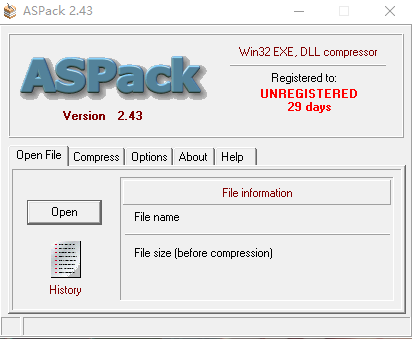

## 1、如何识别壳

### 1.1 常见的壳

不同的外壳程序侧重方面不一样，有的侧重压缩，有的侧重加密。因此外壳可以分为三种：压缩壳、加密壳、VMP壳。

#### 1.1.1 压缩壳

压缩壳的特点是减小软件的体积，加密保护不是其重点。目前兼容性和稳定性较好的压缩壳有：UPX、ASPack、PECompact。

**1）UPX壳**

http://upx.github.io/

**2）ASPack壳**

http://www.aspack.com/



**3）PeCompact壳**

#### 1.1.2 加密壳

加密壳种类较多，不同的壳侧重点也不同，一些壳只是保护程序，另一些壳提供额外的功能，如注册机、使用次数、事件限制等。加密壳兼容性较差。

加密壳的特点：越是有名的壳研究的人越多，被脱壳的概率就越大。

**1）ASProtest壳**

http://www.aspack.com/asprotect32.html

以ASProtect 32为例，介绍其功能：

```bash
ASProtect 32 (formerly ASProtect SKE) is a multifunctional EXE packing tool designed for software developers to protect 32-bit applications with in-built application copy protection system.

The solution has many advantages, including software compression, provides reliable protection methods and tools for software from unauthorized copying, analysis, disassemblers and debuggers.

ASProtect 32 also provides enhanced work with registration keys and the ability to create a single application that can change its functionality or expiration, depending on the entered particular key.
```

**2）Armadillo壳**

Armadillo也称穿山甲，是一款应用范围较广的商业保护软件。

https://zhuanlan.zhihu.com/p/66029373


#### 1.1.3 VMP壳

原理：抽出局部代码，转变为中间码，虚拟机引擎对中间码进行解释，替代CPU解释执行代码，然后跳转回源地址，每次执行都解释执行一次代码，虚拟机有一套自己的反编译算法去解释执行代码。

**1）虚拟机介绍**

一个虚拟机引擎主要由编译器、解释器和虚拟CPU环境（VPU Contect）组成。还会搭配一个或者多个指令系统。虚拟机在运行时，先根据自己的指令系统把已知的x86指令解释成字节码并放在PE文件中，然后将原始代码删除，进入虚拟机执行循环。

**2）EXECryptor壳**

EXECryptor是一款商业保护软件，可以为目标软件添加注册机制、时间限制、使用次数限制等附加功能。

https://execryptor.en.downloadastro.com/

**3）Themida 壳**

Themida 是Oreans的一款商业保护软件。其最大的特点是其虚拟机保护技术，在程序中要用SDK将关键代码交给Themida用虚拟机进行保护。缺点是体积较大。

https://www.oreans.com/Themida.php


**4）VMProtect**

不同于EXECryptor和Themida是把壳与虚拟机结合起来，VMPProtect壳是一种纯虚拟机保护软件。

https://vmpsoft.com/

### 1.2 识别加壳软件

知己知彼百战不殆，在脱壳最重要的就是侦壳。这里需要使用到的工具主要有：PEID(不推荐)，exepeinfo，ArmaFP，任务管理器。

- exepeinfo是用于查壳的

- 任务管理器是用于判断是单进程还是双进程
- ArmaFP是用于判断其保护模式，是标准模式，还是全保护模式(专业模式)


## 2、如何脱壳


### 2.1 手工脱壳

当程序执行时，外壳程序代码首先获得控制权，模拟Windows加载器，将原来的程序恢复到内存中，这时内存中的数据就是加壳前的镜像文件了。适时的将其抓取并修改，即可还原到加壳前的状态。手动脱壳一般分为3个步骤：

- 一是查找真正的程序入口点
- 二是抓取内存镜像文件
- 三是重建PE文件

**1）寻找OEP**

当外壳程序所保护的软件运行时，会执行外壳程序，外壳程序负责在内存中把原程序解压、还原，并把控制权还给解压后的程序，再跳到原来程序的入口点。一般的壳在这里会有一个明显的”分界线“，这个解压后真正的入口点称为OEP。

**根据跨段指令寻找OEP：**这个方法没有太多的技巧，就是从壳的开始处跟踪，直到到达代码段本身（真正的OEP应该在.text段）

**用内存访问断点寻找OEP：**根据跨段指令寻找OEP是手动跟踪直到达到代码段。我们可以使用OD的内存断点的功能对.text段设置内存访问断点，当外壳代码执行完成后跳转到正真的代码段时触发断点，可快速定位OEP。

该方法的关键是代码段解压处理完成后对代码段设置内存访问断点。由于外壳会对代码段执行两次操作（解压和执行），因此可以设置两次内存访问断点。达到OEP。

**根据栈平衡原理寻找OEP：**在编写加壳软件时，必须遵守栈平衡原理。通常使用pushad/popad、pushfd/popfd指令对来保护与恢复现场环境。在脱壳时，根据栈平衡原理对esp设置断点，很快就能找到OEP了。


**根据编译语言的特点找OEP：**每种类型的语言编译的文件入口点都有自己的特点，使用同一编译器编译的程序，其入口点代码都很相似，都有一段启动代码。利用这些函数来设置断点，从而方便地定位程序的OEP。


**2）抓取内存镜像**

抓取内存镜像也称转储（Dump），是指把内存指定地址的镜像文件读取出来，用文件等形式将其保存下来。

Dump内存的时机：当外壳来到OEP处执行代码时开始Dump是最合适的。

**3）重建输入表**

### 2.2 使用工具脱壳

### 2.2.1 UPX 脱壳

### 2.2.2 

[脱壳工具大汇总_eidolon8的博客-CSDN博客_脱壳工具](https://blog.csdn.net/eidolon8/article/details/19418187)