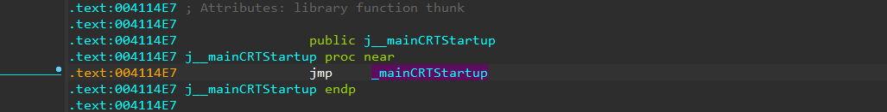
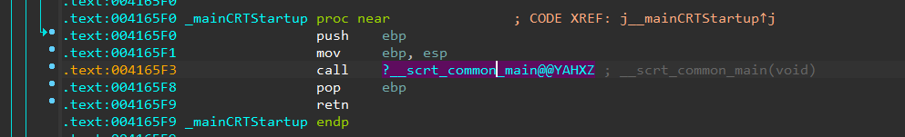
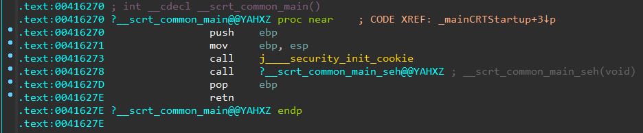
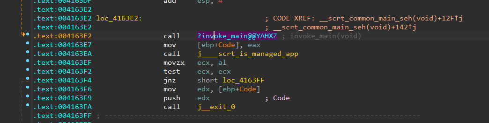
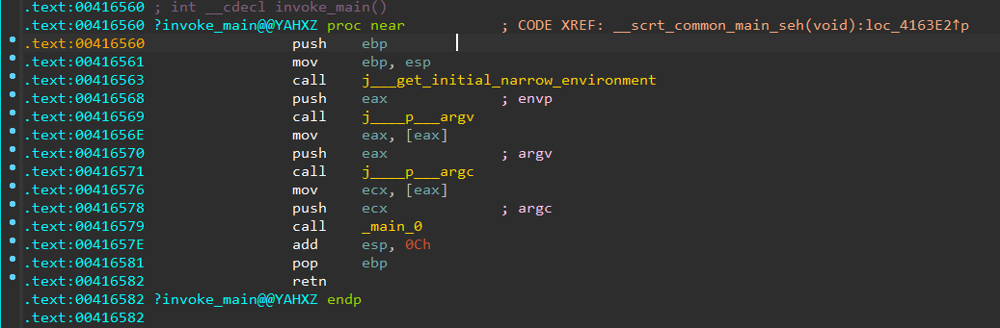

本章内容主要内容主要介绍在不同操作系统环境下，应用程序的逆向技术。着重谈论逆向的方法、使用的工具集。


## 1、Windows应用程序

windows平台下的应用以可执行文件为主，文件格式为PE文件。但是根据程序使用的编程语言的差异，逆向方法上有所不同。下面会根据具体的程序类型进行详细说明。

### 1.1 C/C++开发的普通应用程序

这里指使用visual studio工具开发的Console应用程序。

```c++
#include <iostream>
using namespace std;

bool check(char *input) {
	if (strlen(input) != 10)
	{
		return false;
	}
	return true;
}

int main(int argc, char* argv[])
{
	if (argc <1)
	{
		return 0;
	}
	while (1)
	{
		cout << "please input SerNum: ";
		char input[1024] = {};
		cin >> input;
		if (strlen(input)==0 || !strcmp(input, "quit"))
		{
			break;
		}
		bool ret = check(input);
		if (ret)
		{
			cout << "Congurations, Good job!!!" << endl;
		}
		cout << "Come on, You Can Do it" << endl;
	}
	return 0;
}

```


#### 1.1.1 使用IDA分析函数流程

**逆向分析之：查找main函数**

使用IDA 从Export模块中的start或者相似函数函数开始找：



* j__mainCRTStartup：中的mainCRTStartup是VC编译器特有的函数入口。当操纵系统装在完应用程序后，从此处开始执行，调用我们自己编写的main 函数。

**看到新的调用，继续往下看**



**看到设置安全cooike的函数、安装SEH函数，我们选择进入安装SEH的函数。**



* security cookie: 由于编译程序时启用安全检查 (/GS)选项，编译器会自动添加该函数，主要用于对抗栈溢出漏洞
* 安装seh：SEH是Windows异常机制。




**main函数入口点：特点是四个连续的push 一个call符合C++入口函数main的特点**




**找到main函数之后即可正常分析。**


**使用反编译插件反编译后的main函数**：基本可以清楚的看到应用程序的具体逻辑。

```c++
int __cdecl main(int argc, const char **argv, const char **envp)
{
  int v4; // eax
  int v5; // eax
  char Str[1028]; // [esp+25Ch] [ebp-408h] BYREF

  __CheckForDebuggerJustMyCode(&unk_423027);
  if ( argc < 1 )
    return 0;
  while ( 1 )
  {
    std::operator<<<std::char_traits<char>>(std::cout, "please input SerNum: ");
    j__memset(Str, 0, 0x400u);
    std::operator>><char,std::char_traits<char>>(std::cin, Str);
    if ( !j__strlen(Str) || !j__strcmp(Str, "quit") )
      break;
    if ( check(Str) )
    {
      v4 = std::operator<<<std::char_traits<char>>(std::cout, "Congurations, Good job!!!");
      std::ostream::operator<<(v4, std::endl<char,std::char_traits<char>>);
    }
    v5 = std::operator<<<std::char_traits<char>>(std::cout, "Come on, You Can Do it");
    std::ostream::operator<<(v5, std::endl<char,std::char_traits<char>>);
  }
  return 0;
}
```

#### 1.1.2 使用OD/X64dbg动态分析


#### 1.1.3 技术总结

**VC编译器编译的程序执行流程：**

* 


**其他逆向技巧**

* 使用字符串快速定位关键代码
* 使用API定位关键代码
* 

### 1.2 MFC框架开发的GUI应用程序

#### 1.2.1 MFC应用程序介绍

#### 1.2.2 IDA分析MFC应用程序

#### 1.2.3 OD/x64dbg分析

### 1.3 Python开发打包的应用程序

### 1.4 C#开发的应用程序

## 2、Linux 程序逆向

### 2.1 C/C++开发的普通应用程序

### 2.2 

### 2.3 Android应用程序

## 3、Mac OSX 应用程序